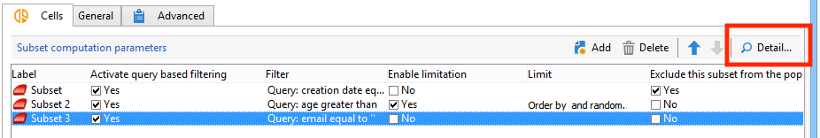

# 儲存格{#cells}

此 **[!UICONTROL Cells]** 活動會以資料欄的形式提供各種子集的檢視。 它有助於子集操控，也設計為利用個人化功能。


此活動可設定為根據使用者需求輸入特定引數。 依預設，每個子集的詳細資訊會透過在專用視窗中顯示 **[!UICONTROL Cells]** 和 **[!UICONTROL Advanced]** 索引標籤。



在下列範例中，已修改輸入表單： **[!UICONTROL Data]** 索引標籤已新增，以啟用每個子集的優惠方案與優先順序層級的關聯。


針對此設定，已將以下資訊新增到工作流程表單中 **[!UICONTROL Administration > Configurations > Input forms]** Adobe Campaign explorer的節點：

```
<container img="nms:miniatures/mini-enrich.png" label="Data">
                <input xpath="@code"/>
                <container xpath="select/node[@alias='@numTest']">
                  <input alwaysActive="true" expr="'long'" type="expr" xpath="@type"/>
                  <input alwaysActive="true" expr="'Priority'" type="expr" xpath="@label"/>
                  <input label="Priority" maxValue="12" minValue="0" type="number"
                         xpath="@value" xpathEditFromType="@type"/>
                </container>
                <container xpath="select/node[@alias='@test']">
                  <input alwaysActive="true" expr="'string'" type="expr" xpath="@type"/>
                  <input alwaysActive="true" expr="'Identifier'" type="expr" xpath="@label"/>
                  <input label="Cell identifier" xpath="@value"/>
                </container>
                <container xpath="select/node[@alias='linkTest']">
                  <input alwaysActive="true" expr="'link'" type="expr" xpath="@type"/>
                  <input alwaysActive="true" expr="'nms:offer'" type="expr" xpath="@dataType"/>
                  <input alwaysActive="true" expr="'Offre'" type="expr" xpath="@label"/>
                  <input computeStringAlias="@valueLabel" label="Offers" notifyPathList="@_cs|@valueLabel"
                         schema="nms:offer" type="linkEdit" xpath="@value"/>
                </container>
```

Adobe Campaign中的輸入表單個人化已保留給專家使用者。