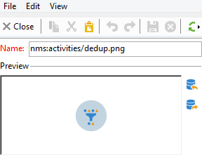

# 變更活動影像{#change-activity-images}

您可以變更用於各種工作流程圖表中的影像。 但是，它們必須符合某些限制。 以下是實作階段：

* 若要變更背景影像，請選取所需的目標定位工作流程，然後按一下 **[!UICONTROL Properties]** 標籤。

  

  若要選取要使用的影像，請按一下 **[!UICONTROL Select link]** 圖示右側 **[!UICONTROL Background image]** 欄位。

  >[!NOTE]
  >
  >背景影像的寬度（以畫素為單位）必須是4的倍數。

  

  此 **[!UICONTROL Edit link]** 圖示可讓您檢視選取的影像。

* 若要變更與活動相關聯的影像，請連按兩下物件，然後按一下 **[!UICONTROL Advanced]** 標籤。

  若要選取要使用的影像，請按一下 **[!UICONTROL Select link]** 圖示右側 **[!UICONTROL Image]** 欄位。

  

  此 **[!UICONTROL Edit link]** 圖示可讓您檢視選取的影像。

  

>[!NOTE]
>
>儲存在 **[!UICONTROL Administration > Configuration > Images]** 樹狀結構的節點可供選取。
>  
>影像必須是PNG格式，具有48x48畫素、1600萬色和透明背景。
