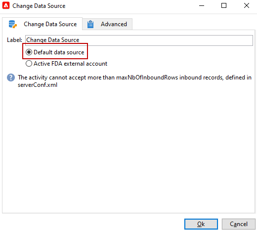

# 變更資料來源 {#change-data-source}

使用 **[!UICONTROL Change data source]** 活動以變更的資料來源 [工作流程工作表](use-workflow-data.md#workflow-temporary-work-table). 此活動可提供更大的彈性，用於管理不同資料來源(例如同盟資料存取(FDA)、Campaign Cloud資料庫(FFDA)和Campaign本機資料庫)的資料。

工作流程 **[!UICONTROL Working table]** 用於處理與工作流程活動共用資料。

根據預設， **[!UICONTROL Working table]** 是在與需要查詢的資料來源相同的資料庫中建立的。
例如，當查詢 **[!UICONTROL Recipients]** 表格，儲存在雲端資料庫中，工作流程會建立 **[!UICONTROL Working table]** 在相同雲端資料庫上。

使用 **[!UICONTROL Change Data Source]** 使用其他資料來源的活動 **[!UICONTROL Working table]**.

請注意，使用時 **[!UICONTROL Change Data Source]** 活動，您必須切換回雲端資料庫才能繼續執行工作流程。

>[!IMPORTANT]
>
>請注意 **[!UICONTROL Change Dimension]** 和 **[!UICONTROL Change Data source]** 活動不應新增為一列。 如果您需要連續使用兩個活動，請務必加入 **[!UICONTROOL 擴充]** 兩者之間的活動。 這可確保正確執行並防止潛在的衝突或錯誤。

若要使用 **[!UICONTROL Change Data Source]** 活動，您必須：

1. 建立工作流程。

1. 使用查詢目標收件者 **[!UICONTROL Query]** 活動。

   如需詳細資訊，請參閱 **[!UICONTROL Query]** 活動，請參閱此 [頁面](query.md#create-a-query).

1. 新增 **[!UICONTROL Change data source]** 活動。

   

1. 編輯您的 **[!UICONTROL Change data source]** 要選取的活動 **[!UICONTROL Default data source]**.

   接著會將包含查詢結果的工作表移至預設的Campaign本機資料庫。

   

1. 新增 **[!UICONTROL JavaScript code]** 在工作表上執行單一作業的活動。

   如需詳細資訊，請參閱 **[!UICONTROL JavaScript code]** 活動，請參閱 [此頁面](sql-code-and-javascript-code.md#javascript-code).

1. 新增另一個 **[!UICONTROL Change data source]** 活動以切換回雲端資料庫。

1. 編輯此活動並選取 **[!UICONTROL Active FDA external account]**，以及對應的 **[!UICONTROL External database]** 外部帳戶。

   

1. 您現在可以開始工作流程。
