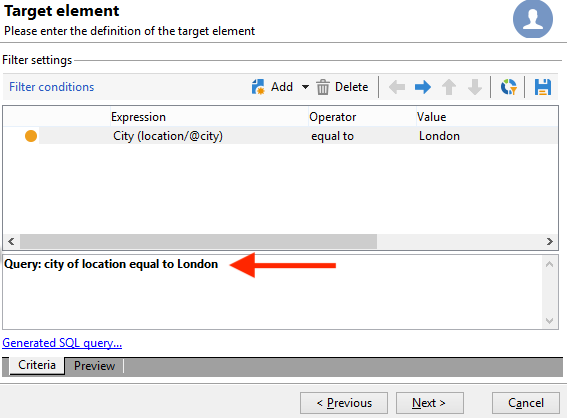

# 執行彙總計算 {#performing-aggregate-computing}

在此範例中，我們要根據性別統計居住在倫敦的收件者人數。

* 需要選取哪個表格？

   收件者表格(**nms：recipient**)

* 應在輸出欄中選取哪些欄位？

   主索引鍵（含計數）和性別

* 篩選資訊所依據的條件為何？

   根據居住在倫敦的收件者

若要建立此範例，請套用下列步驟：

1. 在 **[!UICONTROL Data to extract]**，定義主索引鍵的計數（如上一個範例所示）。 新增 **[!UICONTROL Gender]** 欄中的欄位。 檢查 **[!UICONTROL Group]** 中的選項 **[!UICONTROL Gender]** 欄。 如此一來，收件者就會依性別分組。

   

1. 在 **[!UICONTROL Sorting]** 視窗，按一下 **[!UICONTROL Next]**：這裡不需要排序。
1. 設定資料篩選。 在這裡，您要將選取範圍限製為住在倫敦的連絡人。

   

   >[!NOTE]
   >
   >值區分大小寫。 如果「London」值是在沒有大寫字母的條件中輸入，且收件者清單包含單字「London」及大寫字母，則查詢將失敗。

1. 在 **[!UICONTROL Data formatting]** 視窗，按一下 **[!UICONTROL Next]**：此範例不需要格式設定。
1. 在預覽視窗中，按一下 **[!UICONTROL Launch data preview]**.

   依性別區分的每種排序有三個不同的值： **2** 對於女性， **1** 男士和 **0** 當性別不明時。 在此範例中，此清單包含10名女性、16名男性和2名性別不明的人。

   
