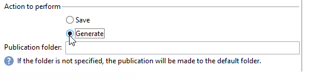

# 內容管理{#content-management}

A **內容管理** 活動可讓您建立和操作內容，並根據此內容產生檔案。 然後可以透過「傳送」活動傳遞此內容。

>[!CAUTION]
>
>內容管理是選用的Adobe Campaign模組。 請檢查您的授權合約。

活動的屬性分為三個步驟：

* **內容選擇**：內容可以先前建立，也可以透過活動建立。
* **內容更新**：任務可以修改內容的主體或匯入所有XML內容。
* **動作**：可儲存或產生產生的內容。

   

1. **內容**

   * **[!UICONTROL Specified in the transition]**

      此選項可讓您使用轉變中指定的內容，即啟用內容管理之事件必須包含 **[!UICONTROL contentId]** 變數。 此變數可由先前的內容管理或任何指令碼設定。

   * **[!UICONTROL Explicit]**

      此選項可讓您透過 **[!UICONTROL Content]** 欄位。 此欄位僅在 **[!UICONTROL Explicit]** 選項時才會選擇此選項。

      

   * **[!UICONTROL Calculated by a script]**

      內容識別碼由指令碼計算。 此 **[!UICONTROL Script]** 欄位可讓您定義評估內容識別碼（主索引鍵）的JavaScript範本。 此欄位僅在 **[!UICONTROL Calculated by a script]** 選項時才會選擇此選項。

      

   * **[!UICONTROL New, created from a publication template]**

      從出版物範本建立新內容。 此新內容將儲存在中指定的檔案中 **[!UICONTROL String]** 欄位。 此 **[!UICONTROL Template]** 欄位會指定要用來建立內容的發佈範本。

      

1. **更新內容**

   * **[!UICONTROL Subject]**

      此欄位可讓您修改內容的主旨。

   * **[!UICONTROL Access to data from an XML feed]**

      此選項可讓您從透過XSL樣式表下載的XML檔案建構內容。 選取此選項時， **[!UICONTROL URL]** 欄位會指定XML內容下載URL。 此 **[!UICONTROL XSL stylesheet]** 可讓您指定用來轉換已下載XML檔案的樣式表。 此屬性是選用的。

      

1. **要執行的動作**

   * **[!UICONTROL Save]**

      此選項會儲存已建立或已修改的內容。

      出站轉變只會啟動一次，其內容會儲存在 **[!UICONTROL contentId]** 變數做為引數。

   * **[!UICONTROL Generate]**

      此選項會儲存內容，然後為具有「檔案」型別發佈的每個轉換範本產生輸出檔案。

      

      系統會針對每個以儲存在中的內容識別碼產生的檔案啟動出站轉變 **[!UICONTROL contentId]** 變數做為引數，以及檔案名稱 **[!UICONTROL filename]** 變數。

## 輸入引數 {#input-parameters}

* contentId

要使用的內容識別碼，如果 **[!UICONTROL Specified in the transition]** 選項已啟用。

## 輸出引數 {#output-parameters}

* contentId

   內容識別碼.

* 檔案名稱

   如果選取的動作為，則為產生檔案的完整名稱 **[!UICONTROL Generate]**.
