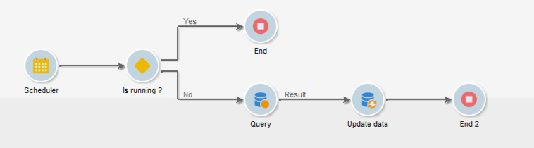

# 協調資料更新{#coordinating-data-updates}

此使用案例詳細說明建立工作流程，讓您可在使用多個工作流程執行時管理伴隨的更新。

目的是檢查更新程式在執行另一個更新操作之前是否已結束。 為此，我們將設定一個執行個體變數，並讓工作流程測試執行個體是否正在執行，以決定是否繼續執行工作流程並執行更新。

此工作流程由下列專案組成：

* a **排程器** 活動，在特定頻率上執行工作流程。
* a **測試** 活動會檢查工作流程是否已執行。
* **查詢** 和 **更新資料** 活動以防工作流程尚未執行，後面接著 **結束** 將工作流程例項變數重新初始化為false的活動。
* 一個 **結束** 活動（如果工作流程已在執行）。

若要建立工作流程，請遵循下列步驟：

1. 新增 **排程器** 活動，然後根據您的需求設定其頻率。
1. 新增 **測試** 活動以檢查工作流程是否已在執行，然後如下所述進行設定。

   >[!NOTE]
   >
   >&quot;isRunning&quot;是我們針對此範例選擇的例項變數名稱。 這不是內建變數。

   

1. 新增 **結束** 活動至 **否** 分支。 如此一來，如果工作流程已在執行中，則不會執行任何動作。
1. 將所需的活動新增至 **是** 分支。 在我們的案例中， **查詢** 和 **更新資料** 活動。
1. 開啟第一個活動，然後新增 **instance.vars.isRunning = true** 中的命令 **[!UICONTROL Advanced]** 標籤。 如此一來，執行個體變數就會設定為執行中。

   

1. 新增 **結束** 活動結尾的 **[!UICONTROL Yes]** 取用，然後新增 **instance.vars.isRunning = false** 中的命令 **[!UICONTROL Advanced]** 標籤。

   如此一來，只要工作流程仍在執行中，就不會執行任何動作。

   

**相關主題：**

* [防止同時執行多個專案](monitor-workflow-execution.md#preventing-simultaneous-multiple-executions)
* [更新資料活動](update-data.md)
