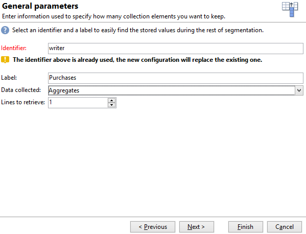

# 建立摘要清單{#creating-a-summary-list}

此使用案例詳細說明了工作流的建立過程，該工作流在收集檔案並完成若干項整理後，允許您建立摘要清單。 該示例基於在商店中進行採購的聯繫人清單。


使用以下資料結構：


其目的是：

* 使用濃縮活動的各種選項
* 在協調後更新資料庫中的資料
* 建立富集資料的全局「視圖」

要建立摘要清單，您需要執行以下步驟：

1. 在工作流的工作表中收集和載入「採購」檔案
1. 通過建立指向引用表的連結來豐富導入的資料
1. 使用增強的資料更新「採購」表
1. 從&quot;Purces&quot;表中使用聚合計算來豐富&quot;Contacts&quot;資料
1. 建立摘要清單

## 步驟1:載入檔案並協調導入的資料 {#step-1--loading-the-file-and-reconciling-the-imported-data}

要載入的資料是「採購」相關資料，格式如下：

```
Product Name;Product price;Store
Computer;2000;London 3
Tablet;600;Cambridge
Computer;2000;London 5
Computer;2000;London 8
Tablet;600;Cambridge
Phone;500;London 5
```

此資料包含在「Purces.txt」文本檔案中。

1. 添加 **檔案收集器** 和 **資料載入（檔案）** 活動。

   的 **檔案收集器** 活動，您可以收集檔案並將檔案從伺服器發送到Adobe Campaign伺服器。

   的 **資料載入（檔案）** 活動，您可以使用收集的資料來豐富工作流的工作表。 有關本練習的詳細資訊，請參閱 [此頁](data-loading--file-.md)。

1. 配置 **檔案收集器** 活動收集文本(&#42;.txt)從選定目錄鍵入檔案。

   

   的 **檔案收集器** 活動，用於管理源目錄中缺少檔案。 要執行此操作，請檢查 **[!UICONTROL Process file nonexistence]** 的雙曲餘切值。 在此工作流中， **等待** 如果收集時目錄中缺少活動，則已添加活動以嘗試其他檔案集合。

1. 配置 **資料載入（檔案）** 活動，使用與要導入的資料格式相同的示例檔案。

   

   按一下 **[!UICONTROL Click here to change the file format...]** 連結，使用「採購」表的內部名稱和標籤更名列。

   

一旦導入了資料，便通過建立指向與「儲存」模式匹配的引用表的連結來進行富集。

添加富集活動並按如下方式配置：

1. 從中選擇由資料組成的主集 **資料載入（檔案）** 的子菜單。

   

1. 按一下 **[!UICONTROL Add data]**，然後選擇 **[!UICONTROL A link]** 的雙曲餘切值。

   

1. 選擇 **[!UICONTROL Define a collection]** 的雙曲餘切值。
1. 選擇「儲存」架構作為目標。

   

有關各種類型連結的詳細資訊，請參閱 [豐富和修改資料](targeting-workflows.md#enrich-and-modify-data)。

在以下窗口中，需要通過選擇源欄位（在主集中）和目標欄位（屬於「儲存」方案）來建立聯接條件以配置資料協調。


現在，該連結已建立，我們將從「儲存」架構向工作流的工作表中添加一列：「郵遞區號參考」欄位。

1. 開啟濃縮活動。
1. 按一下&#x200B;**[!UICONTROL Edit additional data]**。
1. 將「ZipCode Reference」欄位添加到 **[!UICONTROL Output columns]**。


此富集後工作流工作表中的資料如下：


## 步驟2:將富集的資料寫入「採購」表 {#step-2--writing-enriched-data-to-the--purchases--table}

此步驟詳細說明如何將導入和富集的資料寫入「採購」表。 要做到這一點，我們需要 **更新資料** 的子菜單。

工作流工作表中的資料與 **採購** 目標維度必須在 **採購** 表格已更新。

1. 按一下 **[!UICONTROL Reconciliation]** 頁籤。
1. 選擇目標維，即「採購」架構。
1. 為工作流表中的資料選擇「源表達式」（本例中為「storeName」欄位）。
1. 在「採購」表（本例中為「儲存更名」欄位）中為資料選擇「目標表達式」。
1. 核取 **[!UICONTROL Keep unreconciled data coming from the work table]** 選項。


在 **更新資料** 活動，需要以下配置：

1. 選擇 **[!UICONTROL Insert or update]** 的上界 **[!UICONTROL Operation type]** 欄位，以避免每次收集檔案時建立新記錄。
1. 選擇 **[!UICONTROL By directly using the targeting dimension]** 值 **[!UICONTROL Record identification]** 的雙曲餘切值。
1. 選擇「採購」架構 **[!UICONTROL Document type]**。
1. 指定要更新的欄位清單。 的 **[!UICONTROL Destination]** 列用於定義「採購」架構的欄位。 的 **[!UICONTROL Expression]** 列，用於選擇工作表中的欄位以執行映射。
1. 按一下 **[!UICONTROL Generate an outbound transition]** 的雙曲餘切值。


## 第3步：豐富「聯繫人」資料 {#step-3--enriching--contact--data-}

「聯繫人」架構物理地連結到「購買」架構。 這意味著您可以使用「濃縮」選項的另一個選項：添加連結到篩選維的資料。

第二次濃縮的目的是在採購方案上建立聚合，以計算每個已標識聯繫人的採購總額。

1. 添加 **查詢** 鍵入活動，使您能夠恢復所有 **聯繫人** 儲存。
1. 添加 **濃縮** 「活動」(activity)，然後選擇前一個查詢生成的主集。
1. 按一下添加 **[!UICONTROL Data]**。
1. 按一下 **[!UICONTROL Data linked to the targeting dimension]** 的雙曲餘切值。
1. 按一下 **[!UICONTROL Data linked to the filtering dimension]** 的上界 **[!UICONTROL Select fields to add]** 的子菜單。
1. 選擇 **[!UICONTROL Purchases]** 按一下 **[!UICONTROL Next]**。

   

1. 更改 **[!UICONTROL Collected data]** 欄位 **[!UICONTROL Aggregates]** 的雙曲餘切值。

   

1. 按一下&#x200B;**[!UICONTROL Next]**。
1. 添加以下表達式以計算每個聯繫人的採購總額：&quot;Sum(@prodprice)&quot;。

   

要準備摘要清單，您需要從「採購」欄位和第一次富集添加欄位：「郵遞區號參考」欄位。

1. 按一下 **[!UICONTROL Edit additional data...]** 連結。
1. 添加「商店名稱」和「採購/郵遞區號參考」欄位。

   

1. 按一下 **[!UICONTROL Properties]** 頁籤。
1. 更改第二個連結以僅建立一行。

## 第4步：建立並添加到摘要清單 {#step-4--creating-and-adding-to-a-summary-list}

最後一步是將所有增量資料寫入清單。

1. 添加 **清單更新** 活動。 此活動必須連結到第二個濃縮活動的出站轉換。
1. 選擇 **[!UICONTROL Create the list if necessary (Calculated name)]** 的雙曲餘切值。
1. 為計算的名稱選擇一個值。 為清單選擇的標籤是當前日期：&lt;%= formatDate(new Date()，「%2D/%2M/%2Y」)%>。

執行工作流後，清單將包括：

* 聯繫人清單，
* &quot;總採購&quot;欄，
* 「儲存名稱」列，
* 為儲存引用架構中包含的所有儲存輸入「郵遞區號引用」列。


