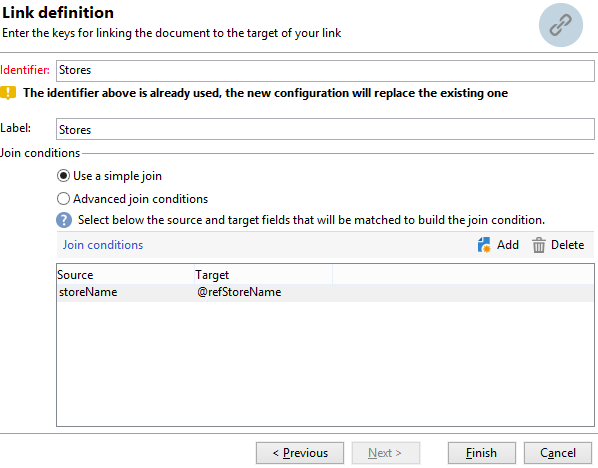

# 建立摘要清單{#creating-a-summary-list}

此使用案例詳細說明了如何建立工作流程，此工作流程在收集檔案並執行數個擴充後，可讓您建立摘要清單。 此示例基於在商店中進行購買的聯繫人清單。


使用下列資料結構：


其目的為：

* 使用擴充活動的各種選項
* 在協調後更新資料庫中的資料
* 建立擴充資料的全域「檢視」

若要建立摘要清單，您需要遵循下列步驟：

1. 在工作流程的工作表中收集和載入「購買」檔案
1. 建立參考表格的連結，以擴充匯入的資料
1. 使用擴充資料更新「購買」表格
1. 從「購買」表中使用匯總計算豐富「聯繫人」資料
1. 建立摘要清單

## 步驟1:載入檔案並調解匯入的資料 {#step-1--loading-the-file-and-reconciling-the-imported-data}

要載入的資料為「購買」相關資料，其格式如下：

```
Product Name;Product price;Store
Computer;2000;London 3
Tablet;600;Cambridge
Computer;2000;London 5
Computer;2000;London 8
Tablet;600;Cambridge
Phone;500;London 5
```

此資料包含在「Purches.txt」文字檔中。

1. 新增 **檔案收集器** 和 **資料載入（檔案）** 活動。

   此 **檔案收集器** 活動可讓您從和收集檔案，並將檔案傳送至Adobe Campaign伺服器。

   此 **資料載入（檔案）** 活動可讓您以收集的資料擴充工作流程的工作表。 有關此活動的詳細資訊，請參閱 [本頁](data-loading--file-.md).

1. 設定 **檔案收集器** 收集文字的活動(&#42;.txt)從所選目錄中鍵入檔案。

   

   此 **檔案收集器** 活動可讓您管理來源目錄中缺少檔案。 若要這麼做，請檢查 **[!UICONTROL Process file nonexistence]** 選項。 在此工作流程中， **等待** 活動已新增，以嘗試其他檔案集合（如果在收集時該檔案集合從目錄中缺少）。

1. 設定 **資料載入（檔案）** 活動，使用與要匯入的資料格式相同的範例檔案。

   

   按一下 **[!UICONTROL Click here to change the file format...]** 連結，使用「購買」表格的內部名稱和標籤來重新命名欄。

   

匯入資料後，會建立與「儲存」架構相符之參考表格的連結，以執行擴充。

新增擴充活動並進行如下設定：

1. 從中選取由資料組成的主集 **資料載入（檔案）** 活動。

   

1. 按一下 **[!UICONTROL Add data]**，然後選取 **[!UICONTROL A link]** 選項。

   

1. 選取 **[!UICONTROL Define a collection]** 選項。
1. 選擇「儲存」架構作為目標。

   

如需各種連結類型的詳細資訊，請參閱 [擴充和修改資料](targeting-workflows.md#enrich-and-modify-data).

在以下窗口中，您需要通過選擇源欄位（在主集中）和目標欄位（屬於「儲存」架構）來建立聯接條件，以配置資料協調。



現在，連結已建立，我們將從「商店」結構新增欄至工作流程的工作表：「郵遞區號參考」欄位。

1. 開啟擴充活動。
1. 按一下&#x200B;**[!UICONTROL Edit additional data]**。
1. 將「郵遞區號參考」欄位新增至 **[!UICONTROL Output columns]**.


此擴充後，工作流程工作表格中的資料將如下：


## 步驟2:將擴充資料寫入「購買」表格 {#step-2--writing-enriched-data-to-the--purchases--table}

此步驟詳細說明如何將匯入和擴充資料寫入「購買」表格。 若要這麼做，我們需要使用 **更新資料** 活動。

工作流程工作表中的資料與 **購買** 目標維度必須在 **購買** 表格已更新。

1. 按一下 **[!UICONTROL Reconciliation]** 擴充活動的索引標籤。
1. 選取目標維度，即此為「購買」結構。
1. 為工作流表中的資料選擇「源表達式」（在此例中為「storeName」欄位）。
1. 為「購買」表格（此例中為「儲存重新命名」欄位）中的資料選取「目標運算式」。
1. 核取 **[!UICONTROL Keep unreconciled data coming from the work table]** 選項。


在 **更新資料** 活動，需要下列設定：

1. 選取 **[!UICONTROL Insert or update]** 選項 **[!UICONTROL Operation type]** 欄位，以避免在每次收集檔案時建立新記錄。
1. 選取 **[!UICONTROL By directly using the targeting dimension]** 值 **[!UICONTROL Record identification]** 選項。
1. 選取「購買」結構，作為 **[!UICONTROL Document type]**.
1. 指定要更新的欄位清單。 此 **[!UICONTROL Destination]** 欄可讓您定義「購買」結構的欄位。 此 **[!UICONTROL Expression]** 欄可讓您選取工作表中的欄位以執行對應。
1. 按一下 **[!UICONTROL Generate an outbound transition]** 選項。


## 步驟3:豐富「聯繫人」資料 {#step-3--enriching--contact--data-}

「連絡人」架構實際上連結至「購買」架構。 這表示您可以使用「擴充」選項的其他選項：新增連結至篩選維度的資料。

第二次擴充的目的是在購買結構上建立匯總，以計算每個已識別連絡人的購買總量。

1. 新增 **查詢** 輸入可讓您全部復原的活動 **聯繫人** 儲存。
1. 新增 **擴充** 活動，然後選取上次查詢產生的主要集。
1. 按一下「新增」 **[!UICONTROL Data]**.
1. 按一下 **[!UICONTROL Data linked to the targeting dimension]** 選項。
1. 按一下 **[!UICONTROL Data linked to the filtering dimension]** 選項 **[!UICONTROL Select fields to add]** 窗口。
1. 選取 **[!UICONTROL Purchases]** 節點，然後按一下 **[!UICONTROL Next]**.

   

1. 變更 **[!UICONTROL Collected data]** 欄位 **[!UICONTROL Aggregates]** 選項。

   

1. 按一下&#x200B;**[!UICONTROL Next]**。
1. 新增下列運算式，以計算每個連絡人的購買總計：&quot;Sum(@prodprice)&quot;。

   

若要準備摘要清單，您需要從「購買」欄位和首次擴充新增欄位：「郵遞區號參考」欄位。

1. 按一下 **[!UICONTROL Edit additional data...]** 擴充活動中的連結。
1. 新增「商店名稱」和「購買/郵遞區號參考」欄位。

   

1. 按一下 **[!UICONTROL Properties]** 標籤。
1. 變更第二個連結，僅建立一行。

## 步驟4:建立並添加到摘要清單 {#step-4--creating-and-adding-to-a-summary-list}

最後一個步驟是將所有擴充資料寫入清單。

1. 新增 **清單更新** 活動。 此活動必須連結至第二個擴充活動的出站轉變。
1. 選取 **[!UICONTROL Create the list if necessary (Calculated name)]** 選項。
1. 為計算名稱選擇值。 為清單選擇的標籤是當前日期：&lt;%= formatDate(new Date(), &quot;%2D/%2M/%2Y&quot;)%>。

執行工作流程後，清單將包括：

* 聯繫人清單，
* 「購買總數」欄，
* 「商店名稱」欄，
* 為儲存參考結構中所含的所有儲存區輸入「郵遞區號參考」欄。


