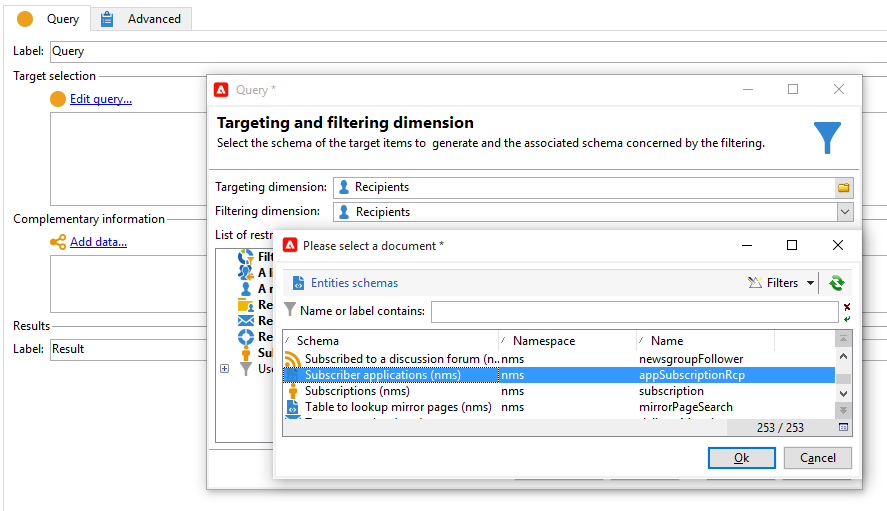
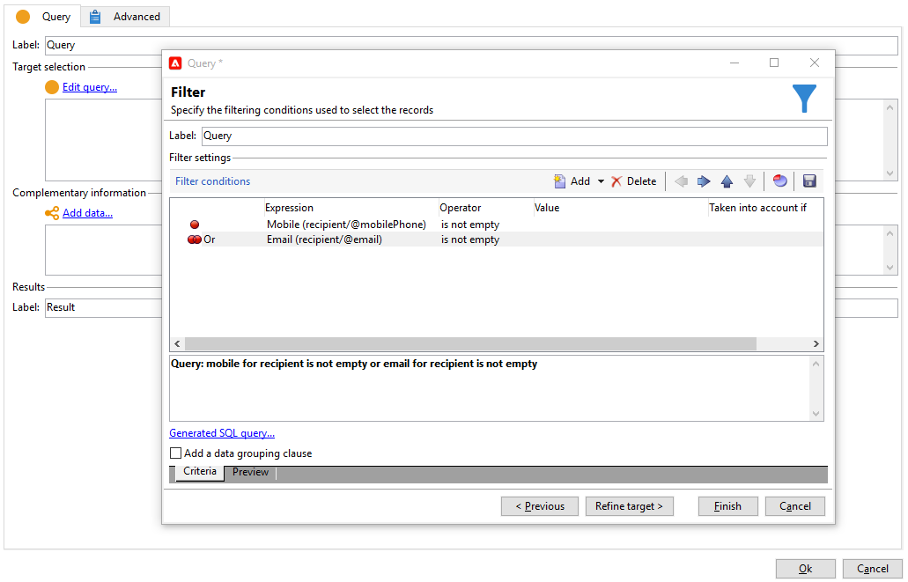

# 跨頻道傳遞{#cross-channel-deliveries}

跨頻道傳遞可在[行銷活動工作流程](campaign-workflows.md)活動的&#x200B;**[!UICONTROL Deliveries]**&#x200B;索引標籤中使用。

選取傳遞所依據的範本，並定義其內容。

您可以使用不同的目標定位活動，在工作流程上游指定傳送的目標。

在以下範例中，瞭解如何建立工作流程，以傳送推播通知訂閱者的電子郵件或簡訊，然後在一週後傳送推播通知。 操作步驟：

1. 建立行銷活動。
1. 在行銷活動的&#x200B;**[!UICONTROL Targeting and workflows]**&#x200B;索引標籤中，新增&#x200B;**[!UICONTROL Query]**&#x200B;活動。
1. 設定查詢：選取訂閱推播通知的收件者作為目標維度。

   >[!NOTE]
   >
   >對於推播通知，請使用&#x200B;**訂閱者應用程式**&#x200B;目標維度。

   

1. 將篩選條件新增至查詢。 在此情況下，我們將選取擁有行動電話號碼或電子郵件地址的收件者。

   

1. 將&#x200B;**[!UICONTROL Split]**&#x200B;活動新增至您的工作流程，以劃分擁有行動電話號碼的收件者和擁有電子郵件地址的收件者。
1. 在&#x200B;**[!UICONTROL Delivery]**&#x200B;索引標籤中，選取每個目標的傳遞。

   按兩下工作流程中的傳送活動，以傳統傳送精靈的相同方式建立您的傳送。

   

1. 新增並設定&#x200B;**[!UICONTROL Wait]**&#x200B;活動，讓收件者無法一次收到太多傳遞。
1. 新增&#x200B;**[!UICONTROL Split]**&#x200B;活動以劃分iOS或Android行動應用程式的訂閱者。

   選取每個作業系統的服務。

   

1. 選取並設定每個作業系統的行動應用程式傳送。

   
