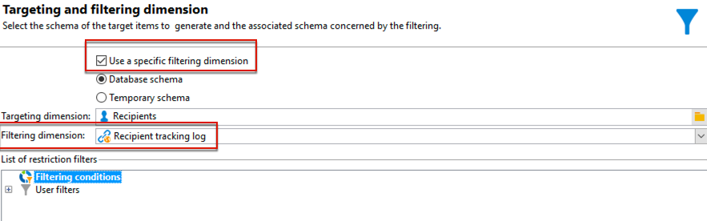

# 跨頻道傳遞工作流程{#cross-channel-delivery-workflow}

此使用案例提供的範例涉及跨通道傳送工作流程。 跨通道傳遞的一般概念在中闡述 [本節](cross-channel-deliveries.md).

目標是將對象從資料庫的收件者細分為不同的群組，以便向群組傳送電子郵件並向其他群組傳送簡訊。

此使用案例的主要實作步驟如下：

1. 建立 **[!UICONTROL Query]** 活動來鎖定您的對象。
1. 建立 **[!UICONTROL Email delivery]** 包含優惠方案連結的活動。
1. 使用 **[!UICONTROL Split]** 活動至：

   * 傳送另一封電子郵件給未開啟第一封電子郵件的收件者。
   * 傳送SMS給已開啟電子郵件但未按一下選件連結的收件者。
   * 將開啟電子郵件並按一下連結的收件者新增至資料庫。

## 步驟1：建立對象 {#step-1--build-the-audience}

若要定義您的目標，請建立查詢以識別收件者。

1. 建立促銷活動. 在[本頁](../campaigns/marketing-campaign-create.md)中瞭解更多。
1. 在 **[!UICONTROL Targeting and workflows]** 索引標籤中，新增 **查詢** 活動至您的工作流程。 有關使用此活動的詳細資訊，請參閱 [本節](query.md).
1. 定義將接收您傳遞的收件者。 例如，選取「金級」成員作為目標維度。
1. 新增篩選條件至您的查詢。 在此範例中，選取擁有電子郵件地址和行動電話號碼的收件者。

   

1. 儲存您的變更。

## 步驟2：建立包含優惠方案的電子郵件 {#step-2--create-an-email-including-an-offer}

1. 建立電子郵件傳遞.
1. 設計訊息並將包含優惠方案的連結插入內容中。

   

   如需將優惠方案整合至訊息內文的詳細資訊，請參閱 [此頁面](../../v8/send/email.md).

1. 儲存您的變更。
1. 用滑鼠右鍵按一下 **[!UICONTROL Email delivery]** 活動以開啟它。
1. 選取 **[!UICONTROL Generate an outbound transition]** 復原母體及追蹤記錄的選項。

   

   這可讓您使用此資訊，根據收件者在收到第一封電子郵件時的行為來傳送另一個傳遞。

1. 新增 **[!UICONTROL Wait]** 活動，讓收件者有幾天時間開啟電子郵件。

   

## 步驟3：將產生的對象分段 {#step-3--segment-the-resulting-audience}

在識別目標並建立第一個傳遞後，您需要使用篩選條件將目標細分為不同的母體。

1. 新增 **Split** 活動以開啟工作流程。 有關使用此活動的詳細資訊，請參閱 [本節](split.md).
1. 從查詢上游計算的母體建立三個區段。

   

1. 針對第一個子集，選取 **[!UICONTROL Add a filtering condition on the inbound population]** 選項並按一下 **[!UICONTROL Edit]**.

   

1. 選取 **[!UICONTROL Recipients of a delivery]** 做為限制篩選器，然後按一下 **[!UICONTROL Next]**.

   

1. 在篩選器設定中，選取 **[!UICONTROL Recipients who have not opened or clicked (email)]** 從 **[!UICONTROL Behavior]** 從下拉式清單中選取電子郵件，其中包含您要從傳遞清單傳送的優惠。 按一下&#x200B;**[!UICONTROL Finish]**。

   

1. 以類似方式針對第二個子集繼續操作，然後選取 **[!UICONTROL Recipients who have not clicked (email)]** 從 **[!UICONTROL Behavior]** 下拉式清單。

   

1. 對於第三個子集，在選取 **[!UICONTROL Add a filtering condition on the inbound population]** 並按一下 **[!UICONTROL Edit]**，選取 **[!UICONTROL Use a specific filtering dimension]** 選項。
1. 選取 **[!UICONTROL Recipient tracking log]** 從 **[!UICONTROL Filtering dimension]** 下拉式清單，反白顯示 **[!UICONTROL Filtering conditions]** 從 **[!UICONTROL List of restriction filters]** 並按一下 **[!UICONTROL Next]**.

   

1. 依下列方式選取篩選條件：

   

1. 按一下 **[!UICONTROL Finish]** 以儲存變更。

## 步驟4：完成工作流程 {#step-4--finalize-the-workflow}

1. 在產生的三個子集之後，將相關活動新增至您的工作流程。 **[!UICONTROL Split]** 活動：

   * 新增 **[!UICONTROL Email delivery]** 活動，向第一個子集傳送提醒電子郵件。
   * 新增 **[!UICONTROL Mobile delivery]** 活動以傳送SMS訊息至第二個子集。
   * 新增 **[!UICONTROL List update]** 活動，將對應的收件者新增至資料庫。

1. 在工作流程中按兩下傳送活動以進行編輯。
1. 按兩下 **[!UICONTROL List update]** 活動並選取 **[!UICONTROL Generate an outbound transition]** 選項。
1. 按一下 **開始** 按鈕來執行工作流程。

目標母體 **查詢** 活動將會分段，以根據收件者的行為接收電子郵件或簡訊傳遞。 剩餘母體將使用新增至資料庫 **[!UICONTROL List update]** 活動。
