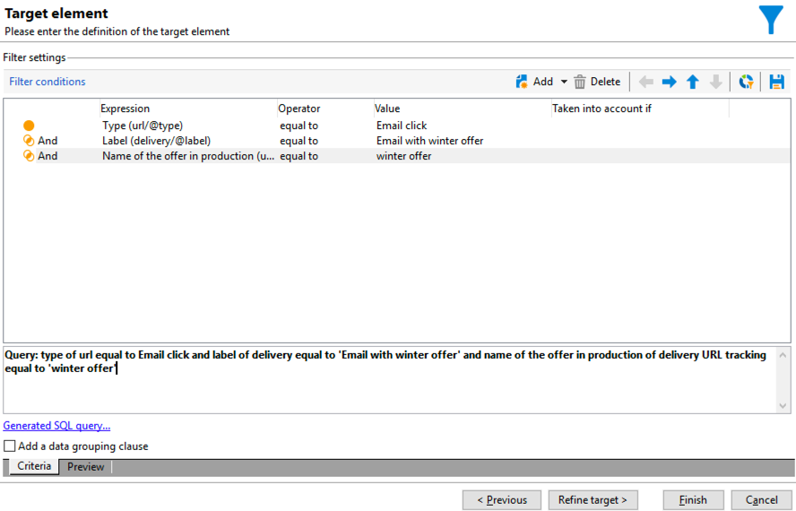

# 跨頻道傳遞工作流程{#cross-channel-delivery-workflow}

此用例提供了涉及跨渠道交付工作流的示例。 在C+++++++++++++++++++++++++++++++++++++++++++ [此部分](cross-channel-deliveries.md)。

目標是將受眾從資料庫的收件人分割為不同的組，目的是向組發送電子郵件，向另一組發送SMS消息。

此使用案例的主要實施步驟如下：

1. 建立 **[!UICONTROL Query]** 活動以針對您的受眾。
1. 建立 **[!UICONTROL Email delivery]** 包含與優惠連結的活動。
1. 使用 **[!UICONTROL Split]** 活動：

   * 向未開啟第一封電子郵件的收件人發送另一封電子郵件。
   * 向開啟電子郵件但未按一下提供連結的收件人發送簡訊。
   * 將開啟電子郵件並按一下連結的收件人添加到資料庫。

## 步驟1:瞄準受眾 {#step-1--targeting-the-audience}

要定義目標，請建立查詢以標識收件人。

1. 建立促銷活動. 有關詳細資訊，請參閱。
1. 在 **[!UICONTROL Targeting and workflows]** 頁籤，添加 **查詢** 活動。 有關使用本練習的詳細資訊，請參閱 [此部分](query.md)。
1. 定義將接收您交貨的收件人。 例如，選擇「Gold」成員作為目標維。
1. 將篩選條件添加到查詢。 在此示例中，選擇具有電子郵件地址和移動號碼的收件人。

   

1. 儲存您的變更。

## 步驟2:建立包括優惠的電子郵件 {#step-2--creating-an-email-including-an-offer}

1. 建立**。
1. 設計消息並將包括優惠的連結插入內容。

   

   有關將優惠整合到消息正文中的詳細資訊，請參閱。

1. 儲存您的變更。
1. 按一下右鍵 **[!UICONTROL Email delivery]** 的子菜單。
1. 選擇 **[!UICONTROL Generate an outbound transition]** 選項以恢復填充和跟蹤日誌。

   

   這樣，您就可以根據收件人在收到第一封電子郵件時的行為使用此資訊來發送另一個遞送。

1. 添加 **[!UICONTROL Wait]** 活動，讓收件人用幾天時間開啟電子郵件。

   

## 第3步：分段生成的受眾 {#step-3--segmenting-the-resulting-audience}

一旦確定了目標並建立了第一次交付，您需要使用篩選條件將目標分割為不同的群。

1. 添加 **拆分** 活動並將其開啟。 有關使用本練習的詳細資訊，請參閱 [此部分](split.md)。
1. 從查詢上游計算的總量建立三個段。

   

1. 對於第一個子集，選擇 **[!UICONTROL Add a filtering condition on the inbound population]** 選項 **[!UICONTROL Edit]**。

   

1. 選擇 **[!UICONTROL Recipients of a delivery]** 作為限制篩選器，然後按一下 **[!UICONTROL Next]**。

   

1. 在篩選器設定中，選擇 **[!UICONTROL Recipients who have not opened or clicked (email)]** 從 **[!UICONTROL Behavior]** 下拉清單，然後從交貨清單中選擇包含您要發送的優惠的電子郵件。 按一下&#x200B;**[!UICONTROL Finish]**。

   

1. 類似地繼續第二個子集並選擇 **[!UICONTROL Recipients who have not clicked (email)]** 從 **[!UICONTROL Behavior]** 的子菜單。

   

1. 對於第三個子集，在選擇 **[!UICONTROL Add a filtering condition on the inbound population]** 按一下 **[!UICONTROL Edit]**，選擇 **[!UICONTROL Use a specific filtering dimension]** 的雙曲餘切值。
1. 選擇 **[!UICONTROL Recipient tracking log]** 從 **[!UICONTROL Filtering dimension]** 下拉清單，突出顯示 **[!UICONTROL Filtering conditions]** 從 **[!UICONTROL List of restriction filters]** 按一下 **[!UICONTROL Next]**。

   

1. 按如下方式選擇篩選條件：

   

1. 按一下 **[!UICONTROL Finish]** 的子菜單。

## 第4步：正在完成工作流 {#step-4--finalizing-the-workflow}

1. 將相關活動添加到工作流中 **[!UICONTROL Split]** 活動：

   * 添加 **[!UICONTROL Email delivery]** 的子集。
   * 添加 **[!UICONTROL Mobile delivery]** 活動，將SMS消息發送到第二子集。
   * 添加 **[!UICONTROL List update]** 活動，將相應的收件人添加到資料庫。

1. 按兩下工作流中的傳遞活動以編輯它們。 有關建立電子郵件和SMS的詳細資訊，請參閱。
1. 按兩下 **[!UICONTROL List update]** 活動，然後選擇 **[!UICONTROL Generate an outbound transition]** 的雙曲餘切值。

   然後，您可以將結果的收件人從Adobe Campaign出口到Adobe Experience Cloud。 例如，可以通過添加**來使用Adobe Target的受眾。

1. 按一下 **開始** 按鈕。

被調查者 **查詢** 活動將根據收件人的行為進行分段，以接收電子郵件或簡訊發送。 剩餘人口將使用 **[!UICONTROL List update]** 的子菜單。
