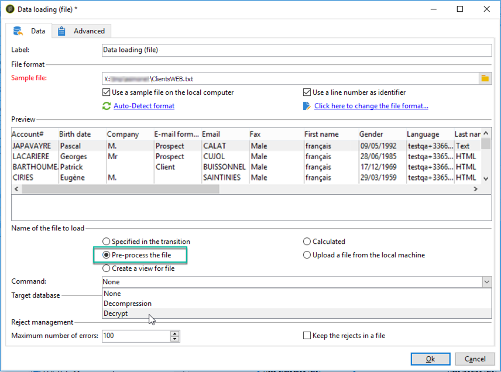

# 資料載入 (檔案){#data-loading-file}

## 使用 {#use}

的 **[!UICONTROL Data loading (File)]** 活動允許您直接訪問外部資料源並在Adobe Campaign使用它。 事實上，在Adobe Campaign資料庫中並不總能找到目標操作所需的所有資料：可以在外部檔案中使用。

要載入的檔案可以通過轉換指定或在執行此活動期間計算。 例如，它可以是客戶的10種最喜愛產品的清單，這些產品的採購在外部資料庫中進行管理。

在此活動的配置窗口的上部分，您可以定義檔案格式。 為此，請使用與要導入的檔案格式相同的示例檔案。 此檔案可以儲存在本地或伺服器上。

>[!CAUTION]
>
>僅支援「平面」結構檔案（如CSV、TXT等）。 不建議使用XML格式。

您可以定義在檔案導入期間要執行的預處理，例如，這樣不必在伺服器上解壓檔案（從而為解壓檔案節省空間），而是在檔案處理中包括解壓。 選擇 **[!UICONTROL Pre-process the file]** 的下一個選項： **[!UICONTROL None]**。 **[!UICONTROL Decompression]** (zcat)或 **[!UICONTROL Decrypt]** (gpg)

有關詳細資訊，請參閱本節：。

## 定義檔案格式 {#defining-the-file-format}

載入檔案時，會自動檢測列格式，並使用每種資料類型的預設參數。 您可以修改這些預設參數，以指定要套用至資料的特定程式，尤其是當有錯誤或空值時。

要執行此操作，請選擇 **[!UICONTROL Click here to change the file format...]** 在 **[!UICONTROL Data loading (file)]** 的子菜單。 隨後將開啟格式詳細資訊窗口。

然後，可以修改檔案的常規格式以及每列的格式。

常規檔案格式允許您定義列的識別方式（檔案編碼、使用的分隔符等）。

欄格式化可讓您定義每列的值處理：

* **[!UICONTROL Ignore column]**：不會在資料載入期間處理此欄。
* **[!UICONTROL Data type]**：指定每欄所需的資料類型。
* **[!UICONTROL Allow NULLs]**:指定如何管理空值。

   * **[!UICONTROL Adobe Campaign default]**：僅為數字欄位產生錯誤，否則插入 NULL 值。
   * **[!UICONTROL Empty value allowed]**：授權空值。因此插入值 NULL。
   * **[!UICONTROL Always populated]**：如果值為空，則產生錯誤。

* **[!UICONTROL Length]**:指定 **字串** 資料類型。
* **[!UICONTROL Format]**:定義時間和日期格式。
* **[!UICONTROL Data transformation]**:定義是否需要對 **字串**。

   * **[!UICONTROL None]**:未修改導入的字串。
   * **[!UICONTROL First letter in upper case]**:字串每個單詞的第一個字母以大寫開頭。
   * **[!UICONTROL Upper case]**:字串中的所有字元都大寫。
   * **[!UICONTROL Lower case]**:字串中的所有字元大小寫都較小。

* **[!UICONTROL White space management]**:指定是否需要在字串中忽略某些空格。 的 **[!UICONTROL Ignore spaces]** 值只允許忽略字串開頭和結尾的空格。
* **[!UICONTROL Error processings]**：會定義發生錯誤時的行為。

   * **[!UICONTROL Ignore the value]**：會忽略值。會在工作流程執行記錄檔中產生警告。
   * **[!UICONTROL Reject line]**：不會處理整行。
   * **[!UICONTROL Use a default value in case of error]**：以在　**[!UICONTROL Default value]**　欄位中定義的預設值取代造成錯誤的值。
   * **[!UICONTROL Reject the line when there is no remapping value]**:除非為錯誤值定義了映射，否則不處理整行(請參見 **[!UICONTROL Mapping]** 選項)。
   * **[!UICONTROL Use a default value in case the value is not remapped]**:用在 **[!UICONTROL Default value]** 欄位，除非已為錯誤值定義映射(請參見 **[!UICONTROL Mapping]** 選項)。

* **[!UICONTROL Default value]**：根據選取的錯誤處理指定預設值。
* **[!UICONTROL Mapping]**:此欄位僅在列詳細資訊配置中可用（通過按兩下或通過列清單右側的選項訪問）。 當導入某些值時，這將轉換這些值。 例如，您可將　&quot;three&quot;　轉換為　&quot;3&quot;。

## 示例：收集資料並將其載入到資料庫中 {#example--collecting-data-and-loading-it-in-the-database}

以下示例允許您每天在伺服器上收集檔案、載入其內容並根據包含的資訊更新資料庫中的資料。 要收集的檔案包含客戶的資訊，這些客戶可能已購買（價格在3000歐元以上）、要求退款或未購買任何物品就去商店。 根據此資訊，將將各種進程應用於資料庫中的其配置檔案。

1. 檔案收集器允許您根據給定的頻率恢復儲存在目錄中的檔案。

   的 **[!UICONTROL Directory]** 頁籤包含有關要恢復的檔案的資訊。 在本例中，將恢復所有文本格式的檔案，其名稱中包含「customers」一詞，並儲存在伺服器的tmp/Adobe/Data/files目錄中。

   使用 **[!UICONTROL File collector]** 在 [檔案收集器](file-collector.md) 的子菜單。

   

   的 **[!UICONTROL Schedule]** 頁籤，用於安排收集器的執行，即指定檢查這些檔案存在的頻率。

   在這裡，我們想在每個工作日的晚上9點觸發收集器。

   

   要執行此操作，請按一下 **[!UICONTROL Change...]** 的子菜單。

   有關此內容的詳細資訊，請參閱 [調度程式](scheduler.md)。

1. 然後配置資料載入（檔案）活動，以指示應如何讀取收集的檔案。 為此，請選擇與要載入的檔案具有相同結構的示例檔案。

   

   此處，檔案包含五列：

   * 第一列包含與事件相符的代碼：購買（多於或少於3000歐元），不購買或退款一次或多次購買。
   * 以下四列包含客戶端的名、姓、電子郵件和帳號。

   要載入的檔案的格式配置與在Adobe Campaign資料導入期間定義的格式配置一致。 有關此的詳細資訊，請參閱此。

1. 在拆分活動中，根據 **事件** 列值。

   「拆分」活動在一節中詳細介紹。

   

   對於每個子集，指定 **事件** 的雙曲餘切值。

   

   的 **[!UICONTROL Split]** 因此，活動將包含以下資訊：

   

1. 然後指定要針對每種類型的填充執行的進程。 在我們的例子中， **[!UICONTROL Update the data]** 的子菜單。 為此，請放置 **[!UICONTROL Update data]** 活動：每個從拆分活動出站轉移的結束。

   的 **[!UICONTROL Update data]** 活動在 [更新資料](update-data.md) 的子菜單。
