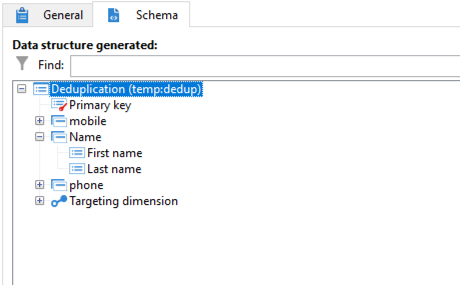

# 使用重複資料刪除活動的合併功能 {#deduplication-merge}

## 關於此使用實例 {#about-this-use-case}

此使用案例說明如何在&#x200B;**[!UICONTROL Deduplication]**&#x200B;活動中使用&#x200B;**[!UICONTROL Merge]**&#x200B;功能。

如需有關此功能的詳細資訊，請參閱[此章節](deduplication.md#merging-fields-into-single-record)。

**[!UICONTROL Deduplication]**&#x200B;活動用於從資料集中移除重複資料列。 在此使用案例中，根據「電子郵件」欄位會複製下列資料。

| 上次修改日期 | 名字 | 姓氏 | 電子郵件 | 行動電話 | 電話 |
|-----|------------|-----------|-------|--------------|------|
| 5/19/2020 | Robert | Tisner | bob@mycompany.com | 444-444-444 | 777-777-7777 |
| 7/22/2020 | Bobby | Tisner | bob@mycompany.com | | 777-777-7777 |
| 10/03/2020 | Bob |  | bob@mycompany.com | | 888-888-8888 |

透過重複資料刪除活動的&#x200B;**[!UICONTROL Merge]**&#x200B;功能，您可以設定重複資料刪除的一組規則，以定義要合併成單一結果資料記錄的一組欄位。 例如，如果有一組重複記錄，您可以選擇保留最舊的電話號碼或最新的名稱。

## 啟用合併功能 {#activating-merge}

若要啟用合併功能，您必須先設定&#x200B;**[!UICONTROL Deduplication]**&#x200B;活動。 要執行此操作，請依照下列步驟執行：

1. 開啟活動，然後按一下&#x200B;**[編輯組態]**&#x200B;連結。

1. 選取要用於重複資料刪除的調解欄位，然後按一下&#x200B;**[!UICONTROL Next]**。 在此範例中，我們要根據電子郵件欄位進行重複資料刪除。

   

1. 按一下&#x200B;**[!UICONTROL Advanced parameters]**&#x200B;連結，然後啟用&#x200B;**[!UICONTROL Merge records]**&#x200B;和&#x200B;**[!UICONTROL Use several record merging criteria]**&#x200B;選項。

   

1. **[!UICONTROL Merge]**&#x200B;索引標籤已新增到&#x200B;**[!UICONTROL Deduplication]**&#x200B;設定畫面。 我們將使用此索引標籤來指定執行重複資料刪除時要合併的資料。

## 設定要合併的欄位 {#configuring-rules}

以下是我們要用來將資料合併成單一記錄的規則：

* 保留最新名稱（名字和姓氏欄位），
* 保留最新的行動電話，
* 保留最舊的電話號碼，
* 群組中的所有欄位都必須非空值，才符合最終記錄的資格。

若要設定這些規則，請遵循下列步驟：

1. 開啟&#x200B;**[!UICONTROL Merge]**&#x200B;標籤，然後按一下&#x200B;**[!UICONTROL Add]**&#x200B;按鈕。

   

1. 指定要合併之欄位群組的識別碼和標籤。

   

1. 表示選取要考慮之記錄的條件。

   

1. 排序上次修改日期，以選取最近的名稱。

   

1. 選取要合併的欄位。 在此範例中，我們要保留名字和姓氏欄位。

   

1. 欄位會新增至要合併的資料集，而新元素會新增至工作流程結構描述。

   重複這些步驟來設定行動電話和電話欄位。

   

   

## 結果 {#results}

設定這些規則後，會在&#x200B;**[!UICONTROL Deduplication]**&#x200B;活動結束時收到下列資料。

| 修改日期 | 名字 | 姓氏 | 電子郵件 | 行動電話 | 電話 |
|-----|------------|-----------|-------|--------------|------|
| 5/19/2020 | Robert | Tisner | bob@mycompany.com | 444-444-444 | 777-777-7777 |
| 7/22/2020 | Bobby | Tisner | bob@mycompany.com | | 777-777-7777 |
| 10/03/2020 | Bob |  | bob@mycompany.com | | 888-888-8888 |

根據先前設定的規則，從三個記錄合併結果。 比較後，系統會使用最新名稱和行動電話，以及原始電話號碼。

| 名字 | 姓氏 | 電子郵件 | 行動電話 | 電話 |
|------------|-----------|-------|--------------|------|
| Bobby | Tisner | bob@mycompany.com | 444-444-4444 | 888-888-8888 |

>[!NOTE]
>
> 請注意，合併的名字是「Bobby」，因為我們設定了同時包含名字和姓氏欄位的「Name」規則。
>
>因此，「Bob」（最近的名字）無法列入考量，因為其相關聯的姓氏欄位為空白。 名字和姓氏的最新組合已合併到最終記錄中。
