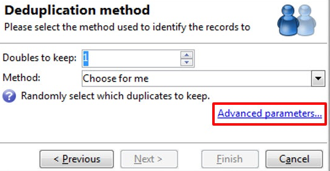

# 去重複化{#deduplication}

重複資料刪除來自入站活動結果的重複項目。 您可以在電子郵件地址、電話號碼或其他欄位上執行重複資料刪除。

此 **[!UICONTROL Deduplication]** 活動用於從資料集中移除重複列。 例如，以下記錄可能會視為重複，因為它們具有相同的電子郵件地址和相同的行動電話及/或家庭電話。

| 上次修改日期 | 名字 | 姓氏 | 電子郵件 | 行動電話 | 電話 |
-----|------------|-----------|-------|--------------|------
| 02/03/2020 | Bob | 蒂斯納 | bob@mycompany.com | 444-444-4444 | 888-888-8888 |
| 05/19/2020 | 羅伯特 | 蒂斯納 | bob@mycompany.com | 444-444-4444 | 777-777-7777 |
| 07/22/2020 | 鮑比 | 蒂斯納 | bob@mycompany.com | 444-444-4444 | 777-777-7777 |

此 **[!UICONTROL Deduplication]** 活動可在識別重複項目後，將整列保留為唯一記錄。 例如，在上述使用案例中，如果活動設定為僅保留具有最舊的記錄 **[!UICONTROL Date]**，結果會是：

| 日期 | 名字 | 姓氏 | 電子郵件 | 行動電話 | 電話 |
-----|----------|------------|-------|--------------|------
| 02/03/2020 | Bob | 蒂斯納 | bob@mycompany.com | 444-444-4444 | 888-888-8888 |

所選主記錄將繼續資料，而不將欄位資料與重複行中的其他相關資料合併。

補充:

| 日期 | 名字 | 姓氏 | 電子郵件 | 行動電話 | 電話 |
-----|------------|-----------|-------|--------------|------
| 05/19/2020 | 羅伯特 | 蒂斯納 | bob@mycompany.com | 444-444-4444 | 777-777-7777 |
| 07/22/2020 | 鮑比 | 蒂斯納 | bob@mycompany.com | 444-444-4444 | 777-777-7777 |

## 最佳實務 {#best-practices}

在重複資料刪除期間，會個別處理入站流程。 例如，如果在查詢1的結果和查詢2的結果中找到收件者A，則不會刪除其重複項目。

需要解決以下問題：

* 建立 **聯合** 活動，統一每個入站流量。
* 建立 **重複資料刪除** 活動之後 **聯合** 活動。

## 設定 {#configuration}

要配置重複資料刪除，請輸入其標籤、方法和重複資料刪除標準，以及與結果相關的選項。

1. 按一下 **[!UICONTROL Edit configuration...]** 連結以定義重複資料刪除模式。

   

1. 選取此活動的目標類型（預設情況下，重複資料刪除連結至收件者）和要使用的標準，即相同值可讓您識別重複項目的欄位。

   >[!NOTE]
   >
   >如果您使用外部資料作為輸入，例如從外部檔案，請務必選取 **[!UICONTROL Temporary schema]** 選項。
   >
   >在下一個步驟中， **[!UICONTROL Other]** 選項可讓您選取要使用的條件或條件：

   

1. 在下一個步驟中， **[!UICONTROL Other]** 選項可讓您選取相同值時要使用的條件或條件。

   

1. 從下拉式清單中，選取要使用的重複資料刪除方法，然後輸入要保留的重複項目數。

   

   可使用下列方法：

   * **[!UICONTROL Choose for me]**：隨機選取要保留在重複項目外的記錄。
   * **[!UICONTROL Following a list of values]**：可讓您定義一或多個欄位的值優先順序。若要定義值，請選取欄位或建立運算式，然後將值新增至適當的資料表中。若要定義新欄位，請按一下值清單上方的 **[!UICONTROL Add]** 按鈕。

      

   * **[!UICONTROL Non-empty value]**：您可以保留所選運算式的值不為空白的記錄作為優先順序。

      

   * **[!UICONTROL Using an expression]**:可讓您保留具有指定運算式最低（或最高）值的記錄。

      
   >[!NOTE]
   >
   >此 **[!UICONTROL Merge]** 功能，可透過 **[!UICONTROL Advanced parameters]** 連結，可讓您設定一組規則，以便將欄位或欄位群組合併成單一產生的資料記錄。 有關詳細資訊，請參閱 [將欄位合併為單一記錄](#merging-fields-into-single-record).

1. 按一下 **[!UICONTROL Finish]** 批准所選重複資料刪除方法。

   視窗的中段會總結定義的設定。

   在活動編輯器視窗的下方區段，您可以修改圖形物件之出站轉變的標籤，並輸入與活動結果相關聯的區段代碼。 此程式碼稍後可用作定位准則。

   

1. 檢查 **[!UICONTROL Generate complement]** 選項。 補充項包含所有重複項。 接著，會新增其他轉變至活動，如下所示：

   

## 範例：在傳送前識別重複項目 {#example--identify-the-duplicates-before-a-delivery}

在以下範例中，重複資料刪除涉及三個查詢的聯合。

工作流程的目的是透過排除重複項目來定義傳送的目標，以避免將重複項目多次傳送給相同的收件者。

標識的重複項還將整合到專用的重複項清單中，如有必要，可重複使用。

1. 新增並連結工作流程運作所需的各種活動，如上所示。

   此處的聯合活動用於將三個查詢「統一」為單一轉變。 因此，重複資料刪除不會單獨用於每個查詢，而是整個查詢。 有關此主題的詳細資訊，請參閱 [最佳實務](#best-practices).

1. 開啟重複資料刪除活動，然後按一下 **[!UICONTROL Edit configuration...]** 連結以定義重複資料刪除模式。
1. 在新視窗中，選取 **[!UICONTROL Database schema]**.
1. 選擇 **收件者** 作為目標維度和篩選維度。
1. 選取 **[!UICONTROL Email]** 重複項目，只傳送一次至每個電子郵件地址，然後按一下 **[!UICONTROL Next]**.

   如果您想要將重複ID設定在特定欄位上，請選取 **[!UICONTROL Other]** 以存取可用欄位清單。

1. 為多個收件者識別相同的電子郵件地址時，選擇僅保留一個項目。
1. 選取 **[!UICONTROL Choose for me]** 重複資料刪除模式，以便隨機選擇在發現重複項目時儲存的記錄，然後按一下 **[!UICONTROL Finish]**.

執行工作流程時，所有識別為重複項目的收件者都會從結果中排除（因此也會排除傳送），並新增至重複項目清單。 此清單可能會再次使用，而不必重新識別重複項目。

## 將欄位合併為單一資料記錄 {#merging-fields-into-single-record}

此 **[!UICONTROL Merge]** 功能可讓您為重複資料刪除設定一組規則，以定義要合併至單一結果資料記錄的欄位或欄位群組。

例如，使用一組重複記錄時，您可以選擇保留最舊的電話號碼或最新名稱。

善用此功能的使用案例可在 [本節](deduplication-merge.md).

要執行此操作，請依照下列步驟執行：

1. 在 **[!UICONTROL Deduplication method]** 選取步驟，按一下 **[!UICONTROL Advanced Parameters]** 連結。

   

1. 選取 **[!UICONTROL Merge records]** 選項來啟用功能。

   如果您想要在每個合併條件中將多個資料欄位分組，請啟動 **[!UICONTROL Use several record merging criteria]** 選項。

   

1. 啟用功能後， **[!UICONTROL Merge]** 標籤 **[!UICONTROL Deduplication]** 活動。 它可讓您定義要合併的欄位群組及其相關規則。

   如需詳細資訊，請參閱 [本節](deduplication-merge.md).

## 輸入參數 {#input-parameters}

* tableName
* 綱要

每個入站事件都必須指定由這些參數定義的目標。

## 輸出參數 {#output-parameters}

* tableName
* 綱要
* recCount

這組三個值可識別重複資料刪除後產生的目標。 **[!UICONTROL tableName]** 是保存目標標識符的表的名稱， **[!UICONTROL schema]** 是母體的綱要（通常為nms:recipient）和 **[!UICONTROL recCount]** 是表格中的元素數。

與補體相關聯的轉變具有相同的參數。
