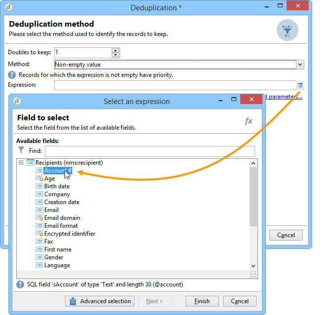

# 去重複化{#deduplication}

重複資料刪除會從入站活動的結果中刪除重複專案。 可在電子郵件地址、電話號碼或其他欄位上執行重複資料刪除。

**[!UICONTROL Deduplication]**&#x200B;活動用於從資料集中移除重複資料列。 例如，下列記錄可能會被視為重複，因為它們有相同的電子郵件地址和相同的行動和/或住家電話。

| 上次修改日期 | 名字 | 姓氏 | 電子郵件 | 行動電話 | 電話 |
-----|------------|-----------|-------|--------------|------
| 02/03/2020 | Bob | Tisner | bob@mycompany.com | 444-444-4444 | 888-888-8888 |
| 05/19/2020 | Robert | Tisner | bob@mycompany.com | 444-444-4444 | 777-777-7777 |
| 07/22/2020 | Bobby | Tisner | bob@mycompany.com | 444-444-4444 | 777-777-7777 |

**[!UICONTROL Deduplication]**&#x200B;活動可在識別重複專案後，保留整列作為唯一記錄。 例如，在上述使用案例中，如果活動設定為只保留具有最舊&#x200B;**[!UICONTROL Date]**&#x200B;的記錄，則結果會是：

| 日期 | 名字 | 姓氏 | 電子郵件 | 行動電話 | 電話 |
-----|----------|------------|-------|--------------|------
| 02/03/2020 | Bob | Tisner | bob@mycompany.com | 444-444-4444 | 888-888-8888 |

選取的主要記錄將結轉資料，不會將欄位資料與重複列中的其他相關資料進行任何合併。

補充：

| 日期 | 名字 | 姓氏 | 電子郵件 | 行動電話 | 電話 |
-----|------------|-----------|-------|--------------|------
| 05/19/2020 | Robert | Tisner | bob@mycompany.com | 444-444-4444 | 777-777-7777 |
| 07/22/2020 | Bobby | Tisner | bob@mycompany.com | 444-444-4444 | 777-777-7777 |

## 最佳實務 {#best-practices}

在重複資料刪除期間，會個別處理傳入資料流。 例如，如果在查詢1的結果中以及在查詢2的結果中找到收件者A，則不會進行重複資料刪除。

此問題需要透過以下方式解決：

* 建立&#x200B;**聯集**&#x200B;活動以統一每個傳入流量。
* 在&#x200B;**聯合**&#x200B;活動後建立&#x200B;**重複資料刪除**&#x200B;活動。

## 設定 {#configuration}

若要設定重複資料刪除，請輸入其標籤、方法和重複資料刪除條件，以及有關結果的選項。

1. 按一下&#x200B;**[!UICONTROL Edit configuration...]**&#x200B;連結以定義重複資料刪除模式。

   

1. 選取此活動的目標型別（預設情況下，重複資料刪除會連結至收件者）以及要使用的條件，即允許您識別重複專案的相同值欄位。

   >[!NOTE]
   >
   >如果您使用外部資料作為輸入（例如來自外部檔案），請務必選取&#x200B;**[!UICONTROL Temporary schema]**&#x200B;選項。
   >
   >在下一步中，**[!UICONTROL Other]**&#x200B;選項可讓您選取要使用的條件或條件：

   

1. 在下一步中，**[!UICONTROL Other]**&#x200B;選項可讓您選取在值相同的情況下要使用的准則或准則。

   

1. 從下拉式清單中，選取要使用的重複資料刪除方法，然後輸入要保留的重複專案數。

   

   可以使用下列方法：

   * **[!UICONTROL Choose for me]**：隨機選取要保留在重複項目外的記錄。
   * **[!UICONTROL Following a list of values]**：可讓您定義一或多個欄位的值優先順序。若要定義值，請選取欄位或建立運算式，然後將值新增至適當的資料表中。若要定義新欄位，請按一下值清單上方的 **[!UICONTROL Add]** 按鈕。

     

   * **[!UICONTROL Non-empty value]**：您可以保留所選運算式的值不為空白的記錄作為優先順序。

     

   * **[!UICONTROL Using an expression]**：可讓您保留具有指定運算式之最低（或最高）值的記錄。

     

   >[!NOTE]
   >
   >可透過&#x200B;**[!UICONTROL Advanced parameters]**&#x200B;連結存取的&#x200B;**[!UICONTROL Merge]**&#x200B;功能可讓您設定一組規則，以便將欄位或欄位群組合併為單一結果資料記錄。 如需詳細資訊，請參閱[將欄位合併為單一記錄](#merging-fields-into-single-record)。

1. 按一下&#x200B;**[!UICONTROL Finish]**&#x200B;以核准選取的重複資料刪除方法。

   視窗的中間區段會摘要列出定義的組態。

   在活動編輯器視窗的下半部，您可以修改圖形物件出站轉變的標籤，並輸入與活動結果相關聯的區段代碼。 此程式碼稍後可當作鎖定目標條件使用。

   

1. 如果要利用剩餘母體，請核取&#x200B;**[!UICONTROL Generate complement]**&#x200B;選項。 補充包含所有重複專案。 隨後會將其他轉變新增至活動，如下所示：

   

## 範例：在傳遞之前識別重複專案 {#example--identify-the-duplicates-before-a-delivery}

在以下範例中，重複資料刪除與三個查詢的聯合有關。

工作流程的目的是透過排除重複專案來定義傳遞的目標，以避免將其多次傳送給相同的收件者。

已識別的重複專案也會整合到專用的重複專案清單中，以便視需要重複使用。

1. 新增並連結工作流程運作所需的各種活動，如上所示。

   聯合活動是用來將三個查詢「統一」成一個單一轉變。 因此，重複資料刪除不適用於個別查詢，但適用於整個查詢。 如需此主題的詳細資訊，請參閱[最佳做法](#best-practices)。

1. 開啟重複資料刪除活動，然後按一下&#x200B;**[!UICONTROL Edit configuration...]**&#x200B;連結以定義重複資料刪除模式。
1. 在新視窗中，選取&#x200B;**[!UICONTROL Database schema]**。
1. 選取&#x200B;**收件者**&#x200B;作為定位和篩選維度。
1. 選取&#x200B;**[!UICONTROL Email]**&#x200B;重複專案的ID欄位，只將傳遞傳送給每個電子郵件地址一次，然後按一下&#x200B;**[!UICONTROL Next]**。

   如果您希望複製ID以特定欄位為基礎，請選取&#x200B;**[!UICONTROL Other]**&#x200B;以存取可用欄位清單。

1. 選擇時，在識別多個收件者的相同電子郵件地址時，只保留一個專案。
1. 選取&#x200B;**[!UICONTROL Choose for me]**&#x200B;重複資料刪除模式，以便隨機選擇在已識別重複專案情況下儲存的記錄，然後按一下&#x200B;**[!UICONTROL Finish]**。

執行工作流程時，會從結果（以及傳遞）中排除所有識別為重複的收件者，並將其新增至重複專案清單。 此清單可再次使用，而不需要重新識別重複專案。

## 將欄位合併到單一資料記錄中 {#merging-fields-into-single-record}

**[!UICONTROL Merge]**&#x200B;功能可讓您設定重複資料刪除的一組規則，以定義要合併成單一結果資料記錄的欄位或欄位群組。

例如，如果有一組重複記錄，您可以選擇保留最舊的電話號碼或最新的名稱。

在[此區段](deduplication-merge.md)中提供了運用此功能的使用案例。

要執行此操作，請依照下列步驟執行：

1. 在&#x200B;**[!UICONTROL Deduplication method]**&#x200B;選取步驟中，按一下&#x200B;**[!UICONTROL Advanced Parameters]**&#x200B;連結。

   

1. 選取&#x200B;**[!UICONTROL Merge records]**&#x200B;選項以啟動功能。

   若要在每個合併條件中將多個資料欄位分組，請啟動&#x200B;**[!UICONTROL Use several record merging criteria]**&#x200B;選項。

   

1. 啟動功能後，**[!UICONTROL Merge]**&#x200B;索引標籤會新增至&#x200B;**[!UICONTROL Deduplication]**&#x200B;活動。 它可讓您定義要合併的欄位群組及其相關規則。

   如需詳細資訊，請參閱[本節](deduplication-merge.md)中提供的專用使用案例。

## 輸入引數 {#input-parameters}

* tableName
* 結構描述

每個傳入事件都必須指定由這些引數定義的目標。

## 輸出引數 {#output-parameters}

* tableName
* 結構描述
* recCount

這組三個值可識別重複資料刪除所產生的目標。 **[!UICONTROL tableName]**&#x200B;是儲存目標識別碼的資料表名稱，**[!UICONTROL schema]**&#x200B;是母體的結構描述（通常是nms：recipient），而&#x200B;**[!UICONTROL recCount]**&#x200B;是資料表中的元素數目。

與補充關聯的轉變有相同的引數。
