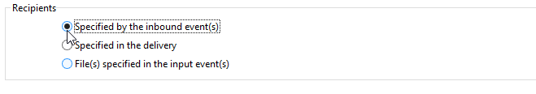
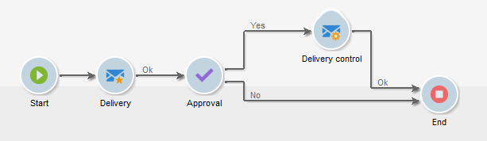

# 傳遞{#delivery}


A **傳遞**-type活動可讓您建立傳遞動作。 可使用輸入元素來建構。

若要設定，請編輯活動並輸入傳送選項。


1. **傳送**

   您可以：

   * 對入站轉變中指定的傳遞採取行動。 若要這麼做，請選取 **[!UICONTROL Delivery]** 區段。

     當先前的工作流程活動已建立或指定傳送時，可使用此選項。 如以下範例所示，這可以由產生出站轉變的相同型別的活動完成。

     在下列範例中，會首次建立傳送。 母體及內容將於稍後定義。 接著，系統會使用入站轉變，將這三個元素的資訊重新輸入新的傳送活動，以便傳送。

     

   * 直接選取相關的傳遞。 若要這麼做，請選取 **[!UICONTROL Explicit]** 選項，然後從 **[!UICONTROL Delivery]** 欄位。

     此清單顯示包含在 **傳遞** 資料夾（預設）。 若要存取其他行銷活動，請按一下 **[!UICONTROL Select link]** 圖示。

     

     從的下拉式清單中選取行銷活動 **[!UICONTROL Folder]** 欄位，或按一下 **[!UICONTROL Display sub-levels]** 若要顯示子資料夾中包含的所有傳送：

     

     選取傳遞動作後，您可以按一下 **[!UICONTROL Edit link]** 圖示。

   * 建立指令碼以計算傳遞。 若要這麼做，請選取 **[!UICONTROL Computed by a script]** 選項並輸入指令碼。 您可以按一下 **[!UICONTROL Edit...]** 選項。 以下範例會復原傳遞的識別碼：

     

   * 建立新傳遞。 若要這麼做，請選取 **[!UICONTROL New, created from a template]** 選項並選取傳遞所根據的傳遞範本。

     

     按一下 **[!UICONTROL Select link]** 圖示以瀏覽資料夾，然後按一下 **[!UICONTROL Edit link]** 圖示（如果您想要檢視所選範本的內容）。

1. **收件者**

   收件者可由傳入事件指定，例如在檔案匯入後，或在傳遞動作中指定。 它們也可以儲存在一個或多個檔案中。

   

1. **內容**

   訊息的內容可在傳遞或傳入事件中定義。

   

1. **要執行的動作**

   您可以建立傳遞、準備、開始、估計目標或傳送證明。

   

   選取要執行的動作型別：

   * **[!UICONTROL Save]**：此選項可讓您建立傳送並儲存。 它不會分析或傳遞。
   * **[!UICONTROL Estimate the target]**：此選項可讓您計算傳送目標，以評估其潛力（第一個分析階段）。 此動作等同於選取 **[!UICONTROL Estimate the population to be targeted]** 選項並按一下 **[!UICONTROL Analyze]** 透過將傳遞傳送到主要目標時 **傳遞**.
   * **[!UICONTROL Prepare]**：此選項可讓您執行完整分析程式（目標計算與內容準備）。 不會傳送傳遞。 此動作等同於選取 **[!UICONTROL Deliver as soon as possible]** 選項並按一下 **[!UICONTROL Analyze]** 使用將傳遞傳送至主要目標時 **傳遞**.
   * **[!UICONTROL Send a proof]**：此選項可讓您傳送傳遞的證明。 此動作等同於按一下 **[!UICONTROL Send a proof]** 傳遞工具列中的按鈕 **傳遞**
   * **[!UICONTROL Prepare and start]**：此選項會啟動完整分析程式（目標計算與內容準備）並傳送傳送。 此動作等同於按一下 **[!UICONTROL Deliver as soon as possible]**， **[!UICONTROL Analyze]**、和 **[!UICONTROL Confirm delivery]** 選項（當傳送傳遞至主要目標時） **傳遞**.

   此 **[!UICONTROL Act on a delivery]** 在工作流程中繼續使用的活動可讓您啟動啟動傳送所需的所有剩餘步驟（目標計算、內容準備、傳送）。 有關詳細資訊，請參閱 [傳遞控制](delivery-control.md).

   也可使用下列選項：

   * **[!UICONTROL Generate an outbound transition]**

     建立將在執行結束時啟用的出站轉變。 您可以選擇是否要擷取傳出傳遞的目標。

   * **[!UICONTROL Do not recover target]**

     不會復原傳出傳遞動作的目標。

   * **[!UICONTROL Processing errors]**

     請參閱 [傳遞控制](delivery-control.md).

   此 **指令碼** 索引標籤可讓您修改傳送引數。

   

## 範例：傳遞工作流程 {#example--delivery-workflow}

建立新工作流程並新增活動，如下圖所示：



開啟 **傳遞** 活動並定義屬性，如下所示：

* 在 **[!UICONTROL Delivery]** 區段，選取 **[!UICONTROL New, created from a template]** 並選取傳遞範本。
* 在 **[!UICONTROL Recipients]** 區段，選取 **[!UICONTROL Specified in the delivery]**.
* 在 **[!UICONTROL Action to execute]** 部分，保留 **[!UICONTROL Prepare]** 選項。


按一下 **[!UICONTROL OK]** 以關閉屬性視窗。 您剛剛設定了活動，包括根據將在其內指定目標的傳遞範本建立和準備新傳遞。

開啟 **核准** 活動並定義屬性，如下所示：

1. 在 **[!UICONTROL Assignment type]** 欄位中，選取您註冊的群組。 如果您是使用「管理員」帳戶連線，請選取「管理」群組。
1. 接下來，輸入標題，並在訊息本文中插入下列文字：

   ```
   Do you wish to approve delivery (<%= vars.recCount %> recipient(s))?
   ```

   此訊息包含以JavaScript撰寫的運算式： **[!UICONTROL vars.recCount]** 代表先前任務傳遞所定位的收件者人數。 如需JavaScript運算式的詳細資訊，請參閱 [JavaScript指令碼和範本](javascript-scripts-and-templates.md).

   

   核准任務的詳細資訊，請參見 [核准](approval.md).

## 輸入引數 {#input-parameters}

傳遞識別碼，如果 **[!UICONTROL Specified in the transition]** 選項已選取於 **[!UICONTROL Delivery]** 區段。

* deliveryId
* tableName
* 結構描述

每個傳入事件都必須指定由這些引數定義的目標。

>[!NOTE]
>
>此引數僅在 **[!UICONTROL Specified by inbound event(s)]** 選項已選取於 **[!UICONTROL Recipients]** 區段。

* 檔案名稱

  產生檔案的完整名稱，如果 **[!UICONTROL File(s) specified by inbound event(s)]** 選項已選取於 **[!UICONTROL Recipients]** 區段。

* contentId

  內容識別碼，如果 **[!UICONTROL Specified by inbound events]** 選項已選取於 **[!UICONTROL Content]** 區段。

## 輸出引數 {#output-parameters}

* tableName
* 結構描述
* recCount

這組三個值可識別傳送產生的目標。 **[!UICONTROL tableName]** 是記憶目標識別碼的表格名稱， **[!UICONTROL schema]** 是母體的綱要（通常是nms：recipient）和 **[!UICONTROL recCount]** 是表格中的元素數。

與補充關聯的轉變有相同的引數。

>[!NOTE]
>
>當URL為 **[!UICONTROL Do not recover target]** 已選取選項。
