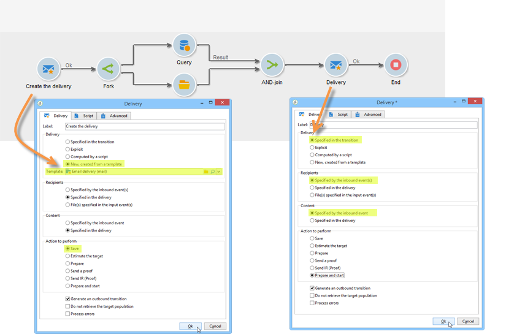
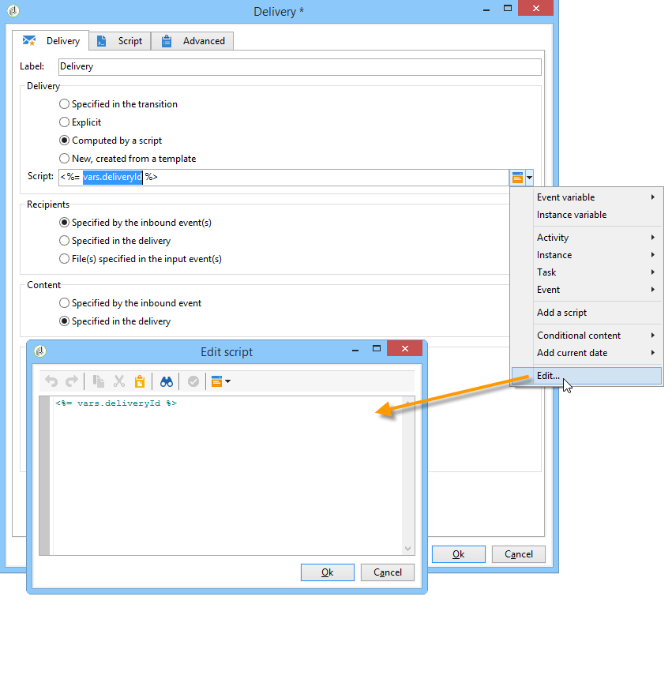

# 傳遞{#delivery}


A **傳送**-type活動可讓您建立傳送動作。 可使用輸入元素來建構。

若要設定，請編輯活動並輸入傳送選項。


1. **傳送**

   您可以：

   * 對入站轉變中指定的傳送採取行動。 若要這麼做，請選取 **[!UICONTROL Delivery]** 的下限。

      當先前的工作流程活動已建立或指定傳送時，可使用此選項。 如下列範例所示，同一類型的活動可能已產生出站轉變，因此可以執行此操作。

      在下列範例中，會首次建立傳送。 母體和內容稍後會定義。 接下來，會使用入站轉變，將這三個元素的資訊重新輸入到新的傳送活動中，以便傳送。

      

   * 直接選取相關的傳送。 若要這麼做，請選取 **[!UICONTROL Explicit]** 選項，然後從 **[!UICONTROL Delivery]** 欄位。

      清單會顯示 **傳遞** 檔案夾。 若要存取其他促銷活動，請按一下 **[!UICONTROL Select link]** 表徵圖。

      

      從 **[!UICONTROL Folder]** 欄位，或按一下 **[!UICONTROL Display sub-levels]** 若要顯示子資料夾中包含的所有傳送：

      

      選取傳送動作後，您可以按一下 **[!UICONTROL Edit link]** 表徵圖。

   * 建立指令碼以計算傳送。 若要這麼做，請選取 **[!UICONTROL Computed by a script]** 選項並輸入指令碼。 您可以按一下 **[!UICONTROL Edit...]** 選項。 下列範例會復原傳送的識別碼：

      

   * 建立新傳送。 若要這麼做，請選取 **[!UICONTROL New, created from a template]** 選項，並選取傳送將依據的傳送範本。

      

      按一下 **[!UICONTROL Select link]** 圖示來瀏覽資料夾，然後按一下 **[!UICONTROL Edit link]** 表徵圖。

1. **收件者**

   收件者可由傳入事件指定，例如在檔案匯入後指定，或在傳送動作中指定。 它們也可以儲存在一或多個檔案中。

   

1. **內容**

   您可以在傳送或入站事件中定義訊息的內容。

   

1. **要執行的動作**

   您可以建立傳遞、準備傳遞、啟動傳遞、預估目標或傳送校樣。

   

   選取要執行的動作類型：

   * **[!UICONTROL Save]**:此選項可讓您建立傳送並儲存。 它不會分析或傳送。
   * **[!UICONTROL Estimate the target]**:此選項可讓您計算傳送目標以評估其潛在（第一個分析階段）。 此動作等同於選取 **[!UICONTROL Estimate the population to be targeted]** 選項，按一下 **[!UICONTROL Analyze]** 透過將傳遞傳送至主要目標時 **傳送**.
   * **[!UICONTROL Prepare]**:此選項可讓您執行完整的分析程式（目標計算和內容準備）。 未傳送傳遞。 此動作等同於選取 **[!UICONTROL Deliver as soon as possible]** 選項，按一下 **[!UICONTROL Analyze]** 傳送傳遞至主要目標時， **傳送**.
   * **[!UICONTROL Send a proof]**:此選項可讓您傳送傳遞的校樣。 此動作等同於按一下 **[!UICONTROL Send a proof]** 按鈕(位於傳遞工具列的 **傳送**
   * **[!UICONTROL Prepare and start]**:此選項會啟動完整分析程式（目標計算和內容準備）並傳送傳遞。 此動作等同於按一下 **[!UICONTROL Deliver as soon as possible]**, **[!UICONTROL Analyze]**，和 **[!UICONTROL Confirm delivery]** 選項 **傳送**.

   此 **[!UICONTROL Act on a delivery]** 工作流程中進一步使用的活動可讓您啟動傳送（target計算、內容準備、傳送）所需的所有其餘步驟。 有關詳細資訊，請參閱 [傳遞控制](delivery-control.md).

   也提供下列選項：

   * **[!UICONTROL Generate an outbound transition]**

      建立將在執行結束時啟動的出站轉變。 您可以選擇是否擷取出站傳送的目標。

   * **[!UICONTROL Do not recover target]**

      無法恢復傳出傳送動作的目標。

   * **[!UICONTROL Processing errors]**

      請參閱 [傳遞控制](delivery-control.md).
   此 **指令碼** 索引標籤可讓您修改傳送參數。

   

## 範例：傳遞工作流程 {#example--delivery-workflow}

建立新工作流程並新增活動，如下圖所示：


開啟 **傳送** 活動並定義屬性，如下所示：

* 在 **[!UICONTROL Delivery]** 部分，選擇 **[!UICONTROL New, created from a template]** 和選取傳遞範本。
* 在 **[!UICONTROL Recipients]** 部分，選擇 **[!UICONTROL Specified in the delivery]**.
* 在 **[!UICONTROL Action to execute]** 區段，保留 **[!UICONTROL Prepare]** 選項。


按一下 **[!UICONTROL OK]** 以關閉屬性窗口。 您剛剛設定了活動，包括根據要在其中指定目標的傳送範本建立和準備新傳送。

開啟 **核准** 活動並定義屬性，如下所示：

1. 在 **[!UICONTROL Assignment type]** 欄位中，選擇要註冊的組。 如果您是使用「管理員」帳戶連線，請選取「管理」群組。
1. 接下來，輸入標題，並在訊息內文中插入下列文字：

   ```
   Do you wish to approve delivery (<%= vars.recCount %> recipient(s))?
   ```

   此訊息包含以JavaScript撰寫的運算式： **[!UICONTROL vars.recCount]** 代表上一任務傳送所定位的收件者人數。 如需JavaScript運算式的詳細資訊，請參閱 [JavaScript指令碼和範本](javascript-scripts-and-templates.md).

   

   「核准」任務在 [核准](approval.md).

## 輸入參數 {#input-parameters}

傳送識別碼(若 **[!UICONTROL Specified in the transition]** 選項 **[!UICONTROL Delivery]** 區段。

* deliveryId
* tableName
* 綱要

每個入站事件都必須指定由這些參數定義的目標。

>[!NOTE]
>
>只有在 **[!UICONTROL Specified by inbound event(s)]** 選項 **[!UICONTROL Recipients]** 區段。

* 檔案名

   若 **[!UICONTROL File(s) specified by inbound event(s)]** 選項 **[!UICONTROL Recipients]** 區段。

* contentId

   內容識別碼(若 **[!UICONTROL Specified by inbound events]** 選項 **[!UICONTROL Content]** 區段。

## 輸出參數 {#output-parameters}

* tableName
* 綱要
* recCount

這組三個值可識別傳送產生的目標。 **[!UICONTROL tableName]** 是儲存目標標識符的表的名稱， **[!UICONTROL schema]** 是母體的綱要（通常為nms:recipient）和 **[!UICONTROL recCount]** 是表格中的元素數。

與補體相關聯的轉變具有相同的參數。

>[!NOTE]
>
>若 **[!UICONTROL Do not recover target]** 選項。
