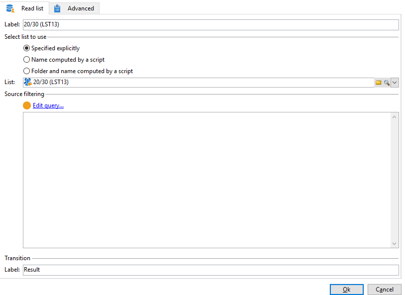

# 使用自訂日期欄位擴充電子郵件{#email-enrichment-with-custom-date-fields}


在此範例中，我們想傳送包含自訂資料欄位的電子郵件給將於本月慶祝生日的收件者。 電子郵件將包含優惠券，有效期限為生日前一週，生日後一週。

我們需要使用定位清單中將於本月慶祝生日的收件者 **[!UICONTROL Split]** 活動。 然後，使用 **[!UICONTROL Enrichment]** 活動，自訂資料欄位將在電子郵件中作為客戶特別優惠方案的有效日期。


若要建立此範例，請套用下列步驟：

1. 在 **[!UICONTROL Targeting and workflows]** 索引標籤中，拖放 **[!UICONTROL Read list]** 定位收件者清單的活動。
1. 要處理的清單可以明確指定、由指令碼計算或根據此處所選取的選項和定義的引數動態本地化。

   

1. 新增 **[!UICONTROL Split]** 此活動會將本月生日慶祝的收件者與其他收件者區分開來。
1. 若要分割您的清單，請在 **[!UICONTROL Filtering of selected records]** 類別，選取 **[!UICONTROL Add a filtering condition on the inbound population]**. 然後，按一下 **[!UICONTROL Edit]**.

   

1. 選取 **[!UICONTROL Filtering conditions]** 然後按一下 **[!UICONTROL Edit expression]** 按鈕來篩選收件者生日的月份。

   

1. 按一下 **[!UICONTROL Advanced Selection]** 則 **[!UICONTROL Edit the formula using an expression]** 並新增下列運算式： Month(@birthDate)。
1. 在 **[!UICONTROL Operator]** 欄，選取 **[!UICONTROL equal to]**.
1. 新增以下專案以進一步篩選條件： **[!UICONTROL Value]** 目前日期的月份： Month(GetDate())。

   這將查詢其生日月份對應到目前月份的收件者。

   

1. 按一下 **[!UICONTROL Finish]**。然後，在 **[!UICONTROL General]** 的標籤 **[!UICONTROL Split]** 活動，按一下 **[!UICONTROL Generate complement]** 在 **[!UICONTROL Results]** 類別。

   使用 **[!UICONTROL Complement]** 結果，您可以新增傳遞活動或更新清單。 在此，我們剛才新增了 **[!UICONTROL End]** 活動。

   

您現在需要設定您的 **[!UICONTROL Enrichment]** 活動：

1. 新增 **[!UICONTROL Enrichment]** 在子集後新增自訂日期欄位的活動。

   

1. 開啟您的 **[!UICONTROL Enrichment]** 活動。 在 **[!UICONTROL Complementary information]** 類別，按一下 **[!UICONTROL Add data]**.

   

1. 選取 **[!UICONTROL Data linked to the filtering dimension]** 則 **[!UICONTROL Data of the filtering dimension]**.
1. 按一下 **[!UICONTROL Add]** 按鈕。

   

1. 新增 **[!UICONTROL Label]**. 然後，在 **[!UICONTROL Expression]** 欄，按一下 **[!UICONTROL Edit expression]**.

   

1. 首先，我們需要將出生日期前一週作為 **有效性開始日期** 包含下列專案 **[!UICONTROL Expression]**： `SubDays([target/@birthDate], 7)`.

   

1. 然後，建立自訂日期欄位 **效度結束日期** （以生日後一週為目標），您需要新增 **[!UICONTROL Expression]**： `AddDays([target/@birthDate], 7)`.

   您可以將標籤新增至運算式。

   

1. 按一下 **[!UICONTROL Ok]**。您的擴充功能現已準備就緒。

在您的 **[!UICONTROL Enrichment]** 活動，您可以新增傳遞。 在此案例中，我們新增了電子郵件傳遞，以向收件者傳送包含有效日期的特殊優惠，給本月慶祝其生日的客戶。

1. 拖放 **[!UICONTROL Email delivery]** 活動之後 **[!UICONTROL Enrichment]** 活動。

   

1. 連按兩下 **[!UICONTROL Email delivery]** 活動，以開始個人化您的傳遞。
1. 新增 **[!UICONTROL Label]** 至您的傳遞，然後按一下 **[!UICONTROL Continue]**.
1. 按一下 **[!UICONTROL Save]** 以建立您的電子郵件傳遞。
1. 存回 **[!UICONTROL Approval]** 電子郵件傳遞的索引標籤 **[!UICONTROL Properties]** 該 **[!UICONTROL Confirm delivery before sending option]** 已勾選。

   然後，開始您的工作流程，以使用目標資訊擴充您的出站轉變。

   

您現在可以使用中建立的自訂日期欄位，開始設計電子郵件傳遞 **[!UICONTROL Enrichment]** 活動。

1. 連按兩下 **[!UICONTROL Email delivery]** 活動。
1. 將您的Target擴充功能新增至電子郵件。 它應位於以下運算式內，以便設定有效日期的格式：

   ```
   <%=
           formatDate(targetData.alias of your expression,"%2D.%2M")  %>
   ```

1. 按一下 。選取 **[!UICONTROL Target extension]** 然後使用先前建立的自訂有效日期 **[!UICONTROL Enrichment]** 活動，將您的擴充功能新增至formatDate運算式。

   

1. 視需要設定您的電子郵件內容。

   

1. 預覽電子郵件，檢查自訂日期欄位是否已正確設定

   

您的電子郵件現已準備就緒。 您可以開始傳送校樣並確認您的傳遞，以傳送生日電子郵件。
