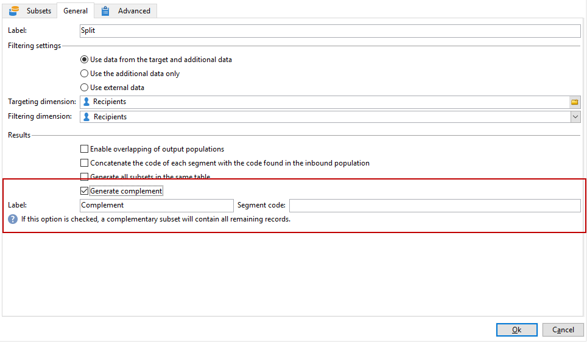

# 使用自訂日期欄位擴充電子郵件{#email-enrichment-with-custom-date-fields}


在此範例中，我們想傳送包含自訂資料欄位的電子郵件給將於本月慶祝生日的收件者。 電子郵件將包含優惠券，有效期限為生日前一週，生日後一週。

我們需要透過&#x200B;**[!UICONTROL Split]**&#x200B;活動鎖定本月將慶祝生日之清單中的收件者。 然後，使用&#x200B;**[!UICONTROL Enrichment]**&#x200B;活動，自訂資料欄位將在電子郵件中作為客戶特殊優惠的有效日期。


若要建立此範例，請套用下列步驟：

1. 在行銷活動的&#x200B;**[!UICONTROL Targeting and workflows]**&#x200B;標籤中，拖放&#x200B;**[!UICONTROL Read list]**&#x200B;活動以定位收件者清單。
1. 要處理的清單可以明確指定、由指令碼計算或根據此處所選取的選項和定義的引數動態本地化。

   

1. 新增&#x200B;**[!UICONTROL Split]**&#x200B;活動，將本月即將過生日的收件者與其他收件者區分開來。
1. 若要分割清單，請在&#x200B;**[!UICONTROL Filtering of selected records]**&#x200B;類別中選取&#x200B;**[!UICONTROL Add a filtering condition on the inbound population]**。 然後，按一下&#x200B;**[!UICONTROL Edit]**。

   

1. 選取「**[!UICONTROL Filtering conditions]**」，然後按一下「**[!UICONTROL Edit expression]**」按鈕，以篩選收件者生日的月份。

   

1. 按一下&#x200B;**[!UICONTROL Advanced Selection]**&#x200B;然後&#x200B;**[!UICONTROL Edit the formula using an expression]**&#x200B;並新增下列運算式： Month(@birthDate)。
1. 在&#x200B;**[!UICONTROL Operator]**&#x200B;欄中，選取&#x200B;**[!UICONTROL equal to]**。
1. 新增目前日期的&#x200B;**[!UICONTROL Value]**&#x200B;個月： Month(GetDate())，進一步篩選條件。

   這將查詢其生日月份對應到目前月份的收件者。

   

1. 按一下 **[!UICONTROL Finish]**。然後，在您&#x200B;**[!UICONTROL Split]**&#x200B;活動的&#x200B;**[!UICONTROL General]**&#x200B;索引標籤中，按一下&#x200B;**[!UICONTROL Results]**&#x200B;類別中的&#x200B;**[!UICONTROL Generate complement]**。

   有了該&#x200B;**[!UICONTROL Complement]**&#x200B;結果，您就可以新增傳遞活動或更新清單。 我們剛才已新增&#x200B;**[!UICONTROL End]**&#x200B;活動。

   

您現在需要設定您的&#x200B;**[!UICONTROL Enrichment]**&#x200B;活動：

1. 在子集之後新增&#x200B;**[!UICONTROL Enrichment]**&#x200B;活動，以新增自訂日期欄位。

   

1. 開啟您的&#x200B;**[!UICONTROL Enrichment]**&#x200B;活動。 在&#x200B;**[!UICONTROL Complementary information]**&#x200B;類別中，按一下&#x200B;**[!UICONTROL Add data]**。

   

1. 選取&#x200B;**[!UICONTROL Data linked to the filtering dimension]**，然後選取&#x200B;**[!UICONTROL Data of the filtering dimension]**。
1. 按一下 **[!UICONTROL Add]** 按鈕。

   

1. 新增&#x200B;**[!UICONTROL Label]**。 然後，在&#x200B;**[!UICONTROL Expression]**&#x200B;欄中按一下&#x200B;**[!UICONTROL Edit expression]**。

   

1. 首先，我們需要將出生日期前一週的目標設為&#x200B;**有效開始日期**，並附上下列&#x200B;**[!UICONTROL Expression]**： `SubDays([target/@birthDate], 7)`。

   

1. 然後，若要建立自訂日期欄位&#x200B;**效度結束日期** （目標為生日之後的那一週），您必須新增&#x200B;**[!UICONTROL Expression]**： `AddDays([target/@birthDate], 7)`。

   您可以將標籤新增至運算式。

   

1. 按一下 **[!UICONTROL Ok]**。您的擴充功能現已準備就緒。

在您的&#x200B;**[!UICONTROL Enrichment]**&#x200B;活動後，您可以新增傳遞。 在此案例中，我們新增了電子郵件傳遞，以向收件者傳送包含有效日期的特殊優惠，給本月慶祝其生日的客戶。

1. 在您的&#x200B;**[!UICONTROL Enrichment]**&#x200B;活動之後拖放&#x200B;**[!UICONTROL Email delivery]**&#x200B;活動。

   

1. 連按兩下您的&#x200B;**[!UICONTROL Email delivery]**&#x200B;活動，以開始個人化您的傳遞。
1. 新增&#x200B;**[!UICONTROL Label]**&#x200B;至您的傳遞，然後按一下&#x200B;**[!UICONTROL Continue]**。
1. 按一下&#x200B;**[!UICONTROL Save]**&#x200B;以建立您的電子郵件傳遞。
1. 在電子郵件傳遞&#x200B;**[!UICONTROL Properties]**&#x200B;的&#x200B;**[!UICONTROL Approval]**&#x200B;索引標籤中籤入&#x200B;**[!UICONTROL Confirm delivery before sending option]**&#x200B;是否已核取。

   然後，開始您的工作流程，以使用目標資訊擴充您的出站轉變。

   

您現在可以使用在&#x200B;**[!UICONTROL Enrichment]**&#x200B;活動中建立的自訂日期欄位，開始設計電子郵件傳遞。

1. 連按兩下您的&#x200B;**[!UICONTROL Email delivery]**&#x200B;活動。
1. 將您的Target擴充功能新增至電子郵件。 它應位於以下運算式內，以便設定有效日期的格式：

   ```
   <%=
           formatDate(targetData.alias of your expression,"%2D.%2M")  %>
   ```

1. 按一下 。選取&#x200B;**[!UICONTROL Target extension]**，然後選取先前以&#x200B;**[!UICONTROL Enrichment]**&#x200B;活動建立的自訂有效日期，以將您的擴充功能新增至formatDate運算式。

   

1. 視需要設定您的電子郵件內容。

   

1. 預覽電子郵件，檢查自訂日期欄位是否已正確設定

   

您的電子郵件現已準備就緒。 您可以開始傳送校樣並確認您的傳遞，以傳送生日電子郵件。
