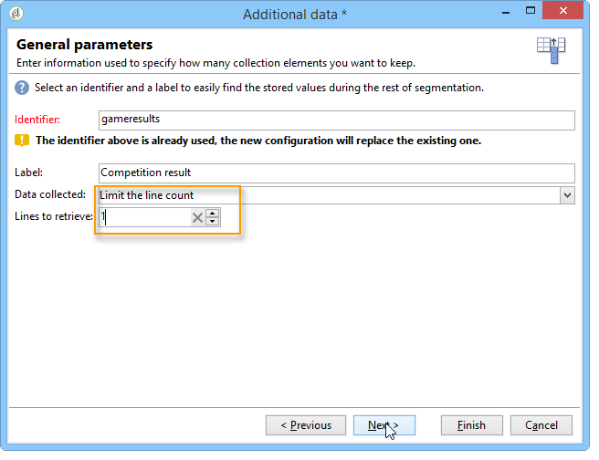

# 豐富資料{#enriching-data}

## 關於豐富資料 {#about-enriching-data}

此使用案例詳細說明目標工作流程中可能使用&#x200B;**[!UICONTROL Enrichment]**&#x200B;活動的方式。 如需使用&#x200B;**[!UICONTROL Enrichment]**&#x200B;活動的詳細資訊，請參閱： [擴充](enrichment.md)。

[本節](email-enrichment-with-custom-date-fields.md)中也有使用案例，說明如何透過自訂日期擴充電子郵件傳遞。

行銷資料庫中的聯絡人會透過網頁應用程式收到參加競爭的邀請。 將在&#x200B;**[!UICONTROL Competition results]**&#x200B;表格中復原競爭的結果。 此資料表已連結至連絡人資料表(**[!UICONTROL Recipients]**)。 **[!UICONTROL Competition results]**&#x200B;表格包含下列欄位：

* 競爭名稱(@game)
* 試用編號(@trial)
* 分數(@score)

在&#x200B;**[!UICONTROL Recipients]**&#x200B;資料表中找到的連絡人可以連結到&#x200B;**[!UICONTROL Competition results]**&#x200B;資料表中的數行。 這兩個資料表之間的關係為1-n型別。 以下是收件者的結果記錄檔範例：

此使用案例的目的在於根據參加最新競爭的人的最高得分，將個人化傳遞傳送給他們。 得分最高的收件者會獲得第一名，得分第二高的收件者會獲得安慰獎，而所有其他收件者都會收到訊息，祝他們下次好運。

為了設定此使用案例，我們已建立下列目標定位工作流程：

若要建立工作流程，請套用下列步驟：

1. 已將兩個&#x200B;**[!UICONTROL Query]**&#x200B;活動和一個&#x200B;**[!UICONTROL Intersection]**&#x200B;活動新增到目標新訂閱者，這些訂閱者最後進入競爭市場。
1. **[!UICONTROL Enrichment]**&#x200B;活動是用來新增儲存在&#x200B;**[!UICONTROL Competition results]**&#x200B;資料表中的資料。 將進行傳遞個人化的&#x200B;**[!UICONTROL Score]**&#x200B;欄位已新增至工作流程的工作表。
1. **[!UICONTROL Split]**&#x200B;型別活動用於根據分數建立收件者子集。
1. 針對每個子集新增&#x200B;**[!UICONTROL Delivery]**&#x200B;活動。

## 步驟1：鎖定目標 {#step-1--targeting}

第一個查詢是用來定位過去六個月內新增到資料庫的收件者。

第二個查詢用於定位參加上次競爭的收件者。

接著會新增&#x200B;**[!UICONTROL Intersection]**&#x200B;型別活動，以定位過去六個月內新增至資料庫以及進入上次競爭的收件者。

## 步驟2：擴充 {#step-2--enrichment}

在此範例中，瞭解如何根據儲存在&#x200B;**[!UICONTROL Competition results]**&#x200B;表格中的&#x200B;**[!UICONTROL Score]**&#x200B;欄位來個人化傳遞。 此表格與收件者表格有1-n型別的關係。 **[!UICONTROL Enrichment]**&#x200B;活動用於將連結至篩選維度的資料表中的資料新增至工作流程的工作表。

1. 在擴充活動的編輯畫面中，依序選取&#x200B;**[!UICONTROL Add data]**、**[!UICONTROL Data linked to the filtering dimension]**&#x200B;並按一下&#x200B;**[!UICONTROL Next]**。

   

1. 然後選取&#x200B;**[!UICONTROL Data linked to the filtering dimension]**&#x200B;選項、選取&#x200B;**[!UICONTROL Competition results]**&#x200B;資料表並按一下&#x200B;**[!UICONTROL Next]**。

   

1. 輸入ID和標籤，並在&#x200B;**[!UICONTROL Data collected]**&#x200B;欄位中選取&#x200B;**[!UICONTROL Limit the line count]**&#x200B;選項。 在&#x200B;**[!UICONTROL Lines to retrieve]**&#x200B;欄位中，選取&#39;1&#39;作為值。 擴充活動會針對每個收件者，從&#x200B;**[!UICONTROL Competition results]**&#x200B;表格新增單一明細行至工作流程的工作表。 按一下&#x200B;**[!UICONTROL Next]**。

   

1. 在此範例中，我們要復原收件者的最高分數，但僅針對最後的競爭。 若要這麼做，請將篩選器新增至「**[!UICONTROL Competition name]**」欄位，以排除與先前比賽相關的所有行。 按一下&#x200B;**[!UICONTROL Next]**。

   

1. 移至&#x200B;**[!UICONTROL Sort]**&#x200B;畫面並按一下&#x200B;**[!UICONTROL Add]**&#x200B;按鈕，選取&#x200B;**[!UICONTROL Score]**&#x200B;欄位並核取&#x200B;**[!UICONTROL descending]**&#x200B;欄位中的方塊，以遞減順序排序&#x200B;**[!UICONTROL Score]**&#x200B;欄位的專案。 對於每個收件者，擴充活動會新增符合上一個遊戲最高分數的行。 按一下&#x200B;**[!UICONTROL Next]**。

   

1. 在&#x200B;**[!UICONTROL Data to add]**&#x200B;視窗中，連按兩下&#x200B;**[!UICONTROL Score]**&#x200B;欄位。 對於每個收件者，擴充活動將僅新增&#x200B;**[!UICONTROL Score]**&#x200B;欄位。 按一下&#x200B;**[!UICONTROL Finish]**。

   

以滑鼠右鍵按一下擴充活動的入站轉變，並選取&#x200B;**[!UICONTROL Display the target]**。 工作表包含下列資料：

連結的結構描述是：

在擴充活動的出站轉變上續約此作業。 我們可以看到連結至收件者分數的資料已新增。 已復原每個收件者的最高分數。

也擴充了相符的結構描述。

## 步驟3：分割與傳送 {#step-3--split-and-delivery}

若要根據收件者的分數來排序收件者，擴充後會新增&#x200B;**[!UICONTROL Split]**&#x200B;活動。

1. 第一個（**獲勝者**）子集已定義為包含分數最高的收件者。 若要這麼做，請定義記錄數量的限制、對分數套用降序排序，並將記錄數量限製為1。

   

1. 第二個（**第二位**）子集包含得分第二高的收件者。 設定與第一個子集的設定相同。

   

1. 第三個（**損失者**）子集包含所有其他收件者。 前往&#x200B;**[!UICONTROL General]**&#x200B;索引標籤並勾選&#x200B;**[!UICONTROL Generate complement]**&#x200B;方塊，以鎖定未達到兩個最高分的所有收件者。

   

1. 為每個子集新增&#x200B;**[!UICONTROL Delivery]**&#x200B;型別活動，並為每個子集使用不同的傳遞範本。

   
