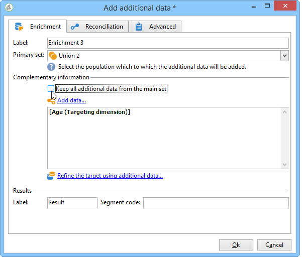

# 擴充{#enrichment}


此 **[!UICONTROL Enrichment]** 活動可讓您新增資訊至設定檔清單，以及新增現有表格的連結（建立新聯結）。 您也可以定義資料庫中設定檔的調解條件。


## 定義 {#definitions}

若要使用擴充活動，您必須熟悉新增資料時可用的各種選項。


此 **[!UICONTROL Data linked to the filtering dimension]** 選項可讓您存取：

* 篩選維度的資料：存取工作表資料
* 連結至篩選維度的資料：存取連結至工作表的資料


此 **[!UICONTROL A link]** 選項可讓您在資料庫的任何表格上建立聯結。


有四種型別的連結：

* **[!UICONTROL Define a collection]**：可讓您定義表格之間具有1-N基數的連結。
* **[!UICONTROL Define a link whose target is still available]**：可讓您定義表格之間具有1-1基數的連結。 連線條件必須由目標表格中的單一記錄定義。
* **[!UICONTROL Define a link whose target does not necessarily exist in the base]**：可讓您定義表格之間具有0-1基數的連結。 連線條件必須由0或1 （最大值）定義 記錄。

   此選項設定於 **[!UICONTROL Simple Join]** 索引標籤，此索引標籤可透過 **[!UICONTROL Edit additional data]** 的連結 **[!UICONTROL Enrichment]** 活動。

* **[!UICONTROL Define a link by searching for a reference among several options]**：此型別的連結會定義與唯一記錄的調解。 Adobe Campaign會在目標表格中新增外部索引鍵，以儲存唯一記錄的參考，藉此建立指向目標表格的連結。

   此選項設定於 **[!UICONTROL Reconciliation and deduplication]** 索引標籤，此索引標籤可透過 **[!UICONTROL Edit additional data]** 的連結 **[!UICONTROL Enrichment]** 活動。

詳細說明擴充活動在其內容中運作的使用案例，也可在以下章節中取得：

* [使用自訂日期欄位擴充電子郵件](email-enrichment-with-custom-date-fields.md).
* [豐富資料](enrich-data.md)
* [建立摘要清單](create-a-summary-list.md)

## 新增資訊 {#adding-information}

使用 **[!UICONTROL Enrichment]** 將欄新增至工作表的活動：此活動可作為查詢活動的補充。

有關其他欄的設定詳情，請參閱 [新增資料](query.md#adding-data).

此 **[!UICONTROL Primary set]** 欄位可讓您選取入站轉變：將擴充此活動工作表格的資料。

按一下 **[!UICONTROL Add data]** 連結並選取要新增的資料型別。 提供的資料型別清單取決於平台上安裝的模組和選項。 在最低限度設定中，您一律可以新增連結至篩選維度和連結的資料。


在以下範例中，外站轉變將會包含目標設定檔年齡的資訊而更加豐富。


以滑鼠右鍵按一下擴充活動的入站轉變，以在擴充階段之前檢視資料。


工作表包含下列資料與關聯的結構描述：


在擴充階段輸出中重複此作業。


您可以看到已新增與設定檔年齡相關的資料：


相符的結構描述也已更加豐富。

## 管理其他資料 {#managing-additional-data}

取消選取 **[!UICONTROL Keep all additional data from the main set]** 選項。 在此情況下，只有擴充活動中選取的其他欄會新增至外寄工作表格。 將不會儲存新增到上游活動的其他資訊。



擴充階段輸出的資料和結構描述如下：


## 建立連結 {#creating-a-link}

您可以使用擴充活動，在工作資料與Adobe Campaign資料庫之間建立連結：這將是入站資料之間工作流程的本機連結。

例如，如果您載入包含收件者帳號、國家/地區和電子郵件之檔案的資料，則必須建立指向國家/地區表格的連結，才能在其設定檔中更新此資訊。

若要這麼做，請套用下列步驟：

1. 收集並載入下列型別的檔案：

   ```
   Account number;Country;Email
   18D65;FRANCE;agnes@gmail.com
   243PP;RUSSIA;paul@gmail.com
   55H87;CROATIA;dave@gmail.com
   56U81;USA;susan@gmail.com
   853PI;ITALY;anna@gmail.com
   890LP;FRANCE;robert@gmail.com
   83TY2;SWITZERLAND;mike@gmail.com
   ```

1. 編輯擴充活動，然後按一下 **新增資料……** 連結以建立與「國家/地區」表格的聯結。

   

1. 選取 **[!UICONTROL Link definition]** 選項，然後按一下 **[!UICONTROL Next]** 按鈕。 指定要建立的連結型別。 在此範例中，我們想將檔案收件者的國家/地區與資料庫專用表格中可用國家/地區清單中的國家/地區進行調解。 選取 **[!UICONTROL Define a link by searching for a reference among several options]** 選項。選取國家/地區表格於 **[!UICONTROL Target schema]** 欄位。

   

1. 最後，選取欄位，讓您將來源檔案值連結至資料庫中的值。

   

在此擴充活動的輸出中，臨時結構描述將包含國家表格的連結：


## 資料協調 {#data-reconciliation}

擴充活動可用於設定資料協調，包括資料載入資料庫後。 在此案例中， **[!UICONTROL Reconciliation]** 索引標籤可讓您定義Adobe Campaign資料庫中的資料與工作表中的資料之間的連結。

選取 **[!UICONTROL Identify the targeting document based on work data]** 選項，指定您要建立連結的結構描述並定義加入條件：若要這麼做，請選取要在工作資料中協調的欄位(**[!UICONTROL Source expression]**)和目標維度(**[!UICONTROL Destination expression]**)。

您可以使用一或多個調解條件。


如果指定了數個連線條件，則必須全部驗證，才能將資料連結在一起。

## 插入優惠方案主張 {#inserting-an-offer-proposition}

擴充活動可讓您將優惠或連結新增至傳遞收件者的優惠方案。

如需擴充活動的詳細資訊，請參閱此 [區段](enrichment.md).

例如，您可以在傳遞前擴充收件者查詢的資料。


設定查詢後(請參閱此 [區段](query.md))：

1. 新增並開啟擴充活動。
1. 在 **[!UICONTROL Enrichment]** 索引標籤中，選取 **[!UICONTROL Add data]**。
1. 選取 **[!UICONTROL An offer proposition]** 在要新增的資料型別中。

   

1. 指定要新增之主張的識別碼和標籤。
1. 指定優惠方案選取範圍。 對此有兩種可能的選項：

   * **[!UICONTROL Search for the best offer in a category]**：核取此選項並指定優惠方案引擎呼叫引數（優惠方案空間、類別或主題、聯絡日期、要保留的優惠方案數量）。 引擎會自動根據這些引數計算要新增的選件。 建議您完成 **[!UICONTROL Category]** 或 **[!UICONTROL Theme]** 欄位，而非同時使用兩者。

      

   * **[!UICONTROL A predefined offer]**：核取此選項，並指定優惠方案空間、特定優惠方案和聯絡人日期，以直接設定您要新增的優惠方案，而不呼叫優惠方案引擎。

      

1. 然後設定與您所選管道對應的傳送活動。 請參閱 [跨頻道傳遞](cross-channel-deliveries.md).

   可供預覽的建議數量取決於擴充活動中執行的設定，而不是直接在傳送中執行的任何可能設定。

若要指定優惠方案主張，您也可以選擇參照優惠方案的連結。 如需詳細資訊，請參閱下節 [引用優惠方案的連結](#referencing-a-link-to-an-offer).

## 引用優惠方案的連結 {#referencing-a-link-to-an-offer}

您也可以參考擴充活動中優惠方案的連結。

操作步驟：

1. 選取 **[!UICONTROL Add data]** 在活動的 **[!UICONTROL Enrichment]** 標籤。
1. 在您選擇要新增的資料型別視窗中，選取 **[!UICONTROL A link]**.
1. 選取您要建立的連結型別及其目標。 在此情況下，目標是優惠方案結構。

   

1. 指定擴充活動（此處為收件者表格）中傳入表格資料與優惠方案表格之間的聯結。 例如，您可以將優惠代碼連結至收件者。

   

1. 然後設定與您所選管道對應的傳送活動。 請參閱 [跨頻道傳遞](cross-channel-deliveries.md).

   >[!NOTE]
   >
   >可供預覽的建議數量取決於傳送中執行的設定。

## 儲存優惠排名和權重 {#storing-offer-rankings-and-weights}

根據預設，當 **擴充** 活動用於傳遞優惠方案，其排名和權重不會儲存在主張表格中。

此 **[!UICONTROL Offer engine]** 活動預設會儲存此資訊。

不過，您可以依照以下方式儲存此資訊：

1. 在查詢之後和傳遞活動之前的擴充活動中，建立對優惠方案引擎的呼叫。
1. 在活動的主視窗中，選取 **[!UICONTROL Edit additional data...]**.

   

1. 新增 **[!UICONTROL @rank]** 排名和欄位 **[!UICONTROL @weight]** 優惠權重。

   

1. 確認新增並儲存工作流程。

傳遞會自動儲存優惠方案的排名和權重。 此資訊會顯示在傳送的 **[!UICONTROL Offers]** 標籤。
