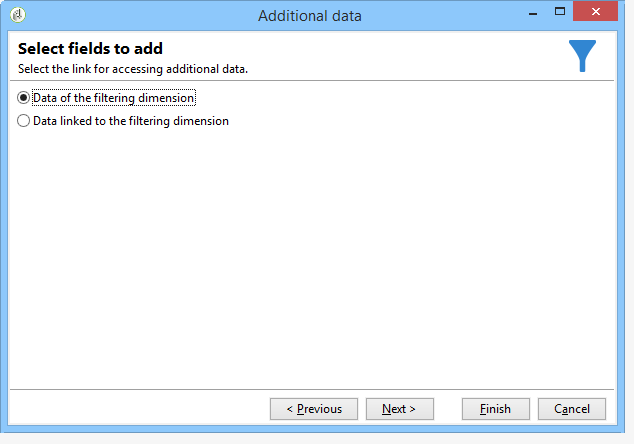

# 擴充{#enrichment}


**[!UICONTROL Enrichment]**&#x200B;活動可讓您新增資訊至設定檔清單，以及連結至現有表格（建立新聯結）。 您也可以定義資料庫中設定檔的調解條件。


## 定義 {#definitions}

若要使用擴充活動，您必須熟悉新增資料時可用的各種選項。


**[!UICONTROL Data linked to the filtering dimension]**&#x200B;選項可讓您存取：

* 篩選維度的資料：存取工作表資料
* 連結至篩選維度的資料：連結至工作表的資料存取權



**[!UICONTROL A link]**&#x200B;選項可讓您在資料庫的任何資料表上建立聯結。


有四種型別的連結：

* **[!UICONTROL Define a collection]**：可讓您定義表格之間具有1-N基數的連結。
* **[!UICONTROL Define a link whose target is still available]**：可讓您定義表格之間具有1-1基數的連結。 連線條件必須由目標表格中的單一記錄定義。
* **[!UICONTROL Define a link whose target does not necessarily exist in the base]**：可讓您定義表格之間具有0-1基數的連結。 連線條件必須由目標表格中的0或1 （最大）記錄定義。

  此選項設定於&#x200B;**[!UICONTROL Simple Join]**&#x200B;索引標籤中，可透過&#x200B;**[!UICONTROL Enrichment]**&#x200B;活動的&#x200B;**[!UICONTROL Edit additional data]**&#x200B;連結存取。

* **[!UICONTROL Define a link by searching for a reference among several options]**：此型別的連結會定義對唯一記錄的調解。 Adobe Campaign會在目標表格中新增外部索引鍵，以儲存唯一記錄的參考，藉此建立指向目標表格的連結。

  此選項設定於&#x200B;**[!UICONTROL Reconciliation and deduplication]**&#x200B;索引標籤中，可透過&#x200B;**[!UICONTROL Enrichment]**&#x200B;活動的&#x200B;**[!UICONTROL Edit additional data]**&#x200B;連結存取。

詳細說明擴充活動在其內容中運作的使用案例，也可在以下章節中取得：

* [包含自訂日期欄位的電子郵件擴充](email-enrichment-with-custom-date-fields.md)。
* [豐富資料](enrich-data.md)
* [建立摘要清單](create-a-summary-list.md)

## 新增資訊 {#adding-information}

使用&#x200B;**[!UICONTROL Enrichment]**&#x200B;活動將資料行新增至工作表：此活動可以當做查詢活動的補充。

[新增資料](query.md#adding-data)中詳細說明了其他資料行的設定。

**[!UICONTROL Primary set]**&#x200B;欄位可讓您選取入站轉變：此活動工作表格的資料將會擴充。

按一下&#x200B;**[!UICONTROL Add data]**&#x200B;連結，並選取要新增的資料型別。 提供的資料型別清單取決於平台上安裝的模組和選項。 在最低限度設定中，您可以一律新增連結至篩選維度和連結的資料。


在以下範例中，將會使用目標設定檔的年齡資訊來擴充出站轉變。


以滑鼠右鍵按一下擴充活動的入站轉變，以在擴充階段之前檢視資料。


工作表包含下列資料和相關聯的綱要：


在擴充階段輸出中重複此作業。


您可以看到已新增與設定檔年齡相關的資料：


也擴充了相符的結構描述。

## 管理其他資料 {#managing-additional-data}

如果您不想保留先前定義的其他資料，請取消選取&#x200B;**[!UICONTROL Keep all additional data from the main set]**&#x200B;選項。 在此情況下，只有擴充活動中選取的其他欄會新增至傳出工作表。 將不會儲存新增到上游活動中的其他資訊。


擴充階段輸出的資料和結構描述如下：


## 建立連結 {#creating-a-link}

您可以使用擴充活動，建立工作資料與Adobe Campaign資料庫之間的連結：這將是入站資料之間工作流程的本機連結。

例如，如果您載入包含收件者帳號、國家/地區和電子郵件之檔案的資料，則必須建立指向國家/地區表格的連結，才能更新其設定檔中的這項資訊。

若要這麼做，請套用下列步驟：

1. 收集並載入下列型別的檔案：

   ```
   Account number;Country;Email
   18D65;FRANCE;agnes@gmail.com
   243PP;RUSSIA;paul@gmail.com
   55H87;CROATIA;dave@gmail.com
   56U81;USA;susan@gmail.com
   853PI;ITALY;anna@gmail.com
   890LP;FRANCE;robert@gmail.com
   83TY2;SWITZERLAND;mike@gmail.com
   ```

1. 編輯擴充活動，然後按一下&#x200B;**新增資料……**&#x200B;連結，以建立與Country資料表的聯結。

   

1. 選取&#x200B;**[!UICONTROL Link definition]**&#x200B;選項並按一下&#x200B;**[!UICONTROL Next]**&#x200B;按鈕。 指定要建立的連結型別。 在此範例中，我們想將檔案收件者的國家/地區與資料庫專用表格中可用國家/地區清單中的國家/地區進行調解。 選擇&#x200B;**[!UICONTROL Define a link by searching for a reference among several options]**&#x200B;選項。 在&#x200B;**[!UICONTROL Target schema]**&#x200B;欄位中選取國家/地區表格。

   

1. 最後，選取欄位，讓您將來源檔案值連結至資料庫中的值。

   

在此擴充活動的輸出中，暫時綱要將包含國家表格的連結：


## 資料調和 {#data-reconciliation}

擴充活動可用於設定資料協調，包括資料載入資料庫之後。 在此情況下，**[!UICONTROL Reconciliation]**&#x200B;索引標籤可讓您定義Adobe Campaign資料庫中的資料與工作表中的資料之間的連結。

選取&#x200B;**[!UICONTROL Identify the targeting document based on work data]**&#x200B;選項，指定您要建立連結的結構描述並定義加入條件：若要這麼做，請在工作資料(**[!UICONTROL Source expression]**)和目標維度(**[!UICONTROL Destination expression]**)中選取要調解的欄位。

您可以使用一個或多個調和標準。


如果指定了多個連線條件，則必須全部驗證這些條件，才能將資料連結在一起。

## 插入優惠方案主張 {#inserting-an-offer-proposition}

擴充活動可讓您將優惠或連結新增至傳遞收件者的優惠。

如需擴充活動的詳細資訊，請參閱此[區段](enrichment.md)。

例如，您可以在傳遞前擴充收件者查詢的資料。


設定查詢之後（請參閱此[區段](query.md)）：

1. 新增並開啟擴充活動。
1. 在&#x200B;**[!UICONTROL Enrichment]**&#x200B;索引標籤中，選取&#x200B;**[!UICONTROL Add data]**。
1. 在要新增的資料型別中選取&#x200B;**[!UICONTROL An offer proposition]**。

   

1. 指定要新增之主張的識別碼和標籤。
1. 指定優惠方案選取專案。 對此有兩種可能的選項：

   * **[!UICONTROL Search for the best offer in a category]**：核取此選項，並指定優惠方案引擎呼叫引數（優惠方案空間、類別或主題、聯絡日期、要保留的優惠方案數目）。 引擎將根據這些引數自動計算要新增的選件。 我們建議完成&#x200B;**[!UICONTROL Category]**&#x200B;或&#x200B;**[!UICONTROL Theme]**&#x200B;欄位，而不是同時完成兩者。

     

   * **[!UICONTROL A predefined offer]**：核取此選項，並指定優惠方案空間、特定優惠方案和連絡日期，以直接設定您要新增的優惠方案，而不呼叫優惠方案引擎。

     

1. 然後，設定與您所選管道對應的傳送活動。 請參閱[跨通道傳遞](cross-channel-deliveries.md)。

   可供預覽的建議數量取決於擴充活動中執行的設定，而非直接在傳送中執行的任何可能設定。

若要指定優惠方案主張，您也可以選擇參照優惠方案的連結。 如需詳細資訊，請參閱下節[參考優惠方案](#referencing-a-link-to-an-offer)的連結。

## 參照優惠方案的連結 {#referencing-a-link-to-an-offer}

您也可以在擴充活動中參考優惠方案的連結。

操作步驟：

1. 在活動的&#x200B;**[!UICONTROL Enrichment]**&#x200B;索引標籤中選取&#x200B;**[!UICONTROL Add data]**。
1. 在您選擇要新增的資料型別視窗中，選取&#x200B;**[!UICONTROL A link]**。
1. 選取您要建立的連結型別及其目標。 在此案例中，目標是選件結構描述。

   

1. 指定擴充活動（此處為收件者表格）中傳入表格資料與優惠方案表格之間的聯結。 例如，您可以將優惠代碼連結至收件者。

   

1. 然後，設定與您所選管道對應的傳送活動。 請參閱[跨通道傳遞](cross-channel-deliveries.md)。

   >[!NOTE]
   >
   >可供預覽的建議數量取決於傳遞中執行的設定。

## 儲存優惠排名和權重 {#storing-offer-rankings-and-weights}

根據預設，使用&#x200B;**擴充**&#x200B;活動傳遞優惠時，其排名和權重不會儲存在主張表格中。

**[!UICONTROL Offer engine]**&#x200B;活動預設會儲存此資訊。

不過，您可以依照以下方式儲存此資訊：

1. 在查詢之後及傳遞活動之前的擴充活動中，建立對優惠方案引擎的呼叫。
1. 在活動的主視窗中，選取&#x200B;**[!UICONTROL Edit additional data...]**。

   

1. 新增排名的&#x200B;**[!UICONTROL @rank]**&#x200B;欄以及優惠權重的&#x200B;**[!UICONTROL @weight]**。

   

1. 確認新增並儲存工作流程。

傳遞會自動儲存優惠方案的排名和權重。 此資訊會顯示在傳遞的&#x200B;**[!UICONTROL Offers]**&#x200B;標籤中。
