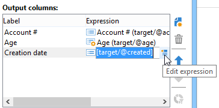

# 資料擷取 (檔案){#extraction-file}

您可以使用&#x200B;**[!UICONTROL Data extraction (file)]**&#x200B;活動，從外部檔案中的工作流程表格擷取資料。

>[!CAUTION]
>
>此活動必須一律具有包含要擷取之資料的入站轉變。

若要設定資料擷取，請套用下列步驟：

1. 指定輸出檔案的名稱：此名稱可包含變數，可透過欄位右側的個人化按鈕插入。
1. 按一下&#x200B;**[!UICONTROL Edit the file format...]**&#x200B;以選取要擷取的資料。

   

   **[!UICONTROL Handle groupings (GROUP BY + HAVING)]**&#x200B;選項新增了額外的步驟來篩選彙總的最終結果，例如，針對指定的採購單型別、已訂購10次以上的客戶等。

1. 如有必要，您可以將新欄新增至輸出檔案，例如計算或處理結果。 若要這麼做，請按一下&#x200B;**[!UICONTROL Add]**&#x200B;圖示。

   

   在其他行中，按一下&#x200B;**[!UICONTROL Edit expression]**&#x200B;圖示以定義新欄的內容。

   

   然後，您將會存取選取視窗。 按一下&#x200B;**[!UICONTROL Advanced selection]**&#x200B;選擇要套用至資料的程式。

   

   從清單中選擇所需的公式。

   

您可以定義在資料擷取期間執行的後程式，以便您壓縮或加密檔案。 若要這麼做，必須在活動的&#x200B;**[!UICONTROL Script]**&#x200B;索引標籤中新增所需的命令。

## 彙總函式清單 {#list-of-aggregate-functions}

以下是可用的彙總函式清單：

* **[!UICONTROL Count]**&#x200B;以計算要彙總之欄位的所有非null值，包括（彙總欄位）的重複值。

  **[!UICONTROL Distinct]**&#x200B;以計算要彙總之欄位中不同和非null值的總數（計算之前會排除重複值），

* **[!UICONTROL Sum]**&#x200B;計算數值欄位值的總和，
* **[!UICONTROL Minimum value]**&#x200B;計算欄位的最小值（數字或其他），
* **[!UICONTROL Maximum value]**&#x200B;以計算欄位的最大值（數值或其他），
* **[!UICONTROL Average]**&#x200B;以計算數值欄位值的平均值。
