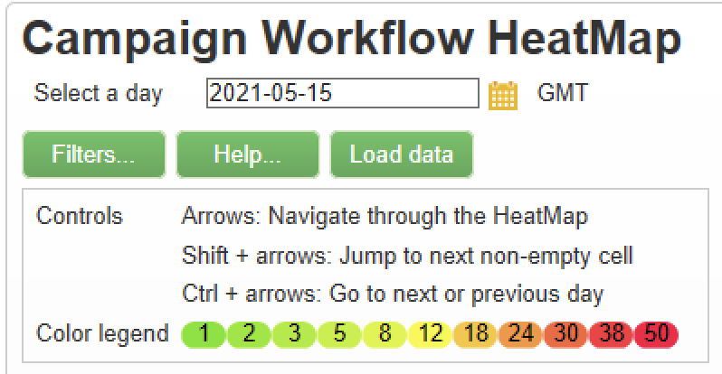
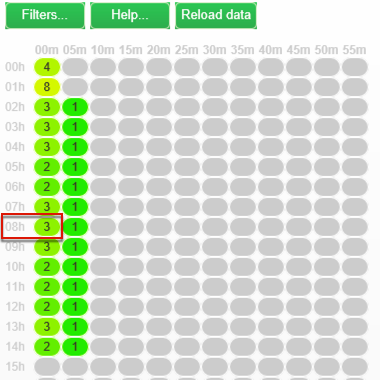
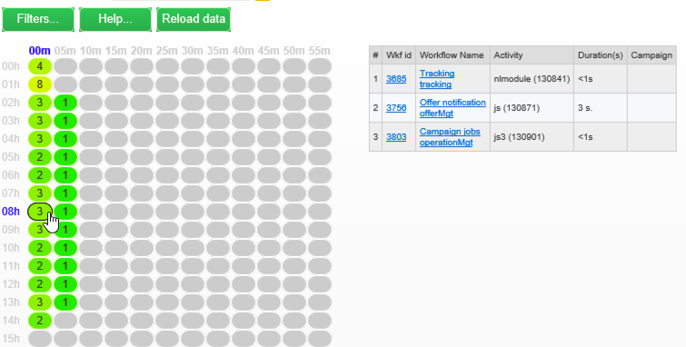

# 工作流程熱度圖 {#workflow-heatmap}

市場活動工作流熱圖包含當前正在運行的所有工作流的顏色編碼圖形表示。 它僅可用於 **市場活動管理員**。

在中發現監控市場活動流程的其他方法。

## 工作流熱圖入門 {#about-the-workflow-heatmap}

通過快速概述併發工作流的數量，工作流熱圖使Adobe Campaign平台管理員能夠監控實例上的負載並相應地規劃工作流。

更準確地說，它幫助平台管理員：

* 檢視並瞭解並行的工作流程
* 依期間篩選工作流程，以查看哪些工作流程可能遇到問題
* 按持續時間篩選活動，以查看哪些活動可能遇到問題
* 輕易尋找個別的工作流程及所有的相關活動 (包括其持續時間)
* 按工作流類型篩選： [技術工作流](technical-workflows.md) 或 [活動工作流](campaign-workflows.md)
* 尋找特定工作流程並加以分析

>[!NOTE]
>
>除 **工作流熱圖**，您可以建立一個工作流，該工作流將允許您監視一組工作流的狀態，並向主管發送定期消息。 有關詳細資訊，請參閱 [專用段](workflow-supervision.md)。

使用工作流熱度圖需要對以下概念有很好的理解： [工作流](about-workflows.md)。 [活動](activities.md) 和 [工作流最佳實踐](workflow-best-practices.md)。

## 自定義工作流熱圖 {#using-the-heatmap}

>[!NOTE]
>
>如果工作流熱圖中未顯示任何資料，請按一下 **[!UICONTROL Load data]** 按鈕

1. 轉到 **[!UICONTROL Monitoring]** 並按一下 **[!UICONTROL Workflow HeatMap]** 連結以顯示 **[!UICONTROL Campaign Workflow HeatMap]** 的子菜單。

   

1. 按一下日曆以選擇日。

   預設情況下，該頁顯示當天的工作流活動。 您可以更改它並選擇過去的任何一天。

   >[!NOTE]
   >
   >僅**未刪除的工作流。\
   >預設情況下，工作流熱度映射時區是為當前管理員用戶定義的時區。 例如，如果您與您正在使用的市場營銷用戶不在同一區域，則可能需要更改它。

1. 按一下 **[!UICONTROL Filters]** 按鈕。

   

1. 使用滑塊將最短持續時間從0秒設定為1小時。 這使您能夠僅搜索運行超過特定秒或分鐘的工作流。

   

1. 您還可以從 **[!UICONTROL Workflows]** 的子菜單。

   

   >[!NOTE]
   >
   >的 **[!UICONTROL Min duration]** 將應用篩選器。 如果找不到特定的工作流，請將最短持續時間重置為0，以便所有工作流都顯示在清單中。

1. 也可以在 **[!UICONTROL Workflow type]** :

   * **[!UICONTROL Technical]** :僅 [內置技術工作流](technical-workflows.md) 和 [資料管理工作流](targeting-workflows.md#data-management) 的上界。
   * **[!UICONTROL Marketing]** :僅連結到市場營銷活動的工作流，稱為 [活動工作流](campaign-workflows.md)，也請參見Wiki頁。

1. 要按名稱搜索特定工作流，還可以使用 **[!UICONTROL Workflow name filter]** 的子菜單。

1. 如果您在其間編輯了一些工作流，請按一下 **[!UICONTROL Reload data]** 按鈕，將選定控制項在Tab鍵次序中下移一個位置。

## 解釋工作流熱圖 {#reading-the-heatmap}

「活動工作流熱度圖」是一個自然可讀的網格，從左上到右下，允許查找具有綠色到紅色顏色編碼範圍的「熱區」。

* 較深的紅色單元格對應於大量工作流同時運行的時段。
* 灰色單元格對應於沒有運行工作流的期間。

要瞭解如何應用顏色代碼以及如何導航熱度圖，請按一下 **[!UICONTROL Help]** 按鈕

每行代表一天的一小時，每個單元格代表該小時的5分鐘。

網格顯示這些5分鐘時段中每個時段同時運行的所有工作流。

在下面的示例中，在上午8點到上午8點05分之間，三個工作流正在運行（不管它們各自的持續時間如何）:

1. 按一下彩色單元格以顯示在此期間運行的所有併發工作流的詳細資訊。

   

   對於每個工作流，都會列出它包含的所有活動及其持續時間。

1. 按一下工作流ID或名稱直接開啟工作流。
1. 返回到 **[!UICONTROL Campaign Workflow HeatMap]** 的 **[!UICONTROL Home]** 按鈕

## 使用案例：使用熱度圖執行操作 {#use-cases--using-the-heatmap-to-take-actions}

有兩種主要情況可使「活動工作流熱度圖」有用。

### 減少併發工作流數 {#reducing-the-number-of-concurrent-workflows}

作為市場活動管理員，工作流熱度圖可以幫助您瞭解實例上的負載，並在適當的時間規劃現有或新的工作流。

1. 從 **[!UICONTROL Campaign Workflow HeatMap]** 的 **[!UICONTROL Filters]** 按鈕
1. 將持續時間設定為幾秒鐘或幾分鐘。
1. 通過增加持續時間篩選器排除不重要的最短工作流。

   

1. 瀏覽結果以瞭解實例上的負載並採取相應操作：

   * 如果遇到效能問題，並且網格中顯示了一個或多個紅色單元格，請考慮更改多個工作流的啟動時間。 請市場營銷用戶手動將工作流從繁忙（「熱」）時段移動到更多可用時段。 這應該能夠維持一天中的穩定活動水準。
   * 要避免出現峰值並防止實例超載，請在規劃新工作流之前查看「熱度圖」並選擇最佳時間。 考慮網格中與灰色或綠色單元格對應的時隙以啟動新工作流。

### 查找影響效能的長時間運行的工作流 {#finding-long-running-workflows-that-impact-performance}

作為市場活動管理員，工作流熱度圖可幫助您查找可以減慢活動的最長工作流。

1. 從 **[!UICONTROL Campaign Workflow HeatMap]** 的 **[!UICONTROL Filters]** 按鈕
1. 將持續時間設定為1小時。

   

1. 通過減少 **[!UICONTROL Min duration]** 的子菜單。
1. 瀏覽結果以查找最長的工作流，這些工作流可能會對伺服器和資料庫資源（CPU、RAM、網路、IOPS等）產生更大影響。
1. 採取適當的操作：

   * 建議市場營銷用戶拆分最長的工作流以減少處理時間。
   * 開始對特定工作流和特定活動（如JavaScript、導入、導出等）進行更深入的分析，以便隔離問題並更輕鬆地解決它們。

## 使用HeatMap改進工作流規劃 {#example--using-the-heatmap-to-improve-workflow-planning}

以下示例說明了在使用Adobe Campaign工作流熱圖時如何提高計畫的效率和效能。

在這種情況下，許多用戶都在抱怨工作流效能。 您需要檢查哪些因素降低了活動速度以及如何解決問題。

1. 轉到 **[!UICONTROL Monitoring]** 並按一下 **[!UICONTROL Workflows]** 連結以顯示 **[!UICONTROL Campaign Workflow HeatMap]** 的子菜單。
1. 設定 **[!UICONTROL Min duration]** 過濾到5分鐘。
1. 設定 **[!UICONTROL Workflow type]** 篩選 **[!UICONTROL Marketing]** 。
1. 從「熱度圖」網格中，觀察以下內容：

   

   * 50個長時間（超過5分鐘）的促銷工作流在上午10點運行。
   * 其中大多數具有掛起狀態（預設情況下，併發限制設定為20）。
   * 需要每天手動重新啟動掛起的工作流。
   * 效能低。

1. 不再有50個工作流從上午10點開始，而是將工作流的開始時間平均分佈到一天的其餘時間。
1. 返回 **[!UICONTROL Campaign Workflow HeatMap]** 的 **[!UICONTROL Reload data]** 按鈕
1. 現在，請注意以下事項：

   

   * 上午10時，只有18個長期活動工作流仍在運行。
   * 沒有其他工作流處於掛起狀態（併發限制仍設定為20）。
   * 工作流開始時間在一天中均勻分佈。
   * 不再有用戶抱怨效能問題。
