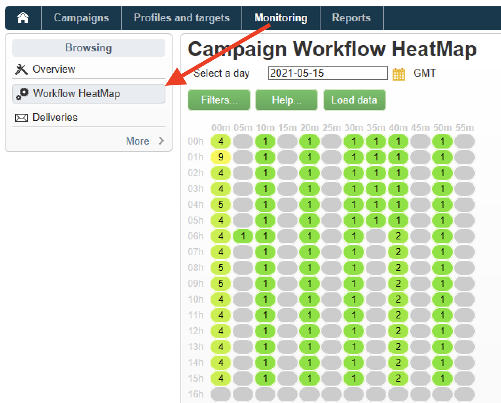

# 工作流程熱度圖 {#workflow-heatmap}

Campaign Workflow HeatMap以顏色編碼的圖形呈現方式包含目前執行的所有工作流程。 它僅適用於 **Campaign管理員**.

## 開始使用工作流程熱度圖 {#about-the-workflow-heatmap}

「工作流程熱度圖」提供並行工作流程數目的快速概覽，讓Adobe Campaign平台管理員可監控執行個體的負載，並據此規劃工作流程。

更準確地說，這可協助平台管理員：

* 檢視並瞭解並行的工作流程
* 依期間篩選工作流程，以查看哪些工作流程可能遇到問題
* 依持續時間篩選活動，以檢視哪些活動可能會遇到問題
* 輕易尋找個別的工作流程及所有的相關活動 (包括其持續時間)
* 依工作流程型別篩選： [技術工作流程](technical-workflows.md) 或 [行銷活動工作流程](campaign-workflows.md)
* 尋找特定工作流程並加以分析

>[!NOTE]
>
>除了 **工作流程熱度圖**，您可以建立工作流程來監控一組工作流程的狀態，並傳送週期性訊息給主管。 如需詳細資訊，請參閱 [專用區段](workflow-supervision.md).

使用Workflow HeatMap需要充分瞭解以下概念： [工作流程](about-workflows.md)， [活動](activities.md) 和 [工作流程最佳實務](workflow-best-practices.md).

## 自訂工作流程熱度圖 {#using-the-heatmap}

>[!NOTE]
>
>如果「工作流程熱度圖」中未顯示任何資料，請按一下 **[!UICONTROL Load data]** 按鈕。

1. 前往 **[!UICONTROL Monitoring]** 並按一下 **[!UICONTROL Workflow HeatMap]** 連結以顯示 **[!UICONTROL Campaign Workflow HeatMap]** 頁面。

   

1. 按一下行事曆以選取日期。

   依預設，頁面會顯示當天的工作流程活動。 您可以加以變更，並選取過去的任何一天。

   >[!NOTE]
   > 
   >依預設，工作流程熱度圖時區是為目前管理員使用者定義的時區。 例如，如果您與正在使用的行銷使用者不在同一區域，您可能會想要變更此區域。

1. 按一下 **[!UICONTROL Filters]** 按鈕。

   

1. 使用滑桿來設定從0秒到1小時的最短持續時間。 這可讓您僅搜尋執行時間超過特定秒數或分鐘數的工作流程。

   

1. 您也可以從以下選擇特定的工作流程： **[!UICONTROL Workflows]** 下拉式清單。

   

   >[!NOTE]
   >
   >此 **[!UICONTROL Min duration]** 已套用篩選器。 如果找不到特定工作流程，請將最短持續期間重設為0，以便所有工作流程都顯示在清單中。

1. 您也可以篩選 **[!UICONTROL Workflow type]** ：

   * **[!UICONTROL Technical]** ：僅限 [內建技術工作流程](technical-workflows.md) 和 [資料管理工作流程](targeting-workflows.md#data-management) 都會顯示。
   * **[!UICONTROL Marketing]** ：僅限連結至行銷活動的工作流程(稱為 [行銷活動工作流程](campaign-workflows.md)，則會顯示。

1. 若要依名稱搜尋特定工作流程，您也可以使用 **[!UICONTROL Workflow name filter]** 欄位。

1. 如果您在這段時間編輯了一些工作流程，請按一下 **[!UICONTROL Reload data]** 按鈕以重新整理網格中顯示的資料。

## 解譯工作流程熱度圖 {#reading-the-heatmap}

Campaign Workflow HeatMap是從左上到右下方的自然可讀網格，允許尋找具有綠色到紅色顏色編碼範圍的「熱點區域」。

* 較暗的紅色儲存格對應於同時執行大量工作流程時的時段。
* 灰色儲存格對應於沒有執行工作流程時的期間。

若要瞭解如何套用顏色代碼以及如何導覽HeatMap，請按一下 **[!UICONTROL Help]** 按鈕。

每一列代表一天中的一小時，每個儲存格代表該小時的5分鐘。

格線會顯示在這些5分鐘週期的每個週期中同時執行的所有工作流程。

在以下範例中，上午8點至上午8:05之間，有三個工作流程在執行中（無論其個別持續期間為何）：

1. 按一下彩色儲存格，以顯示在此期間執行的所有並行工作流程詳細資訊。

   

   對於每個工作流程，會列出其中包含的所有活動及其持續時間。

1. 按一下工作流程ID或名稱，直接開啟工作流程。
1. 返回至 **[!UICONTROL Campaign Workflow HeatMap]** 檢視，按一下 **[!UICONTROL Home]** 按鈕。

## 使用案例：使用熱度圖採取動作 {#use-cases--using-the-heatmap-to-take-actions}

在兩種主要情況下，「行銷活動工作流程熱度圖」會很有用。

### 減少並行工作流程的數量 {#reducing-the-number-of-concurrent-workflows}

作為Campaign管理員， Workflow HeatMap可以協助您瞭解執行個體的負載，並在適當的時間規劃現有或新的工作流程。

1. 從 **[!UICONTROL Campaign Workflow HeatMap]** 檢視，按一下 **[!UICONTROL Filters]** 按鈕。
1. 將持續時間設定為幾秒或幾分鐘。
1. 透過增加持續時間篩選條件來排除不重要的最短工作流程。

   

1. 探索結果以瞭解執行個體的負載並採取適當的動作：

   * 如果您遇到效能問題，而且格線中顯示一或多個紅色的儲存格，請考慮變更數個工作流程的開始時間。 要求行銷使用者將手動工作流程從忙碌（「忙碌」）時段移至更多可用的時段。 這應該會維持一天的穩定活動水準。
   * 若要避免尖峰並避免執行個體超載，請在規劃新工作流程前先檢視HeatMap，然後選擇最佳時間。 考慮與格線中灰色或綠色儲存格對應的時段，以開始新的工作流程。

### 尋找影響效能的長期執行工作流程 {#finding-long-running-workflows-that-impact-performance}

作為Campaign管理員， Workflow HeatMap可幫助您找到拖慢活動速度的最長工作流程。

1. 從 **[!UICONTROL Campaign Workflow HeatMap]** 檢視，按一下 **[!UICONTROL Filters]** 按鈕。
1. 將持續時間設為1小時。

   

1. 減少「 」，包含更多結果 **[!UICONTROL Min duration]** 篩選。
1. 探索結果以找出最長的工作流程，這些工作流程對伺服器和資料庫資源（CPU、RAM、網路、IOPS等）的影響可能更大。
1. 採取適當的動作：

   * 建議行銷使用者分割最長的工作流程，以減少處理時間。
   * 開始更深入地分析特定工作流程和特定活動（例如JavaScript、匯入、匯出等），以隔離問題並更輕鬆地解決問題。

## 使用HeatMap改善工作流程規劃 {#example--using-the-heatmap-to-improve-workflow-planning}

以下範例說明如何在使用Adobe Campaign Workflow HeatMap時提高規劃效率，以及如何改善效能。

在這種情況下，許多使用者抱怨工作流程效能。 您需要檢查哪些因素會減慢活動的速度，以及如何解決問題。

1. 前往 **[!UICONTROL Monitoring]** 並按一下 **[!UICONTROL Workflows]** 連結以顯示 **[!UICONTROL Campaign Workflow HeatMap]** 頁面。
1. 設定 **[!UICONTROL Min duration]** 篩選至5分鐘。
1. 設定 **[!UICONTROL Workflow type]** 篩選至 **[!UICONTROL Marketing]**.
1. 在「熱度圖」格線中，觀察下列情況：

   

   * 50個長效的行銷活動工作流程會在上午10點執行（超過5分鐘）。
   * 這些檔案大多具有擱置狀態（預設情況下，並行限制設為20）。
   * 擱置中的工作流程每天都需要手動重新啟動。
   * 效能低。

1. 與其從上午10點開始有50個工作流程，不如在一天中的其餘時間平均分配工作流程的開始時間。
1. 返回 **[!UICONTROL Campaign Workflow HeatMap]** 頁面，然後按一下 **[!UICONTROL Reload data]** 按鈕。
1. 現在請注意下列事項：

   

   * 上午10點時，只有18個長期的行銷活動工作流程仍在執行中。
   * 沒有其他工作流程處於擱置狀態（並行限制仍設為20）。
   * 工作流程開始時間會平均分配到全天。
   * 沒有更多使用者抱怨效能問題。
