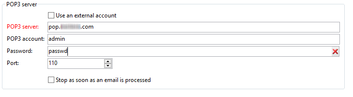

# 傳入電子郵件{#inbound-emails}

此 **傳入電子郵件** 活動可讓您從POP3郵件伺服器下載及處理電子郵件訊息。

的第一個標籤 **傳入電子郵件** 活動可讓您輸入POP3伺服器的參數，並輸入在收到每條消息時要執行的指令碼。 第二個索引標籤可讓您指派排程給活動，第三個索引標籤則定義活動過期條件。

1. **[!UICONTROL Inbound Emails]**

   * **[!UICONTROL Use an external account]**

      激活此選項時，您可以選擇外部POP3帳戶，而不輸入連接參數。 此 **[!UICONTROL External account]** 欄位指定要用於連接到電子郵件服務的外部POP3帳戶。 只有在啟用「使用外部帳戶」選項時，此欄位才會顯示。

      如果未選取此選項，則必須指定以下參數：

      

      * **[!UICONTROL POP3 server]**

         POP3伺服器的名稱。

      * **[!UICONTROL POP3 account]**

         使用者名稱。

      * **[!UICONTROL Password]**

         用戶帳戶密碼。

      * **[!UICONTROL Port]**

         POP3連接埠號。 預設埠為110。
   * **[!UICONTROL Stop as soon as email is processed]**

      此選項可讓您逐一處理電子郵件。 活動只會啟動其轉變一次，然後完成處理，將未處理的訊息留在伺服器上。

1. **[!UICONTROL Script]**

   指令碼可讓您處理訊息，並執行取決於訊息內容的各種操作。 該指令碼對每條消息執行，並可確定要對消息（離開或刪除消息）執行的操作以及對出站轉變的激活。

   傳回程式碼必須是下列其中一個值：

   * 1 — 從伺服器刪除訊息並啟用出站轉變。
   * 2 — 將訊息保留在伺服器上並啟動出站轉變。
   * 3 — 從伺服器刪除訊息。
   * 4 — 將訊息留在伺服器上。

   可從全域存取訊息的內容 **[!UICONTROL mailMessage]** 變數。

1. **[!UICONTROL Schedule]**

   若要定義活動的排程，請按一下 **[!UICONTROL Scheduling]** 標籤和檢查 **[!UICONTROL Plan execution]**. 按一下 **[!UICONTROL Change]** 按鈕來設定排程。

   排程設定與排程活動的相同。 請參閱 [排程器](scheduler.md).

1. **[!UICONTROL Expiration]**

   您可以透過 **[!UICONTROL Expiration]** 標籤。

   

   設定與排程活動的設定相同。 請參閱 [過期](define-approvals.md).
