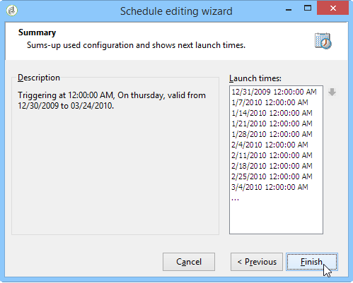

# 增量查詢{#incremental-query}

增量查詢可讓您根據條件定期選取目標，同時排除已針對此條件的人員。

已定位的母體會依工作流程例項和活動儲存在記憶體中，即從相同範本啟動的兩個工作流程不共用相同記錄。 另一方面，根據相同工作流程例項的相同增量查詢的兩個任務將使用相同記錄。

查詢的定義與標準查詢的定義相同，但其執行已排程。

**相關主題：**

* [使用案例：使用增量查詢更新每季清單](quarterly-list-update.md)
* [建立查詢](query.md#creating-a-query)

>[!CAUTION]
>
>如果增量查詢的結果等於 **0** 在其其中一個執行期間，工作流程會暫停，直到查詢下一次程式化執行為止。 因此，增量查詢之後的轉變和活動不會在後續執行之前處理。

操作步驟：

1. 在 **[!UICONTROL Scheduling & History]** 索引標籤中，選取 **[!UICONTROL Schedule execution]** 選項。 任務在建立後會保持作用中，而且只會在排程指定的時間觸發，以執行查詢。 但是，如果停用該選項，則會立即執行查詢 **一次完成**.
1. 按一下 **[!UICONTROL Change]** 按鈕。

   在 **[!UICONTROL Schedule editing wizard]** 視窗，您可以設定頻率、事件週期和事件有效期的型別。

   

1. 按一下 **[!UICONTROL Finish]** 以儲存排程。

   

1. 的下半部 **[!UICONTROL Scheduling & History]** 索引標籤可讓您選取要在歷史記錄中考慮的天數。

   

   * **[!UICONTROL History in days]**

     已設目標的收件者可記錄自目標日期起的最大天數。 如果此值為零，收件者永遠不會從記錄中清除。

   * **[!UICONTROL Keep history when starting]**

     此選項可讓您在啟用活動時不會清除記錄。

   * **[!UICONTROL SQL table name]**

     此引數可讓您多載包含歷史記錄資料的預設SQL表格。

## 輸出引數 {#output-parameters}

* tableName
* 綱要
* recCount

這組三個值會識別查詢所定位的母體。 **[!UICONTROL tableName]** 是記錄目標識別碼的資料表名稱， **[!UICONTROL schema]** 是母體的綱要（通常是nms：recipient）和 **[!UICONTROL recCount]** 是表格中的元素數。
