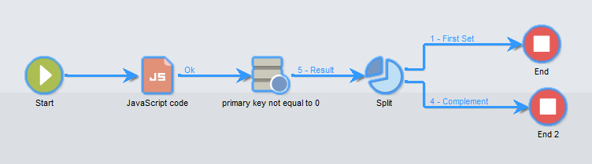

# JavaScript 指令碼和範本{#javascript-scripts-and-templates}


指令碼可讓您計算值、在流程中不同工作之間交換資料，以及使用SOAP呼叫執行特定作業。

指令碼在工作流程圖表中隨處可見：

* 所有活動都有初始化指令碼。 初始化指令碼會在活動啟動時執行，並可用來初始化變數及修改屬性。
* 「JavaScript程式碼」活動僅用於執行指令碼。
* 「測試」活動會評估JavaScript運算式，以啟動適當的轉變。
* 大部分的文字欄位都是JavaScript範本：JavaScript運算式可包含在&lt;%=和%>之間。 這些欄位提供可開啟下拉式清單的按鈕，以幫助您輸入運算式。

  

## 物件已公開 {#objects-exposed}

在工作流程內容中執行的JavaScripts會存取一系列其他全域物件。

* **執行個體**：代表正在執行的工作流程。 此物件的結構描述是&#x200B;**xtk：workflow**。
* **任務**：代表正在執行的任務。 此物件的結構描述是&#x200B;**xtk：workflowTask**。
* **event**：代表啟動執行中工作的事件。 此物件的結構描述是&#x200B;**xtk：workflowEvent**。 此物件未針對已從多個轉變啟動的&#x200B;**AND-join**&#x200B;型別活動初始化。
* **事件**：代表啟動目前工作的事件清單。 此物件的結構描述是&#x200B;**xtk：workflowEvent**。 此資料表通常包含一個專案，但可能包含已根據數個轉變啟動的&#x200B;**AND-join**&#x200B;型別活動的數個。
* **活動**：代表正在執行的工作的模式。 此物件的結構描述取決於活動型別。 此物件可由初始化指令碼修改，而在其他指令碼中，修改會產生無法確定的效果。

您可以按一下指令碼工具列右側的按鈕，在下拉式清單中檢視這些物件可用的屬性。

>[!CAUTION]
>
>除了vars屬性的子屬性以外，這些物件的屬性是唯讀的。
>  
>這些屬性大多只會在執行基礎任務或執行個體被鈍化後更新。 讀取的值不一定會符合目前狀態，而是符合先前狀態。

**範例**

在此範例和下列範例中，建立包含&#x200B;**JavaScript code**&#x200B;活動和&#x200B;**End**&#x200B;活動的工作流程，如下圖所示。


連按兩下&#x200B;**JavaScript程式碼**&#x200B;活動並插入下列指令碼：

```
logInfo("Label: " + instance.label)
logInfo("Start date: " + task.creationDate)
```

**[!UICONTROL logInfo(message)]**&#x200B;函式將訊息插入記錄檔中。

按一下&#x200B;**[!UICONTROL OK]**&#x200B;關閉建立精靈，然後使用工作流程清單右上角的動作按鈕啟動工作流程。 在執行結束時，請查閱記錄。 您應該會看到兩則對應至指令碼的訊息：一顯示工作流程的標籤，另一則顯示啟動指令碼的日期。

## 變數 {#variables}

變數是&#x200B;**[!UICONTROL instance]**、**[!UICONTROL task]**&#x200B;和&#x200B;**[!UICONTROL event]**&#x200B;物件的可用屬性。 為這些變數授權的JavaScript型別為&#x200B;**[!UICONTROL string]**、**[!UICONTROL number]**&#x200B;和&#x200B;**[!UICONTROL Date]**。

### 執行個體變數 {#instance-variables}

執行個體變數(**[!UICONTROL instance.vars.xxx]**)可與全域變數比較。 所有活動都會共用這些區段。

### 任務變數 {#task-variables}

工作變數(**[!UICONTROL task.vars.xxx]**)可與區域變數比較。 它們僅供目前任務使用。 持續性活動會使用這些變數來保留資料，這些變數有時也用於在相同活動的不同指令碼之間交換資料。

### 事件變數 {#event-variables}

事件變數(**[!UICONTROL vars.xxx]**)可在工作流程處理序的基本工作之間交換資料。 這些變數是由啟動進行中任務的任務所傳遞。 您可以修改它們並定義新的它們。 然後會傳遞至下列活動。

>[!CAUTION]
>
>在[AND-join](and-join.md)型別活動的情況下，變數會合併，但如果相同的變數定義兩次，則會發生衝突，且值仍未確定。

事件是最常使用的變數，應優先使用這些變數而非例項變數。

特定事件變數會由各種活動修改或讀取。 這些全都是字串型別變數。 例如，匯出會以剛匯出的檔案全名設定&#x200B;**[!UICONTROL vars.filename]**&#x200B;變數。 所有這些讀取或修改的變數都記錄在[關於活動](activities.md)中（在活動的&#x200B;**輸入引數**&#x200B;和&#x200B;**輸出引數**&#x200B;區段中）。

### 使用案例 {#example}

>[!NOTE]
>
>[此區段](workflow-use-cases.md)中有其他工作流程使用案例。

**範例1**

在此範例中，例項變數可用來動態計算要套用至母體的分割百分比。

1. 建立工作流程並新增開始活動。

1. 新增並設定JavaScript程式碼活動，以定義執行個體變數。

   例如： `instance.vars.segmentpercent = 10;`

   

1. 新增「查詢」活動，並根據您的需求鎖定收件者。

1. 新增分割活動，並將其設定為執行傳入母體的隨機抽樣。 抽樣百分比可以是您選擇的任何值。 在此範例中，它被設定為50%。

   此百分比會根據先前定義的例項變數，以動態方式更新。

   

1. 在分割活動之進階索引標籤的初始化指令碼區段中，定義JS條件。 JS條件會選取從「分割」活動出來的第一個轉變的隨機取樣百分比，並將其更新為先前建立的執行個體變數所設定的值。

   ```
   activity.transitions.extractOutput[0].limiter.percent = instance.vars.segmentpercent;
   ```

   

1. 請確定補充是在分割活動的獨立轉變中產生，並在每個出站轉變後新增「結束」活動。

1. 儲存並執行工作流程。 動態抽樣會根據執行個體變數套用。

   

**範例2**

1. 從前一個範例取得工作流程，並將&#x200B;**JavaScript Code**&#x200B;活動的指令碼取代為下列指令碼：

   ```
   instance.vars.foo = "bar1"
   vars.foo = "bar2"
   task.vars.foo = "bar3"
   ```

1. 將下列指令碼新增至&#x200B;**End**&#x200B;活動的初始化指令碼：

   ```
   logInfo("instance.vars.foo = " + instance.vars.foo)
   logInfo("vars.foo = " + vars.foo)
   logInfo("task.vars.foo = " + task.vars.foo)
   ```

1. 啟動工作流程，然後檢視記錄。

   ```
   Workflow finished
   task.vars.foo = undefined
   vars.foo = bar2
   instance.vars.foo = bar1
   Starting workflow (operator 'admin')
   ```

此範例顯示&#x200B;**JavaScript程式碼**&#x200B;之後的活動可存取執行個體變數和事件變數，但無法從外部存取任務變數（「未定義」）。

### 調用查詢中的執行個體變數 {#calling-an-instance-variable-in-a-query}

在活動中指定執行個體變數後，即可在工作流程查詢中重複使用它。

因此，若要在篩選器中呼叫變數&#x200B;**instance.vars.xxx = &quot;yyyy&quot;**，請輸入&#x200B;**$(instance/vars/@xxx)**。

例如：

1. 透過&#x200B;**[!UICONTROL JavaScript code]**&#x200B;建立定義傳遞內部名稱的執行個體變數： **instance.vars.deliveryIN = &quot;DM42&quot;**。

   

1. 建立其定位和篩選維度為收件者的查詢。 在條件中，指定您希望尋找透過變數指定之傳遞傳送的所有收件者。

   提醒一下，此資訊會儲存在傳送記錄檔中。

   若要參考&#x200B;**[!UICONTROL Value]**&#x200B;欄中的執行個體變數，請輸入&#x200B;**$(instance/vars/@deliveryIN)**。

   工作流程將傳回DM42傳遞的收件者。

   

## 進階功能 {#advanced-functions}

除了標準JavaScript函式之外，還有一些特殊函式可用於操控檔案、讀取或修改資料庫中的資料，或將訊息新增到記錄中。

### 日誌 {#journal}

**[!UICONTROL logInfo(message)]**&#x200B;已在上述範例中詳細說明。 此函式將資訊訊息新增至日誌。

**[!UICONTROL logError(message)]**&#x200B;新增錯誤訊息至記錄檔。 指令碼會中斷其執行，而工作流程會變更為錯誤狀態（預設會暫停執行個體）。

## 初始化指令碼 {#initialization-script}

在特定條件下，您可在執行時修改活動的屬性。

大部分的活動屬性都可以使用JavaScript範本動態計算，或是工作流程屬性明確允許指令碼計算值。

不過，對於其他屬性，您必須使用初始化指令碼。 在執行工作之前會評估此指令碼。 **[!UICONTROL activity]**&#x200B;變數會參考與工作對應的活動。 此活動的屬性可以修改，而且只會影響此工作。

**相關主題**
[工作流程中的JavaScript程式碼範例](javascript-in-workflows.md)
