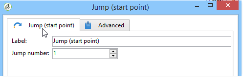

# 跳至 (起點和終點){#jump-start-point-and-end-point}

**[!UICONTROL Jump]** — 型別圖形物件可用來改善複雜圖表的可讀性，尤其是交叉轉換的圖表。

跳躍是沒有箭頭的轉接。

它們會從一個活動移至另一個活動，如下列範例所示：

對於每個「起點」型別的轉接，必須定位「終點」型別的轉接。

您可以在同一個工作流程中插入數個起點和終點跳躍。 它們由必須在引數中輸入的數字來識別：

若要改善圖表的可讀性，您可以變更與跳轉關聯的影像以顯示相關數字。 請參閱[變更活動影像](change-activity-images.md)。
