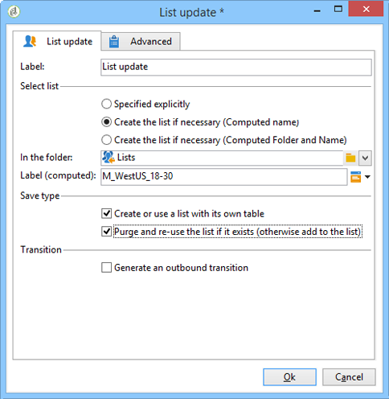

# 清單更新{#list-update}

A **清單更新** 活動將轉換中指定的人口儲存在收件人清單中。

可以從現有組清單中選擇該清單。

也可以使用 **[!UICONTROL Create the list if necessary (Computed name)]** 和 **[!UICONTROL Create the list if necessary (Computed Folder and Name)]** 頁籤 這些選項允許您選擇所選的標籤以建立清單，以及以後將保存清單的資料夾。 也可以通過插入動態欄位或指令碼自動生成標籤。 標籤右側的彈出式菜單中提供了不同的動態欄位。

如果清單已存在，則收件人將添加到現有內容，除非您檢查 **[!UICONTROL Purge the list if it exists (otherwise add to the list)]** 的雙曲餘切值。 在這種情況下，在更新前刪除清單的內容。

如果希望建立或更新的清單使用收件人表以外的表，請檢查 **[!UICONTROL Create or use a list with its own table]** 的雙曲餘切值。

要使用此選項，必須在您的Adobe Campaign實例中配置了相關的特定表。

通常，將目標保存在清單中會標籤工作流的結束。 預設情況下， **[!UICONTROL List update]** 因此，活動沒有出站轉換。 檢查 **[!UICONTROL Generate an outbound transition]** 的子菜單。

 [瞭解如何從視頻中的瀏覽器建立收件人清單](#video)

## 示例：清單更新 {#example--list-update}

在下例中，清單更新活動遵循一個查詢，該查詢針對在法國生活的30歲以上的男性。 清單最初將根據查詢結果建立。 然後，每次從工作流啟動時都會更新它。 例如，它可定期用於市場活動的定向促銷優惠。

1. 添加 **[!UICONTROL list update activity]** 在查詢後直接開啟它以編輯它。

   有關在工作流中建立查詢的詳細資訊，請參閱 [查詢](query.md)。

1. 您可以為活動選擇標籤。
1. 選擇 **[!UICONTROL Create the list if necessary (Calculated name)]** 選項，顯示將在執行第一個工作流後建立清單，然後使用以下執行更新清單。
1. 選擇要保存清單的資料夾。
1. 輸入清單的標籤。 可以插入動態欄位以自動從清單中生成名稱。 在此示例中，清單與查詢具有相同的名稱，以便輕鬆標識其內容。
1. 離開 **[!UICONTROL Purge the list if it exists (otherwise add to the list)]** 選項可刪除與目標條件不匹配的收件人，並將新收件人插入清單。
1. 另請 **[!UICONTROL Create or use a list with its own table]** 選項。
1. 離開 **[!UICONTROL Generate an outbound transition]** 複選框。
1. 按一下 **[!UICONTROL Ok]** 然後啟動工作流。

   

   然後建立或更新匹配的收件人清單。

## 輸入參數 {#input-parameters}

* 表名
* 架構

標識要保存在組中的人口。

## 輸出參數 {#output-parameters}

* 組ID:組標識符。

## 教程視頻 {#video}

此視頻顯示如何從瀏覽器建立收件人清單。

>[!VIDEO](https://video.tv.adobe.com/v/25602/quality=12)

可提供其他Campaign Classic操作視頻 [這裡](https://experienceleague.adobe.com/docs/campaign-classic-learn/tutorials/overview.html?lang=zh-Hant)。
