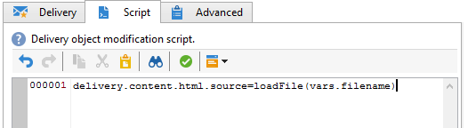

# 載入傳遞內容{#loading-delivery-content}

如果您的傳送內容位於Amazon S3、FTP或SFTP伺服器上的HTML檔案中，則可輕鬆將此內容載入到Adobe Campaign傳送中。

操作步驟：

1. 如果您尚未定義Adobe Campaign與託管內容檔案的(S) FTP伺服器之間的連線，請在&#x200B;**[!UICONTROL Administration]** > **[!UICONTROL Platform]** > **[!UICONTROL External Accounts]**&#x200B;中建立新的S3、FTP或SFTP外部帳戶。 在此外部帳戶中指定用來建立與S3或(S) FTP伺服器連線的位址和認證。

   以下是S3外部帳戶的範例：

   

1. 建立新的工作流程，例如，從&#x200B;**[!UICONTROL Profiles and Targets]** > **[!UICONTROL Jobs]** > **[!UICONTROL Targeting workflows]**。
1. 將&#x200B;**[!UICONTROL File transfer]**&#x200B;活動新增至您的工作流程，並透過指定進行設定

   * 用來連線至S3或(S) FTP伺服器的外部帳戶。
   * S3或(S) FTP伺服器上的檔案路徑。

   

1. 新增&#x200B;**[!UICONTROL Delivery]**&#x200B;活動並將其連線到&#x200B;**[!UICONTROL File transfer]**&#x200B;活動的出站轉變。 請依照以下步驟設定：

   * 傳送：根據您的需求，可以是系統中已建立的特定傳送，或根據現有範本的新傳送。
   * 收件者：在此範例中，將視為在傳送本身中指定目標。
   * 內容：即使內容已匯入上一個活動，請選取&#x200B;**[!UICONTROL Specified in the delivery]**。 由於內容是從遠端伺服器上的檔案直接匯入，因此在工作流程處理時不會有任何識別碼，且無法識別為來自入站事件。
   * 要執行的動作：選取&#x200B;**[!UICONTROL Save]**&#x200B;以儲存傳遞，並可在執行工作流程後從&#x200B;**[!UICONTROL Campaign management]** > **[!UICONTROL Deliveries]**&#x200B;存取它。

   

1. 在&#x200B;**[!UICONTROL Delivery]**&#x200B;活動的&#x200B;**[!UICONTROL Script]**&#x200B;索引標籤中，新增下列命令以載入傳遞中匯入檔案的內容：

   ```
   delivery.content.html.source=loadFile(vars.filename)
   ```

   

1. 儲存並執行工作流程。 已在&#x200B;**[!UICONTROL Campaign management]** > **[!UICONTROL Deliveries]**&#x200B;下建立包含載入內容的新傳遞。

