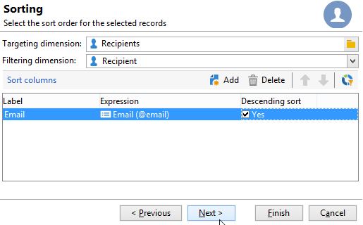

# 使用本地核准活動{#using-the-local-approval-activity}

的 **[!UICONTROL Local approval]** 整合到目標工作流中的活動允許您在發送遞送之前設定收件人審批流程。

>[!CAUTION]
>
>要使用此功能，您需要購買「分佈式市場營銷」模組，該模組是「市場活動」選項。 請檢查您的授權合約。

要設定此用例，我們建立了以下目標工作流：

本地審批流程的主要步驟是：

1. 由於A.D.A. **[!UICONTROL Split]** 使用資料分發模型鍵入活動。

   

1. 的 **[!UICONTROL Local approval]** 然後，活動接管並向每個本地主管發送通知電子郵件。 活動將暫停，直到每個本地主管批准分配給他們的接收人。

1. 一旦達到批准截止日期，工作流將再次啟動。 在此示例中， **[!UICONTROL Delivery]** 活動啟動，並將交付發送到批准的目標。

   >[!NOTE]
   >
   >一旦到期，未獲批准的收件人將被排除在目標之外。

   

1. 幾天後，第二個 **[!UICONTROL Local approval]** 類型活動向每個本地主管發送一封通知電子郵件，其中包含其聯繫人所執行操作的摘要（按一下、開啟等）。

## 步驟1:建立資料分發模板 {#step-1--creating-the-data-distribution-template-}

通過資料分配模板，您可以限制基於資料分組的目標所導致的填充，同時允許您將每個值分配給本地主管。 在此示例中，我們定義了 **[!UICONTROL Email address domain]** 欄位作為分發欄位，並為每個本地主管分配域

有關建立資料分發模板的詳細資訊，請參閱 [限制每個資料分佈的子集記錄數](split.md#limiting-the-number-of-subset-records-per-data-distribution)。

1. 要建立資料分發模板，請轉到 **[!UICONTROL Resources > Campaign management > Data distribution]** 按一下 **[!UICONTROL New]**。

   

1. 選取 **[!UICONTROL General]** 索引標籤。

   

1. 輸入 **[!UICONTROL Label]** 和 **[!UICONTROL Distribution context]**。 在此示例中，我們選擇了 **[!UICONTROL Recipient]** 目標架構和 **[!UICONTROL Email domain]** 欄位。 收件者清單將按域細分。
1. 在 **[!UICONTROL Distribution type]** 欄位，選擇目標限制值在中的表示方式 **[!UICONTROL Distribution]** 頁籤。 這裡，我們選擇 **[!UICONTROL Percentage]**。
1. 在 **[!UICONTROL Approval storage]** 欄位，輸入與正在使用的目標模式匹配的批准的儲存模式。 下面我們將使用預設儲存架構： **[!UICONTROL Local approval of recipients]**。
1. 然後按一下 **[!UICONTROL Advanced parameters]** 的子菜單。

   

1. 保留 **[!UICONTROL Approve the targeted messages]** 選項，以便從要批准的收件人清單中預先選擇所有收件人。
1. 在 **[!UICONTROL Delivery label]** 欄位，我們保留了預設表達式（傳遞的計算字串）。 在反饋通知中將使用傳遞的標準標籤。
1. 在 **[!UICONTROL Grouping field]** 部分，我們選擇 **[!UICONTROL Gender]** 欄位，用於在審批和反饋通知中顯示收件人。
1. 在 **[!UICONTROL Edit targeted messages]** 的 **[!UICONTROL Edit recipients]** Web應用程式和 **[!UICONTROL recipientId]** 的下界。 在批准和反饋通知中，收件人將可按一下並指向Web應用程式的URL。 其他URL參數將是 **[!UICONTROL recipientId]**。
1. 然後按一下 **[!UICONTROL Distribution]** 頁籤。 對於每個域，輸入以下欄位：

   

   * **[!UICONTROL Value]**:輸入域名的值。
   * **[!UICONTROL Percentage / Fixed]**:為每個域輸入最大值。 要將交貨發送到的收件人數。 在本示例中，我們希望將交付限制為每個域10%。
   * **[!UICONTROL Label]**:輸入要在審批和反饋通知中顯示的域標籤。
   * **[!UICONTROL Group or operator]**:選擇分配給域的運算子或運算子組。

      >[!CAUTION]
      >
      >確保已為運算子分配了相應的權限。

## 步驟2:建立目標工作流 {#step-2--creating-the-targeting-workflow}

要設定此用例，我們建立了以下目標工作流：

添加了以下活動：

* 二 **[!UICONTROL Query]** 活動，
* 一 **[!UICONTROL Intersection]** 活動，
* 一 **[!UICONTROL Split]** 活動，
* 一 **[!UICONTROL Local approval]** 活動，
* 一 **[!UICONTROL Delivery]** 活動，
* 一 **[!UICONTROL Wait]** 活動，
* 一秒 **[!UICONTROL Local approval]** 活動，
* 一 **[!UICONTROL End]** 的子菜單。

### 查詢、交叉點和拆分 {#queries--intersection-and-split}

上游目標由兩個查詢組成，一個交叉點和一個分割。 目標化後的人口可以使用 **[!UICONTROL Split]** 活動。

有關配置拆分活動的詳細資訊，請參閱 [拆分](split.md)。 資料分發模板的建立詳情請參見 [限制每個資料分佈的子集記錄數](split.md#limiting-the-number-of-subset-records-per-data-distribution)。

如果不想限制查詢中的填充，則不必使用 **[!UICONTROL Query]**。 **[!UICONTROL Intersection]**, **[!UICONTROL Split]** 活動。 在這種情況下，在第一個 **[!UICONTROL Local approval]** 的子菜單。

1. 在 **[!UICONTROL Record count limitation]** 的 **[!UICONTROL Limit the selected records]** ，然後按一下 **[!UICONTROL Edit]** 的子菜單。

   

1. 選擇 **[!UICONTROL Keep only the first records after sorting]** 選項 **[!UICONTROL Next]**。

   

1. 在 **[!UICONTROL Sort columns]** 部分，添加應用排序的欄位。 我們選了 **[!UICONTROL Email]** 的子菜單。 按一下&#x200B;**[!UICONTROL Next]**。

   

1. 選擇 **[!UICONTROL By data distribution]** 選項，選擇以前建立的分發模板(請參閱 [步驟1:建立資料分發模板](#step-1--creating-the-data-distribution-template-)) **[!UICONTROL Finish]**。

   

在分配模板中，我們選擇將填充限制為每個分組值的10%，這與工作流中顯示的值（340作為輸入，34作為輸出）一致。

### 審批通知 {#approval-notification}

的 **[!UICONTROL Local approval]** 活動允許您向每個本地主管發送通知。

有關配置的詳細資訊 **[!UICONTROL Local approval]** 活動，請參閱 [本地批准](local-approval.md)。

需要輸入以下欄位：

1. 在 **[!UICONTROL Action to execute]** 區段中，選取 **[!UICONTROL Target approval notification]** 選項。
1. 在 **[!UICONTROL Distribution context]** 區段中，選取 **[!UICONTROL Specified in the transition]** 選項。

   如果不想限制目標人口，請選擇 **[!UICONTROL Explicit]** 框中，輸入以前在 **[!UICONTROL Data distribution]** 的子菜單。

1. 在 **[!UICONTROL Notification]** 的子菜單。 在此，我們選擇了預設模板： **[!UICONTROL Local approval notification]**。
1. 在 **[!UICONTROL Approval schedule]** 部分，我們保留了預設審批截止時間（3天）並添加了提醒。 交貨將在批准開始3天後離開。 一旦達到批准截止時間，則未批准的收件人不會通過目標被考慮。

通知電子郵件由 **[!UICONTROL Local approval]** 活動。

### 等待 {#wait}

等待活動允許您推遲將發送傳遞反饋通知的第二個本地批准活動的開始。 在 **[!UICONTROL Duration]** 欄位，我們已進入 **[!UICONTROL 5d]** 值（5天）。 接收人在發送交貨後5天執行的操作將包括在反饋通知中。

### 反饋通知 {#feedback-notification}

第二 **[!UICONTROL Local approval]** 活動允許您向每個本地主管發送交貨反饋通知。

需要輸入以下欄位。

1. 在 **[!UICONTROL Action to execute]** 的 **[!UICONTROL Delivery feedback report]**。
1. 在 **[!UICONTROL Delivery]** 的 **[!UICONTROL Specified in the transition]**。
1. 在 **[!UICONTROL Notification]** 的子菜單。

達到等待活動中配置的截止時間後，第二個 **[!UICONTROL Local approval]** 類型活動向每個本地主管發送以下通知電子郵件：

### 管理員的審核跟蹤 {#approval-tracking-by-the-administrator}

每次啟動本地審批活動時，都會建立審批任務。 管理員可以控制這些審批任務中的每一項。

轉到市場活動的目標工作流，然後按一下 **[!UICONTROL Local approval tasks]** 頁籤。

也可以通過 **[!UICONTROL Approval tasks]** 頁籤。

選擇要監視的任務，然後按一下 **[!UICONTROL Detail]** 按鈕 的 **[!UICONTROL General]** 的子菜單。 如有必要，您可以更改審批和催款日期。

此頁籤顯示以下資訊：

* 任務的標籤及其ID
* 使用的分發模板
* 目標消息的數量
* 連結的工作流和市場活動
* 任務計畫

的 **[!UICONTROL Distribution]** 頁籤，您可以查看批准日誌、其狀態、目標消息數、批准日期以及批准交付的操作員。

選擇批准日誌，然後按一下 **[!UICONTROL Detail]** 按鈕，來查看更多資訊。 的 **[!UICONTROL General]** 的子菜單。 您還可以更改審批狀態。

此頁籤顯示以下資訊：

* 連結的審批任務
* 審批狀態(**[!UICONTROL Approved]** 或 **[!UICONTROL Pending]**)
* 使用的分發模板
* 批准的本地主管和批准日期
* 目標和批准的郵件數

的 **[!UICONTROL Targeted]** 頁籤顯示目標收件人的清單及其批准狀態。 如有必要，您可以更改此狀態。

