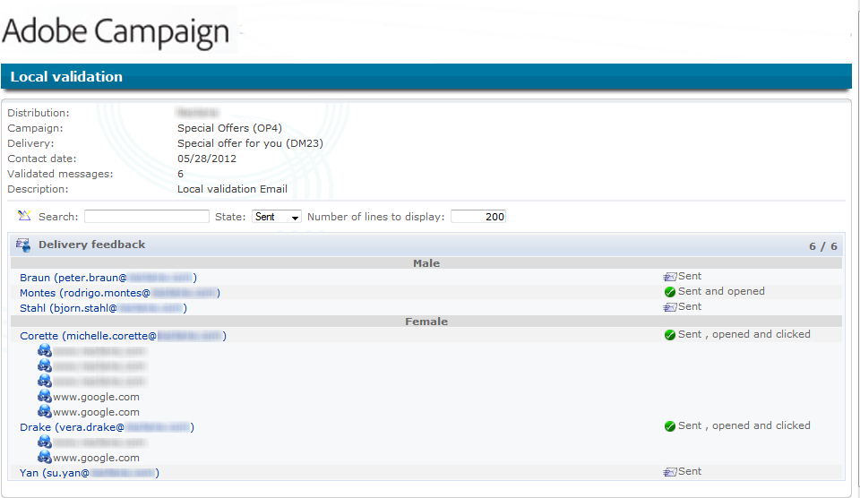

# 使用本地核准活動{#using-the-local-approval-activity}

此 **[!UICONTROL Local approval]** 整合至目標定位工作流程的活動可讓您在傳送傳遞前設定收件者核准流程。

>[!CAUTION]
>
>若要使用此函式，您必須購買分散式行銷模組，這是行銷活動選項。 請檢查您的授權合約。

為了設定此使用案例，我們已建立下列目標定位工作流程：

本地核准流程的主要步驟為：

1. 由於「 」，鎖定目標所產生的母體可能會受到限制 **[!UICONTROL Split]** 使用資料分佈模型輸入活動。

   

1. 此 **[!UICONTROL Local approval]** 活動接著接手並傳送通知電子郵件給每個本機主管。 活動會擱置，直到每個本機主管核准指派給他們的收件者為止。

1. 一旦達到核准期限，工作流程就會重新開始。 在此範例中， **[!UICONTROL Delivery]** 活動會開始，並傳送至核准的目標。

   >[!NOTE]
   >
   >一旦到達截止日期，未獲核准的收件者則會從目標定位中排除。

   

1. 幾天後，第二個 **[!UICONTROL Local approval]** 型別活動會傳送通知電子郵件給每個本機主管，其中包含其聯絡人執行的動作（點選、開啟等）摘要。

## 步驟1：建立資料發佈範本 {#step-1--creating-the-data-distribution-template-}

資料發佈範本可讓您限制根據資料分組定位而導致的母體，同時讓您將每個值指派給本機主管。 在此範例中，我們已定義 **[!UICONTROL Email address domain]** 欄位做為分配欄位，並將網域指派給每個本機主管

有關建立資料發佈範本的詳細資訊，請參閱 [限制每個資料分佈的子集記錄數](split.md#limiting-the-number-of-subset-records-per-data-distribution).

1. 若要建立資料發佈範本，請前往 **[!UICONTROL Resources > Campaign management > Data distribution]** 節點並按一下 **[!UICONTROL New]**.

   

1. 選取 **[!UICONTROL General]** 索引標籤。

   

1. 輸入 **[!UICONTROL Label]** 和 **[!UICONTROL Distribution context]**. 在此範例中，我們已選取 **[!UICONTROL Recipient]** 目標定位結構描述和 **[!UICONTROL Email domain]** 做為分佈欄位的欄位。 收件者清單將依網域劃分。
1. 在 **[!UICONTROL Distribution type]** 欄位中，選取目標限制值在 **[!UICONTROL Distribution]** 標籤。 在此，我們已選擇 **[!UICONTROL Percentage]**.
1. 在 **[!UICONTROL Approval storage]** 欄位中，輸入與使用中目標結構描述相符之核准的儲存結構描述。 我們在這裡將使用預設儲存結構描述： **[!UICONTROL Local approval of recipients]**.
1. 然後按一下 **[!UICONTROL Advanced parameters]** 連結。

   

1. 保留 **[!UICONTROL Approve the targeted messages]** 核取選項，以便從要核准的收件者清單中預先選取所有收件者。
1. 在 **[!UICONTROL Delivery label]** 欄位，我們保留了預設運算式（傳遞的計算字串）。 回饋意見通知將使用傳遞的標準標籤。
1. 在 **[!UICONTROL Grouping field]** 部分，我們已選取 **[!UICONTROL Gender]** 欄位作為分組欄位，用於在核准和意見反應通知中顯示收件者。
1. 在 **[!UICONTROL Edit targeted messages]** 部分，我們已選取 **[!UICONTROL Edit recipients]** 網頁應用程式及 **[!UICONTROL recipientId]** 引數。 在核准和回饋通知中，收件者將可點選，且會指向網頁應用程式的URL。 額外的URL引數將會是 **[!UICONTROL recipientId]**.
1. 然後按一下 **[!UICONTROL Distribution]** 標籤。 針對每個網域，輸入下列欄位：

   

   * **[!UICONTROL Value]**：輸入網域名稱的值。
   * **[!UICONTROL Percentage / Fixed]**：對於每個網域，輸入最大值。 您要傳送傳遞的收件者人數。 在此範例中，我們想將每個網域的傳送限製為10%。
   * **[!UICONTROL Label]**：輸入要顯示在核准和意見反應通知中的網域標籤。
   * **[!UICONTROL Group or operator]**：選取指派給網域的運運算元或運運算元群組。

     >[!CAUTION]
     >
     >請確定已指派適當的許可權給運運算元。

## 步驟2：建立目標定位工作流程 {#step-2--creating-the-targeting-workflow}

為了設定此使用案例，我們已建立下列目標定位工作流程：

已新增下列活動：

* 兩個 **[!UICONTROL Query]** 活動，
* 一 **[!UICONTROL Intersection]** 活動，
* 一 **[!UICONTROL Split]** 活動，
* 一 **[!UICONTROL Local approval]** 活動，
* 一 **[!UICONTROL Delivery]** 活動，
* 一 **[!UICONTROL Wait]** 活動，
* 秒 **[!UICONTROL Local approval]** 活動，
* 一 **[!UICONTROL End]** 活動。

### 查詢、交集和分割 {#queries--intersection-and-split}

上游目標定位由兩個查詢、一個交集和一個分割組成。 您可以使用來限制定位所產生的母體 **[!UICONTROL Split]** 使用資料分佈範本的活動。

有關設定分割活動的詳細資訊，請參閱 [Split](split.md). 建立資料發佈範本的詳細資訊，請參見 [限制每個資料分佈的子集記錄數](split.md#limiting-the-number-of-subset-records-per-data-distribution).

如果您不想限制來自查詢的母體，則不必使用 **[!UICONTROL Query]**， **[!UICONTROL Intersection]**、和 **[!UICONTROL Split]** 活動。 在此情況下，請先完成資料發佈範本 **[!UICONTROL Local approval]** 活動。

1. 在 **[!UICONTROL Record count limitation]** 區段，選取 **[!UICONTROL Limit the selected records]** 選項，然後按一下 **[!UICONTROL Edit]** 連結。

   

1. 選取 **[!UICONTROL Keep only the first records after sorting]** 選項並按一下 **[!UICONTROL Next]**.

   

1. 在 **[!UICONTROL Sort columns]** 區段，新增套用排序的欄位。 在此，我們已選擇 **[!UICONTROL Email]** 欄位。 按一下&#x200B;**[!UICONTROL Next]**。

   

1. 選取 **[!UICONTROL By data distribution]** 選項，選取先前建立的發佈範本(請參閱 [步驟1：建立資料發佈範本](#step-1--creating-the-data-distribution-template-))並按一下 **[!UICONTROL Finish]**.

   

在分佈範本中，我們已選擇將母體限製為每個分組值10%，這符合工作流程中顯示的值（340作為輸入和34作為輸出）。

### 核准通知 {#approval-notification}

此 **[!UICONTROL Local approval]** 活動可讓您傳送通知給每個本機主管。

有關設定的詳細資訊 **[!UICONTROL Local approval]** 活動，請參閱 [本地核准](local-approval.md).

需要輸入下列欄位：

1. 在 **[!UICONTROL Action to execute]** 區段中，選取 **[!UICONTROL Target approval notification]** 選項。
1. 在 **[!UICONTROL Distribution context]** 區段中，選取 **[!UICONTROL Specified in the transition]** 選項。

   如果您不想限制目標母體，請選取 **[!UICONTROL Explicit]** 選項，然後輸入先前在 **[!UICONTROL Data distribution]** 欄位。

1. 在 **[!UICONTROL Notification]** 區段，選取傳遞範本及用於通知電子郵件的主旨。 在此處，我們已選擇預設範本： **[!UICONTROL Local approval notification]**.
1. 在 **[!UICONTROL Approval schedule]** 部分，我們保留預設核准期限（3天）並新增提醒。 傳遞將在核准開始後3天後離開。 一旦達到核准期限，未核准的收件者就不會在鎖定目標時列入考量。

通知電子郵件是由以下使用者傳送： **[!UICONTROL Local approval]** 活動給本機監督員。

### 等待 {#wait}

等待活動可讓您延遲將傳送傳送回饋通知的第二個本機核准活動的開始。 在 **[!UICONTROL Duration]** 欄位，我們已輸入 **[!UICONTROL 5d]** 值（5天）。 在傳送傳遞後5天內由收件者執行的動作將包含在回饋通知中。

### 意見反應通知 {#feedback-notification}

第二個 **[!UICONTROL Local approval]** 活動可讓您傳送傳遞回饋意見通知給每位本機主管。

需要輸入下列欄位。

1. 在 **[!UICONTROL Action to execute]** 區段，選擇 **[!UICONTROL Delivery feedback report]**.
1. 在 **[!UICONTROL Delivery]** 區段，選擇 **[!UICONTROL Specified in the transition]**.
1. 在 **[!UICONTROL Notification]** 區段，選取傳遞範本及用於通知電子郵件的主旨。

一旦達到等待活動中設定的截止日期，第二個 **[!UICONTROL Local approval]** 型別作業會傳送下列通知電子郵件給每個本機主管：

### 管理員的核准追蹤 {#approval-tracking-by-the-administrator}

每次本機核准活動開始時，都會建立核准任務。 管理員可以控制這些核准任務。

前往行銷活動的目標定位工作流程，然後按一下 **[!UICONTROL Local approval tasks]** 標籤。

本機核准工作的清單也可透過 **[!UICONTROL Approval tasks]** 資料發佈範本的索引標籤。

選取要監視的工作，然後按一下 **[!UICONTROL Detail]** 按鈕。 此 **[!UICONTROL General]** 本機核准任務的標籤可讓您檢視任務的資訊。 如有需要，您可以變更核准和提醒日期。

此標籤會顯示下列資訊：

* 任務的標籤及其ID
* 使用的散發範本
* 目標訊息數
* 連結的工作流程與行銷活動
* 任務排程

此 **[!UICONTROL Distribution]** 任務的索引標籤可讓您檢視核准記錄、其狀態、目標訊息數、核准日期，以及核准傳送的操作員。

選取核准記錄檔，然後按一下 **[!UICONTROL Detail]** 按鈕以顯示更多資訊。 此 **[!UICONTROL General]** 本機核准記錄檔的索引標籤可讓您檢視一般記錄檔資訊。 您也可以變更核准狀態。

此標籤會顯示下列資訊：

* 連結的核准任務
* 核准狀態(**[!UICONTROL Approved]** 或 **[!UICONTROL Pending]**)
* 使用的散發範本
* 核准的當地主管和核准日期
* 已鎖定目標和已核准的訊息數

此 **[!UICONTROL Targeted]** 核准記錄的索引標籤會顯示目標收件者的清單及其核准狀態。 您可以視需要變更此狀態。

