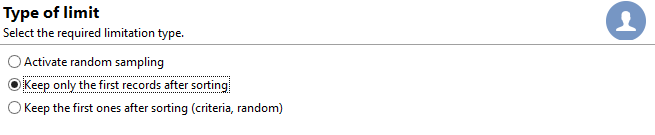
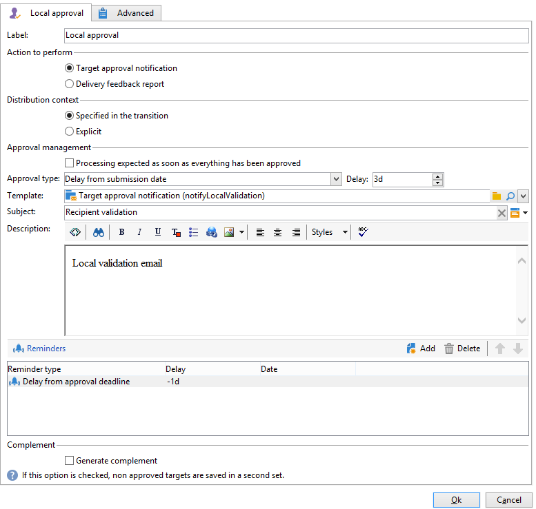

# 使用本地核准活動{#using-the-local-approval-activity}

此 **[!UICONTROL Local approval]** 整合至目標工作流程的活動可讓您在傳送傳遞之前設定收件者核准程式。

>[!CAUTION]
>
>若要使用此功能，您需要購買Distributed Marketing模組（此為促銷活動選項）。 請檢查您的授權合約。

為了設定此使用案例，我們建立了下列目標工作流程：

本機核准程式的主要步驟為：

1. 鎖定目標產生的母體可能會因 **[!UICONTROL Split]** 使用資料分送模型輸入活動。

   

1. 此 **[!UICONTROL Local approval]** 然後，活動接管並向每個本地主管發送通知電子郵件。 在每個本地主管批准分配給它們的收件者之前，活動將被暫停。

1. 一旦達到核准截止日期，工作流程就會重新開始。 在此範例中， **[!UICONTROL Delivery]** 活動開始，並傳送至已核准的目標。

   >[!NOTE]
   >
   >到達期限後，尚未核准的收件者將排除在鎖定目標之外。

   

1. 幾天後，第二天 **[!UICONTROL Local approval]** 類型活動向每個本地主管發送通知電子郵件，其中包含其聯繫人執行的操作（點擊、開啟等）的摘要。

## 步驟1:建立資料分送範本 {#step-1--creating-the-data-distribution-template-}

通過資料分發模板，您可以限制根據資料分組進行目標定位而生成的母體，同時允許您將每個值分配給本地主管。 在此範例中，我們已定義 **[!UICONTROL Email address domain]** 欄位作為分發欄位，並為每個本地主管分配域

如需建立資料分送範本的詳細資訊，請參閱 [限制每個資料分發的子集記錄數](split.md#limiting-the-number-of-subset-records-per-data-distribution).

1. 若要建立資料分送範本，請前往 **[!UICONTROL Resources > Campaign management > Data distribution]** 節點，按一下 **[!UICONTROL New]**.

   

1. 選取 **[!UICONTROL General]** 索引標籤。

   

1. 輸入 **[!UICONTROL Label]** 和 **[!UICONTROL Distribution context]**. 在此範例中，我們已選取 **[!UICONTROL Recipient]** 目標結構和 **[!UICONTROL Email domain]** 欄位作為分發欄位。 收件者清單將依網域劃分。
1. 在 **[!UICONTROL Distribution type]** 欄位中，選取目標限制值在 **[!UICONTROL Distribution]** 標籤。 我們選了 **[!UICONTROL Percentage]**.
1. 在 **[!UICONTROL Approval storage]** 欄位，輸入與使用中目標架構相符之核准的儲存架構。 以下是使用預設儲存架構： **[!UICONTROL Local approval of recipients]**.
1. 然後按一下 **[!UICONTROL Advanced parameters]** 連結。

   

1. 保留 **[!UICONTROL Approve the targeted messages]** 選項，以便從要核准的收件者清單中預先選取所有收件者。
1. 在 **[!UICONTROL Delivery label]** 欄位中，我們保留了預設運算式（傳送的計算字串）。 傳送的標準標籤將用於意見通知中。
1. 在 **[!UICONTROL Grouping field]** 部分，我們已選擇 **[!UICONTROL Gender]** 欄位，作為在核准和意見通知中顯示收件者的分組欄位。
1. 在 **[!UICONTROL Edit targeted messages]** 部分，我們已選取 **[!UICONTROL Edit recipients]** web應用程式和 **[!UICONTROL recipientId]** 參數。 在核准和意見通知中，收件者將可點按，並指向Web應用程式的URL。 其他URL參數為 **[!UICONTROL recipientId]**.
1. 然後按一下 **[!UICONTROL Distribution]** 標籤。 對於每個網域，輸入下列欄位：

   

   * **[!UICONTROL Value]**:輸入域名的值。
   * **[!UICONTROL Percentage / Fixed]**:對於每個網域，輸入最大值。 您要傳送傳遞給的收件者人數。 在此範例中，我們想將傳送限制為每個網域10%。
   * **[!UICONTROL Label]**:輸入要在批准和反饋通知中顯示的域的標籤。
   * **[!UICONTROL Group or operator]**:選擇分配給域的運算子或運算子組。

      >[!CAUTION]
      >
      >請確定已為運算子指派適當的權限。

## 步驟2:建立目標工作流程 {#step-2--creating-the-targeting-workflow}

為了設定此使用案例，我們建立了下列目標工作流程：

已新增下列活動：

* 二 **[!UICONTROL Query]** 活動，
* 一 **[!UICONTROL Intersection]** 活動，
* 一 **[!UICONTROL Split]** 活動，
* 一 **[!UICONTROL Local approval]** 活動，
* 一 **[!UICONTROL Delivery]** 活動，
* 一 **[!UICONTROL Wait]** 活動，
* A秒 **[!UICONTROL Local approval]** 活動，
* 一 **[!UICONTROL End]** 活動。

### 查詢、交集和拆分 {#queries--intersection-and-split}

上游定位由兩個查詢組成，一個交集和一個分割。 定位產生的母體可使用 **[!UICONTROL Split]** 使用資料分送範本的活動。

如需設定分割活動的詳細資訊，請參閱 [分割](split.md). 如需資料分送範本的建立詳細資訊，請參閱 [限制每個資料分發的子集記錄數](split.md#limiting-the-number-of-subset-records-per-data-distribution).

如果您不想限制查詢的母體，則無須使用 **[!UICONTROL Query]**, **[!UICONTROL Intersection]**，和 **[!UICONTROL Split]** 活動。 在此情況下，請完成第一個 **[!UICONTROL Local approval]** 活動。

1. 在 **[!UICONTROL Record count limitation]** 區段，選取 **[!UICONTROL Limit the selected records]** ，然後按一下 **[!UICONTROL Edit]** 連結。

   

1. 選取 **[!UICONTROL Keep only the first records after sorting]** 選項，然後按一下 **[!UICONTROL Next]**.

   

1. 在 **[!UICONTROL Sort columns]** 節，添加應用排序的欄位。 在這裡，我們選擇了 **[!UICONTROL Email]** 欄位。 按一下&#x200B;**[!UICONTROL Next]**。

   

1. 選取 **[!UICONTROL By data distribution]** 選項，選取先前建立的發佈範本(請參閱 [步驟1:建立資料分送範本](#step-1--creating-the-data-distribution-template-))，然後按一下 **[!UICONTROL Finish]**.

   

在分配模板中，我們選擇將母體限制為每分組值10%，這與工作流中顯示的值一致（340作為輸入，34作為輸出）。

### 核准通知 {#approval-notification}

此 **[!UICONTROL Local approval]** 活動可讓您傳送通知給每個本機主管。

有關配置的詳細資訊 **[!UICONTROL Local approval]** 活動，請參閱 [本地批准](local-approval.md).

需要輸入下列欄位：

1. 在 **[!UICONTROL Action to execute]** 區段中，選取 **[!UICONTROL Target approval notification]** 選項。
1. 在 **[!UICONTROL Distribution context]** 區段中，選取 **[!UICONTROL Specified in the transition]** 選項。

   如果您不想限制目標母體，請選取 **[!UICONTROL Explicit]** 選項，並在 **[!UICONTROL Data distribution]** 欄位。

1. 在 **[!UICONTROL Notification]** 區段，選取傳送範本和用於通知電子郵件的主旨。 在此，我們選取了預設範本： **[!UICONTROL Local approval notification]**.
1. 在 **[!UICONTROL Approval schedule]** 小節中，我們保留了預設的核准截止時間（3天），並新增了提醒。 交貨將在核准後3天結束。 一旦達到核准截止日期，目標就不會將尚未核准的收件者納入考量。

通知電子郵件由 **[!UICONTROL Local approval]** 活動。

### 等待 {#wait}

等待活動可讓您延遲第二個本機核准活動的開始，該活動會傳送傳送意見通知。 在 **[!UICONTROL Duration]** 欄位，我們已進入 **[!UICONTROL 5d]** 值（5天）。 在傳送傳遞後，收件者執行5天的動作將包含在意見通知中。

### 意見通知 {#feedback-notification}

第二個 **[!UICONTROL Local approval]** 活動可讓您傳送傳遞意見通知給每個本機主管。

需要輸入下列欄位。

1. 在 **[!UICONTROL Action to execute]** ，選擇 **[!UICONTROL Delivery feedback report]**.
1. 在 **[!UICONTROL Delivery]** ，選擇 **[!UICONTROL Specified in the transition]**.
1. 在 **[!UICONTROL Notification]** 區段，選取傳送範本和用於通知電子郵件的主旨。

達到等待活動中設定的截止時間後，第二個 **[!UICONTROL Local approval]** 類型活動向每個本地主管發送以下通知電子郵件：

### 管理員的核准追蹤 {#approval-tracking-by-the-administrator}

每次本機核准活動開始時，都會建立核准任務。 管理員可以控制這些核准任務中的每個。

前往促銷活動的目標定位工作流程，然後按一下 **[!UICONTROL Local approval tasks]** 標籤。

您也可以透過 **[!UICONTROL Approval tasks]** 頁簽。

選擇要監視的任務，然後按一下 **[!UICONTROL Detail]** 按鈕。 此 **[!UICONTROL General]** 「本地批准」任務的頁簽可讓您查看有關該任務的資訊。 如有必要，您可以更改批准和提醒日期。

此索引標籤會顯示下列資訊：

* 任務的標籤及其ID
* 使用的發佈範本
* 目標訊息的數量
* 連結的工作流程和行銷活動
* 任務計畫

此 **[!UICONTROL Distribution]** 索引標籤，可讓您檢視核准記錄、其狀態、目標訊息數量、核准日期，以及核准傳送的運算子。

選取核准記錄，然後按一下 **[!UICONTROL Detail]** 按鈕以顯示更多資訊。 此 **[!UICONTROL General]** 本機核准記錄的標籤，可讓您檢視一般記錄資訊。 您也可以變更核准狀態。

此索引標籤會顯示下列資訊：

* 連結的批准任務
* 批准狀態(**[!UICONTROL Approved]** 或 **[!UICONTROL Pending]**)
* 使用的發佈範本
* 批准的地方主管和批准日期
* 已定位和已核准的訊息數

此 **[!UICONTROL Targeted]** 「核准記錄」的索引標籤會顯示目標收件者的清單及其核准狀態。 您可以視需要變更此狀態。

