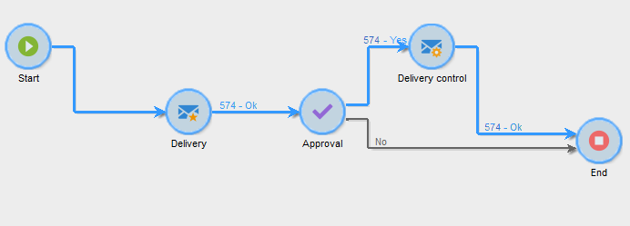

# 本地核准{#local-approval}

整合至目標定位工作流程後， **[!UICONTROL Local approval]** 活動可讓您在傳送傳遞前設定收件者核准流程。

>[!CAUTION]
>
>若要使用此活動，您必須已購買「分散式行銷」模組，此為行銷活動選項。 請檢查您的授權合約。

例如 **[!UICONTROL Local approval]** 具有發佈範本的活動，請參閱 [使用本機核准活動](local-approval-activity.md).

首先，輸入活動的標籤，然後 **[!UICONTROL Action to execute]** 欄位：

* 選取 **[!UICONTROL Target approval notification]** 選項可在傳遞前傳送通知電子郵件給本機主管，要求他們核准指派給他們的收件者。

* **增量查詢**：可讓您執行查詢並計畫其執行。 請參閱 [增量查詢](incremental-query.md) 區段。

  

## 目標核准通知 {#target-approval-notification}

在此案例中， **[!UICONTROL Local approval]** 活動會放置在上游目標定位與傳送之間：

如果收到目標核准通知，則要輸入的欄位包括：

* **[!UICONTROL Distribution context]**：選取 **[!UICONTROL Specified in the transition]** 選項(如果您使用 **[!UICONTROL Split]** 輸入活動以限制目標母體。 在此情況下，會在分割活動中輸入發佈範本。 如果您不限制目標母體，請選取 **[!UICONTROL Explicit]** 選項，並在以下位置輸入發佈範本： **[!UICONTROL Data distribution]** 欄位。

  有關建立資料發佈範本的詳細資訊，請參閱 [限制每個資料分佈的子集記錄數](split.md#limiting-the-number-of-subset-records-per-data-distribution).

* **[!UICONTROL Approval management]**

   * 選取傳遞範本及用於電子郵件通知的主題。 預設範本可供使用： **[!UICONTROL Local approval notification]**. 您也可以新增說明，此說明會出現在核准和回饋通知的收件者清單上方。
   * 指定 **[!UICONTROL Approval type]** 對應於核准期限（從核准開始的日期或期限）的欄位。 在此日期，工作流程會再次開始，而未核准的收件者不會納入目標定位的考量。 傳送通知後，活動會排入佇列，以便本機主管可以核准其連絡人。

     >[!NOTE]
     >
     >依預設，開始核准程式時，活動會暫停三天。

     您也可以新增一或多個提醒，通知本機主管即將到達截止日期。 若要這麼做，請按一下 **[!UICONTROL Add a reminder]** 連結。

* **[!UICONTROL Complementary set]**：此 **[!UICONTROL Generate complement]** 選項可讓您產生第二個集合，其中包含所有未核准的目標。

  >[!NOTE]
  >
  >此選項預設為停用。

## 傳遞回饋意見報告 {#delivery-feedback-report}

在此案例中， **[!UICONTROL Local approval]** 活動會放置在傳送之後：

若是傳送意見反應報告，必須輸入下列欄位：

* 選取 **[!UICONTROL Specified in the transition]** 選項，表示傳送是在前一個活動期間輸入。 選取 **[!UICONTROL Explicit]** 以在本機核准活動中指定傳送。
* 選取傳遞範本和通知電子郵件的物件。 有一個預設範本： **[!UICONTROL Local approval notification]**.

## 範例：核准工作流程傳遞 {#example--approving-a-workflow-delivery}

此範例說明如何設定工作流程傳送的核准流程。 如需建立傳遞工作流程的詳細資訊，請參閱 [範例：傳遞工作流程](delivery.md#example--delivery-workflow) 區段。

操作員可透過下列兩種方式之一核准傳送：使用電子郵件訊息中連結的網頁，或透過使用者端主控台。

* 網頁核准

  傳送給管理員群組操作員的電子郵件可讓您核准傳遞目標。 訊息會使用定義的文字，而JavaScript運算式會由計算值取代（在此例中為「574」）

  若要核准傳遞，請按一下相關連結，並登入Adobe Campaign使用者端主控台。

  

  進行選擇，然後按一下 **[!UICONTROL Submit]** 按鈕。

  

* 透過使用者端主控台核准

  在樹狀結構中， **[!UICONTROL Administration > Production > Objects created automatically > Approvals pending]** 節點包含要由目前連線的運運算元核准的工作清單。 清單應顯示一行。 連按兩下此行以回應。 下列視窗隨即顯示：

選取 **是**，然後按一下 **[!UICONTROL Approve]**. 訊息會通知您已記錄回應。

返回工作流程畫面：大約10秒後，圖表顯示如下：

工作流程已執行 **[!UICONTROL Delivery control]** 任務，在此例中，這表示開始傳遞先前建立的傳送。 工作流程已完成，並未發生錯誤。
