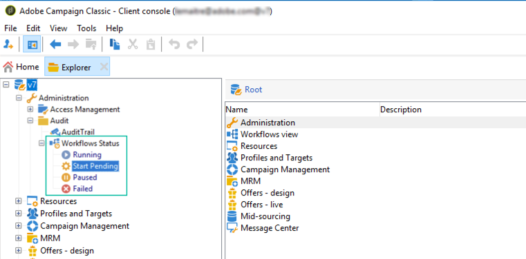

# 監視工作流程的執行 {#monitoring-workflow-execution}

本節提供如何監控工作流程執行的資訊。

也提供了如何建立工作流程，讓您監控「暫停」、「停止」或「有錯誤」之工作流程集的狀態的使用案例，其位於 [本節](workflow-supervision.md#supervising-workflows).

此外，執行個體的管理員可使用 **稽核軌跡** 若要檢查活動和上次對工作流程完成的修改，請查看工作流程的狀態。 進一步了解稽核軌跡(位於  [Campaign Classicv7檔案](https://experienceleague.adobe.com/docs/campaign-classic/using/monitoring-campaign-classic/production-procedures/audit-trail.html?lang=en#accessing-audit-trail){target="_blank"}.

## 顯示進度 {#displaying-progress}

您可以使用工具列上的適當圖示來顯示進度，以監控執行。

此 **[!UICONTROL Display progress information]** 圖示可讓您在執行畫面中顯示狀態和活動結果。


選取此選項時，已執行的活動會以藍色顯示，擱置中的活動會閃爍，警告會以橘色顯示，錯誤會以紅色顯示。 此選項也會顯示活動在其出站轉變上的結果，後面是活動屬性中定義的結果標籤，如果超過一秒，則顯示作業的持續時間


## 顯示日誌 {#displaying-logs}

記錄檔包含工作流程的歷史記錄或稽核軌跡。 它註冊所有用戶操作、執行的所有操作和遇到的錯誤。 您可以：

* 選取 **[!UICONTROL Tracking]** 標籤。 此清單包含所有工作流程訊息。

   

* 依活動篩選記錄訊息。 要執行此操作，請按一下 **[!UICONTROL Display the tasks and the log]** 圖表上方的工具列上，以顯示 **[!UICONTROL Log]** 和 **[!UICONTROL Tasks]** 標籤。 選取活動以檢視所有相關訊息。 此清單包含未選取活動時的所有訊息。

   

   >[!NOTE]
   >
   >按一下圖表的背景以取消選取所有元素。

* 僅查看連結到給定任務的那些消息。 若要這麼做，請選取 **[!UICONTROL Tasks]** ，然後在圖表中選取活動以限制清單。 按兩下任務以顯示資訊；視窗中的最後一個索引標籤包含記錄檔。

   

   此 **[!UICONTROL Details...]** 按鈕可讓您顯示有關活動執行的所有其他資訊。 例如，您可以檢視驗證運算子，並在適用時，檢視其在核准期間輸入的註解。

>[!NOTE]
>
>重新啟動工作流程時，不會清除記錄檔。 所有郵件都會保留。 如果要放棄上次執行中的消息，必須清除歷史記錄。

記錄檔會顯示與目標工作流程活動相關的執行訊息的時間順序清單。

* 目標定位促銷活動記錄

   執行定位促銷活動後，按一下 **[!UICONTROL Tracking]** 標籤來檢視執行追蹤。

   

   所有促銷活動訊息皆會顯示：執行促銷活動以及警告或錯誤。

* 活動記錄

   您也可以檢視執行記錄和每個活動的詳細資訊。 執行此作業有兩種方式：

   1. 選取目標活動，然後按一下 **[!UICONTROL Display the tasks and the log]** 表徵圖。

      

      圖表的下方區段顯示兩個標籤：日誌和任務。

      在圖表中選取的活動會作為記錄和任務清單上的篩選器。

      

   1. 以滑鼠右鍵按一下目標活動並選取 **[!UICONTROL Display logs]**.

      

      記錄檔會顯示在個別視窗中。

## 清除日誌 {#purging-the-logs}

不會自動清除工作流歷史記錄：預設會保留所有訊息。 歷史記錄可透過 **[!UICONTROL File > Actions]** 或按一下 **[!UICONTROL Actions]** 按鈕。 選取 **[!UICONTROL Purge history]**。中可用的選項 **[!UICONTROL Actions]** 功能表在 [動作工具列](start-a-workflow.md) 區段。


## 工作表和工作流架構 {#worktables-and-workflow-schema}

工作流程會傳達可透過特定活動操作的工作台。 Adobe Campaign可讓您透過資料管理活動來修改、重新命名及擴充工作流程工作表的欄，例如，根據客戶的需求，將這些欄與命名法對齊，以收集關於合約共同受益人的其他資訊，等等。

您也可以建立各種工作維度之間的連結，並定義維度變更。 例如，對於資料庫中記錄的每個合同，定址主持人，並在附加資訊中使用共同持有人資料。

當工作流被鈍化時，將自動刪除工作流的工作表。 如果要保留工作表，請通過 **[!UICONTROL List update]** 活動(請參閱 [清單更新](list-update.md))。

## 管理錯誤 {#managing-errors}

發生錯誤時，工作流程會暫停，當發生錯誤時執行的活動會閃爍紅色。 在工作流程概觀中，於 **[!UICONTROL Monitoring]** 標籤 —   **[!UICONTROL Workflows]** 連結，您只能顯示有錯誤的工作流程，如下所示。


在Adobe Campaign Explorer中，工作流程清單會顯示 **[!UICONTROL Failed]** 欄。


當工作流出錯時，只要其電子郵件地址列在其配置檔案中，則屬於工作流監督組的操作員將通過電子郵件獲得通知。 此群組選取於 **[!UICONTROL Supervisor(s)]** 工作流屬性的欄位。


通知內容設定於 **[!UICONTROL Workflow manager notification]** 預設範本：此範本是在 **[!UICONTROL Execution]** 頁簽。 通知會顯示錯誤工作流程的名稱及相關任務。

通知範例：


此連結可讓您以Web模式存取Adobe Campaign主控台，並在您登入後處理錯誤工作流程。


您可以設定工作流程，使其不會暫停，並在發生錯誤時繼續執行。 要執行此操作，請編輯工作流 **[!UICONTROL Properties]** 和 **[!UICONTROL Error management]** 區段，選取 **[!UICONTROL Ignore]** 選項 **[!UICONTROL In case of error]** 欄位。 然後，您可以指定在暫停處理程式之前可忽略的連續錯誤數。

在這種情況下，錯誤任務被中止。 此模式特別適用於設計為稍後重新嘗試促銷活動（定期動作）的工作流程。


>[!NOTE]
>
>您可以針對每個活動個別套用此設定。 要執行此操作，請編輯活動屬性，並在 **[!UICONTROL Advanced]** 標籤。

## 正在處理錯誤 {#processing-errors}

關於活動， **[!UICONTROL Process errors]** 選項會顯示特定轉變，若產生錯誤則會啟用此轉變。 在此情況下，工作流程不會進入錯誤模式，且會繼續執行。

考慮的錯誤是檔案系統錯誤（無法移動檔案、無法訪問目錄等）。

此選項不會處理與活動配置相關的錯誤，即無效值。 與錯誤配置相關的錯誤將不會啟用此轉變（目錄不存在等）。

如果工作流程暫停（手動或在發生錯誤後自動）, **[!UICONTROL Start]** 按鈕會在停止的工作流程執行時重新啟動。 將重新執行錯誤活動（或已暫停的活動）。 先前的活動不會重新執行。

若要重新執行所有工作流程活動，請使用 **[!UICONTROL Restart]** 按鈕。

如果您修改已執行的活動，則重新啟動工作流程執行時，不會考慮變更。

如果您修改未執行的活動，則會在重新啟動工作流程執行時考慮這些活動。

如果您修改已暫停的活動，則重新啟動工作流程時，無法正確考慮變更。

如果可能，建議在執行修改後完全重新啟動工作流程。

## 執照監督 {#instance-supervision}

此 **[!UICONTROL Instance supervision]** 頁面可讓您檢視Adobe Campaign伺服器活動，並顯示工作流程和傳送的清單，當中含有錯誤。

若要存取此頁面，請前往 **[!UICONTROL Monitoring]** ，然後按一下 **[!UICONTROL General view]** 連結。


若要顯示所有工作流程，請按一下 **[!UICONTROL Workflows]** 連結。 使用下拉式清單，根據其狀態顯示平台中的工作流程。


按一下有錯誤的工作流程上的連結，以開啟並檢視其記錄檔。


## 防止同時執行多個執行 {#preventing-simultaneous-multiple-executions}

單一工作流程可同時執行數個執行。 在某些情況下，您應該避免發生此情況。

例如，您可以讓排程器每小時觸發工作流程執行一次，但有時整個工作流程的執行需要超過一小時。 如果工作流已運行，則可能要跳過執行。

如果您在工作流程開始時有訊號活動，如果工作流程執行中，您可能想略過訊號。

一般原則如下：


解決方案是使用例項變數。 執行個體變數會由工作流程的所有平行執行共用。

以下是簡單的測試工作流程：


此 **[!UICONTROL Scheduler]** 會每分鐘觸發一個事件。 以下 **[!UICONTROL Test]** 活動將測試 **isRunning** 執行個體變數，以決定是否繼續執行：


>[!NOTE]
>
>**isRunning** 是為此範例選擇的變數名稱。 這不是內建變數。

緊接在 **[!UICONTROL Test]** 在 **是** 分支必須在其中設定例項變數 **初始化指令碼**:

```
instance.vars.isRunning = true
```

中最後的活動 **是** 分支必須將變數回復為false **初始化指令碼**:

```
instance.vars.isRunning = false
```

請注意：

* 您可以透過 **變數** 標籤 **屬性**.
* 重新啟動工作流程時，執行個體變數會重設。
* 在JavaScript中，未定義的值在測試中為false，這可讓您在初始化執行個體變數之前測試執行個體變數。
* 您可以借由將記錄指令新增至「no」結尾的初始化指令碼，來監控因此機制而未處理的活動。

   ```
   logInfo("Workflow already running, parallel execution not allowed.");
   ```

本節將介紹一個使用案例： [協調資料更新](coordinate-data-updates.md).

## 資料庫維護 {#database-maintenance}

工作流程使用大量工作表格，耗用空間，若不進行維護，最終會使整個平台變慢。

此 **資料庫清理** 可透過 **管理>生產>技術工作流程** 節點，可讓您刪除過時的資料，以避免資料庫呈指數增長。 工作流程會自動觸發，使用者不需干預。

您也可以建立特定技術工作流程，以清除不必要的資料佔用空間。 請參閱和 [節](#purging-the-logs).

## 處理暫停的工作流程 {#handling-of-paused-workflows}

預設情況下，如果暫停工作流，則不會清除其工作表。 從組建8880中，已暫停狀態過久的工作流程會自動停止，並清除其工作表。 此行為的觸發方式如下：

* 自超過7天以來已暫停的工作流程在監控控制面板（和監控API）中會顯示為警告，並會傳送通知給監控群組。
* 每週，當 **[!UICONTROL cleanupPausedWorkflows]** 技術工作流程已觸發。 如需工作流程的詳細資訊，請參閱 [本節](delivery.md).
* 在4次通知後（即預設為暫停狀態一個月），工作流程會無條件停止。 記錄檔在停止後會顯示在工作流程中。 下次執行時將清除這些表 **[!UICONTROL cleanup]** 工作流程

可通過NmsServer_PausedWorkflowPeriod選項配置這些句點。

工作流程主管會收到通知。 也會通知修改工作流程的建立者和最後使用者。 管理員不會收到通知。

## 根據工作流程的狀態篩選工作流程 {#filtering-workflows-status}

Campaign Classic介面可讓您使用預先定義的執行個體來監控所有工作流程的執行狀態 **檢視**. 若要存取這些檢視，請開啟 **[!UICONTROL Administration]** / **[!UICONTROL Audit]** / **[!UICONTROL Workflows Status]** 節點。

可使用下列檢視：

* **[!UICONTROL Running]**：列出所有執行中的工作流程。
* **[!UICONTROL Paused]**：列出所有暫停的工作流程。
* **[!UICONTROL Failed]**：列出所有失敗的工作流程。
* **)。



依預設，這些檢視可在 **[!UICONTROL Audit]** 檔案夾。 但是，您可以在資料夾樹中選擇的位置重新建立它們。 如此一來，無管理權限的標準使用者便能使用這些功能。

要執行此操作：

1. 按一下右鍵要添加視圖的資料夾。
1. 在 **[!UICONTROL Add new folder]** / **[!UICONTROL Administration]**，選擇要添加的視圖。
1. 將資料夾新增至樹狀結構後，請務必將其設為檢視，以便顯示所有工作流程（無論其來源資料夾為何）。 有關如何配置視圖的詳細資訊，請參閱 [本頁](../../v8/audiences/folders-and-views.md#turn-a-folder-to-a-view).

除了這些檢視，您還可以設定篩選資料夾，讓您根據工作流程的執行狀態來篩選工作流程清單。 操作步驟：

1. 存取工作流程類型資料夾，然後選取 **[!UICONTROL Filters]** / **[!UICONTROL Advanced filter]** 功能表。
1. 設定篩選器，以便工作流程的 **[!UICONTROL @status]** 欄位等於您選擇的狀態。
1. 儲存並命名篩選器。 然後，篩選器清單就會直接提供它。


如需詳細資訊，請參閱下列章節：
