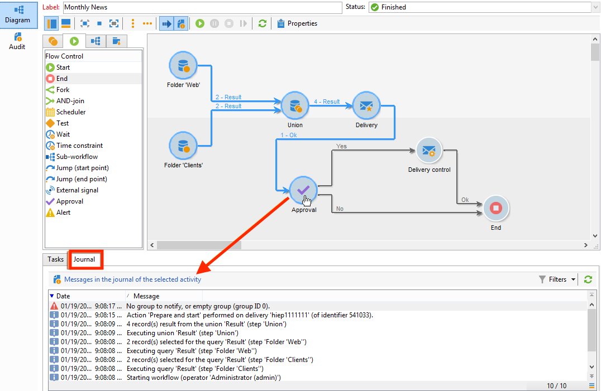
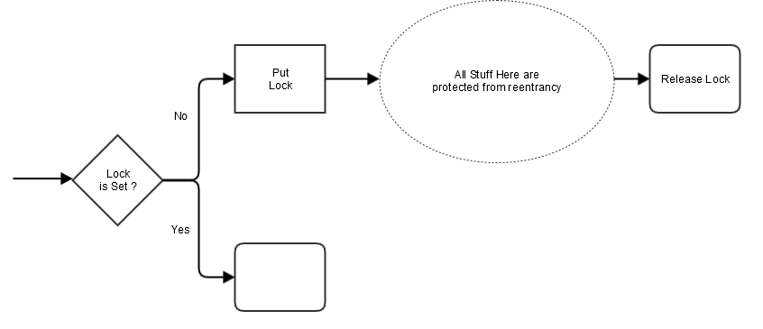

# 監視工作流程的執行 {#monitoring-workflow-execution}

本節提供如何監視工作流程執行的資訊。

您也可以參閱以下使用案例，瞭解如何建立工作流程，以監控一組「已暫停」、「已停止」或「發生錯誤」的工作流程的狀態 [本節](workflow-supervision.md#supervising-workflows).

此外，執行個體的管理員可以使用 **稽核軌跡** 若要檢查活動和對工作流程進行的最後修改，請檢查工作流程的狀態。 進一步瞭解中的稽核軌跡  [Campaign Classic v7檔案](https://experienceleague.adobe.com/docs/campaign-classic/using/monitoring-campaign-classic/production-procedures/audit-trail.html#accessing-audit-trail){target="_blank"}.

## 顯示進度 {#displaying-progress}

您可以使用工具列上的適當圖示來顯示進度，以監視執行。

此 **[!UICONTROL Display progress information]** 圖示可讓您在執行畫面中顯示狀態和活動結果。


選取此選項時，執行的活動會以藍色顯示，擱置的活動會閃爍，警告會以橘色顯示，而錯誤則以紅色顯示。 此選項也會顯示其出站轉變上的活動結果，其後是活動屬性中定義的結果標籤，如果超過一秒，則為工作的持續時間


## 顯示記錄 {#displaying-logs}

記錄檔包含工作流程的歷史記錄或稽核軌跡。 它會註冊所有使用者動作、執行的所有作業以及遇到的錯誤。 您可以：

* 選取 **[!UICONTROL Tracking]** 標籤中。 此清單包含所有工作流程訊息。

  

* 依活動篩選紀錄訊息。 若要這麼做，請按一下 **[!UICONTROL Display the tasks and the log]** ，以顯示 **[!UICONTROL Log]** 和 **[!UICONTROL Tasks]** 圖表下方的索引標籤。 選取活動以檢視所有相關訊息。 此清單包含未選取活動時的所有訊息。

  

  >[!NOTE]
  >
  >按一下圖表的背景以取消選取所有元素。

* 僅檢視連結至指定任務的訊息。 若要這麼做，請選取 **[!UICONTROL Tasks]** 標籤，然後在圖表中選取活動以限制清單。 按兩下工作以顯示資訊；視窗中的最後一個標籤包含記錄。

  

  此 **[!UICONTROL Details...]** 按鈕可讓您顯示有關活動執行的所有其他資訊。 例如，您可以檢視驗證運運算元，以及核准期間輸入的註解（如適用）。

>[!NOTE]
>
>重新啟動工作流程時不會清除記錄。 會保留所有訊息。 如果您要捨棄先前執行的訊息，則必須永久刪除歷史記錄。

記錄檔會顯示與定位工作流程活動相關之執行訊息的時間順序清單。

* 目標定位行銷活動的記錄

  目標定位行銷活動執行後，按一下 **[!UICONTROL Tracking]** 標籤以檢視執行追蹤。

  

  所有行銷活動訊息都會顯示：已執行的行銷活動以及警告或錯誤。

* 活動記錄

  您也可以檢視每個活動的執行記錄檔和詳細資訊。 有兩種方法可以達成此目的：

   1. 選取目標活動，然後按一下 **[!UICONTROL Display the tasks and the log]** 圖示。

      

      圖表的下半部分顯示兩個標籤：記錄檔和工作。

      在圖表中選取的活動在記錄和工作清單中作為篩選器。

      

   1. 以滑鼠右鍵按一下目標活動，然後選取 **[!UICONTROL Display logs]**.

      

      記錄會顯示在另一個視窗中。

## 清除記錄 {#purging-the-logs}

系統不會自動清除工作流程歷史記錄：預設會保留所有訊息。 可透過以下方式清除歷史記錄： **[!UICONTROL File > Actions]** 功能表或按一下 **[!UICONTROL Actions]** 按鈕的位置。 選取 **[!UICONTROL Purge history]**。中可用的選項 **[!UICONTROL Actions]** 功能表的詳細說明，請參見 [動作工具列](start-a-workflow.md) 區段。


## 工作表和工作流程結構描述 {#worktables-and-workflow-schema}

工作流程會傳達可透過特定活動操作的工作表。 Adobe Campaign可讓您透過「資料管理」活動，修改、重新命名及擴充工作流程工作表格的欄，例如根據客戶需求調整其命名法，以收集合約共同受益人的其他資訊等。

您也可以建立不同工作維度之間的連結，並定義維度變更。 例如，針對資料庫中記錄的每份合約，指定主要持有者的位址，並在其他資訊中使用共同持有者資料。

當工作流程鈍化時，會自動刪除工作流程的工作表。 如果要保留工作表，請透過以下方式將其儲存在清單中： **[!UICONTROL List update]** 活動(請參閱 [清單更新](list-update.md))。

## 管理錯誤 {#managing-errors}

發生錯誤時，工作流程會暫停，而發生錯誤時所執行的活動會以紅色閃爍。 在工作流程概覽中的 **[!UICONTROL Monitoring]** 標籤 —   **[!UICONTROL Workflows]** 連結，您只能顯示有錯誤的工作流程，如下所示。


在Adobe Campaign Explorer中，工作流程清單會顯示 **[!UICONTROL Failed]** 欄。


當工作流程發生錯誤時，只要工作流程監督群組的操作員的電子郵件地址列在其設定檔中，該操作員就會收到電子郵件通知。 此群組選取於 **[!UICONTROL Supervisor(s)]** 工作流程屬性的欄位。


通知內容設定於 **[!UICONTROL Workflow manager notification]** 預設範本：此範本在 **[!UICONTROL Execution]** 工作流程屬性的索引標籤。 通知會顯示錯誤工作流程和相關任務的名稱。

通知範例：


連結可讓您在Web模式下存取Adobe Campaign使用者端主控台，並在您登入後處理錯誤工作流程。


您可以設定工作流程，使其在出現錯誤時不會暫停並繼續執行。若要這麼做，請編輯工作流程 **[!UICONTROL Properties]** 而且，在 **[!UICONTROL Error management]** 區段，選取 **[!UICONTROL Ignore]** 中的選項 **[!UICONTROL In case of error]** 欄位。 然後，您可以指定在程序暫停之前可以忽略的連續錯誤數。

在此情況下，錯誤工作會中止。 此模式特別適合用於設計為在稍後重新嘗試行銷活動（定期動作）的工作流程。


>[!NOTE]
>
>您可以對每個活動個別套用此設定。 若要這麼做，請編輯活動屬性，並在 **[!UICONTROL Advanced]** 標籤。

## 正在處理錯誤 {#processing-errors}

關於活動， **[!UICONTROL Process errors]** 選項會顯示會在產生錯誤時啟用的特定轉變。 在此情況下，工作流程不會進入錯誤模式並繼續執行。

考慮的錯誤是檔案系統錯誤（無法移動檔案、無法存取目錄等）。

此選項不會處理與活動設定相關的錯誤，即無效值。 與錯誤設定相關的錯誤將不會啟用此轉換（目錄不存在等）。

如果暫停工作流程（手動或在錯誤後自動暫停）， **[!UICONTROL Start]** 按鈕會在其停止處重新啟動工作流程執行。 系統會重新執行錯誤的活動（或已暫停的活動）。 先前活動不會重新執行。

若要重新執行所有工作流程活動，請使用 **[!UICONTROL Restart]** 按鈕。

如果您修改已執行的活動，則重新啟動工作流程執行時不會考慮變更。

如果您修改未執行的活動，則會在重新啟動工作流程執行時考慮這些活動。

如果您修改暫停的活動，則當工作流程重新啟動時，無法正確考量變更。

如果可行，建議在執行修改後完全重新啟動工作流程。

## 執行個體監督 {#instance-supervision}

此 **[!UICONTROL Instance supervision]** 頁面可讓您檢視Adobe Campaign伺服器活動，並顯示有錯誤的工作流程與傳遞清單。

若要存取此頁面，請移至 **[!UICONTROL Monitoring]** 標籤並按一下 **[!UICONTROL General view]** 連結。


若要顯示所有工作流程，請按一下 **[!UICONTROL Workflows]** 連結。 使用下拉式清單，根據工作流程的狀態顯示平台中的工作流程。


按一下發生錯誤的工作流程上的連結，以開啟並檢視其記錄。


## 防止同時執行多個專案 {#preventing-simultaneous-multiple-executions}

單一工作流程可以同時執行數個執行。 在某些情況下，您應該防止此情況發生。

例如，您可以讓排程器每小時觸發一次工作流程執行，但有時整個工作流程的執行需要超過一小時。 如果工作流程已在執行中，您可能會想要略過執行。

如果您在工作流程開始時有訊號活動，則在工作流程正在執行時，您可能想要略過訊號。

一般原則如下：



解決方案是使用例項變數。 執行個體變數會由工作流程的所有平行執行共用。

以下是簡單的測試工作流程：


此 **[!UICONTROL Scheduler]** 每分鐘觸發一次事件。 下列專案 **[!UICONTROL Test]** 活動即將測試 **isRning** 執行個體變數來決定是否繼續執行：


>[!NOTE]
>
>**isRning** 是為此範例選擇的變數名稱。 這不是內建變數。

緊接在後的活動 **[!UICONTROL Test]** 在 **是** 分支必須在其中 **初始化指令碼**：

```
instance.vars.isRunning = true
```

中的最後一個活動 **是** 分支必須將其中的變數恢復為false **初始化指令碼**：

```
instance.vars.isRunning = false
```

請注意：

* 您可以透過以下方式檢查執行個體變數的目前值 **變數** 工作流程中的索引標籤 **屬性**.
* 當您重新啟動工作流程時，執行個體變數會重設。
* 在JavaScript中，測試中未定義的值為false，可讓您在初始化執行個體變數之前對其進行測試。
* 您可以將記錄指示新增至「no」結尾的初始化指令碼，以監視因此機制而未處理的活動。

  ```
  logInfo("Workflow already running, parallel execution not allowed.");
  ```

本節中提供使用案例： [協調資料更新](coordinate-data-updates.md).

## 資料庫維護 {#database-maintenance}

工作流程會使用許多工作表格，消耗空間，如果不進行維護，最終會導致整個平台速度變慢。

此 **資料庫清理** 可透過存取的工作流程 **管理>生產>技術工作流程** 節點，可讓您刪除過時的資料，以避免資料庫內容呈指數增長。 工作流程會自動觸發，使用者無需另行干預。

您也可以建立特定的技術工作流程，以清除不必要的資料佔用空間。 請參見和 [區段](#purging-the-logs).

## 處理暫停的工作流程 {#handling-of-paused-workflows}

根據預設，如果暫停工作流程，則不會永久刪除其工作表。 從Build 8880開始，已處於暫停狀態太久的工作流程會自動停止，並清除其工作表。 此行為的觸發方式如下：

* 在超過7天後暫停的工作流程會在監控儀表板（和監控API）中顯示為警告，並傳送通知給主管群組。
* 每週都會發生相同的狀況，當 **[!UICONTROL cleanupPausedWorkflows]** 技術工作流程已觸發。 如需工作流程的詳細資訊，請參閱 [本節](delivery.md).
* 在4個通知後（即預設為暫停狀態一個月），工作流程會無條件停止。 記錄停止後，即會顯示在工作流程中。 表格會在下次執行時清除 **[!UICONTROL cleanup]** 工作流程

這些期間可透過NmsServer_PausedWorkflowPeriod選項設定。

通知工作流程主管。 也會通知建立者和上次修改工作流程的使用者。 管理員不會收到通知。

## 根據工作流程的狀態進行篩選 {#filtering-workflows-status}

Campaign Classic介面可讓您使用預先定義來監視執行個體上所有工作流程的執行狀態 **檢視**. 若要存取這些檢視，請開啟 **[!UICONTROL Administration]** / **[!UICONTROL Audit]** / **[!UICONTROL Workflows Status]** 節點。

可使用下列檢視：

* **[!UICONTROL Running]**：列出所有執行中的工作流程。
* **[!UICONTROL Paused]**：列出所有暫停的工作流程。
* **[!UICONTROL Failed]**：列出所有失敗的工作流程。
* ** )。


依預設，這些檢視的存取位置為 **[!UICONTROL Audit]** 資料夾。 不過，您可以在資料夾樹狀結構中所選擇的位置重新建立它們。 如此一來，便可供沒有管理許可權的標準使用者使用。

若要這麼做：

1. 在您要新增檢視的資料夾上按一下滑鼠右鍵。
1. 在 **[!UICONTROL Add new folder]** / **[!UICONTROL Administration]**，選取您要新增的檢視。
1. 資料夾新增至樹狀結構後，請務必將其設定為檢視，以便顯示所有工作流程，無論其原始資料夾為何。 有關如何設定檢視的詳細資訊，請參閱 [此頁面](../../v8/audiences/folders-and-views.md#turn-a-folder-to-a-view).

除了這些檢視之外，您還可以設定篩選資料夾，讓您根據工作流程的執行狀態來篩選工作流程清單。 操作步驟：

1. 存取工作流程型別資料夾，然後選取 **[!UICONTROL Filters]** / **[!UICONTROL Advanced filter]** 功能表。
1. 設定篩選器，使工作流程的 **[!UICONTROL @status]** 欄位等於您選擇的狀態。
1. 儲存並命名篩選器。 然後，您就可以直接從篩選器清單中取得該篩選。


如需詳細資訊，請參閱下列章節：
