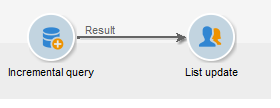

# 使用增量查詢更新每季清單 {#quarterly-list-update}

在以下示例中， [增量查詢](incremental-query.md) 用於自動更新收件人清單。 這些接收人是季節性市場營銷活動的一部分。

由於這些活動是在每季開始時為提供相關體育活動而發起的，因此這些清單每季度更新一次。 但是，此活動必須每9個月針對一次此處的收件人。 這樣，您就可以將接收者的資格頻率排除在外，並提供多年中不同季節的活動。

1. 將增量查詢以及清單更新活動添加到新工作流中。
1. 配置 **[!UICONTROL Incremental query]** 中指定的活動頁籤 [建立查詢](query.md#creating-a-query)。
1. 選擇 **[!UICONTROL Scheduling & History]** 頁籤，然後指定270天歷史記錄。 已經成為目標的接收者將在270天或大約9個月內不再成為目標。

   然後按一下 **[!UICONTROL Change...]** 按鈕

1. 要確保在每個季節開始之前更新清單，請選擇 **[!UICONTROL Monthly]**。
1. 在下一螢幕上，選擇三月、六月、九月和十二月。 選擇本月20日，然後選擇要啟動工作流的時間。
1. 接下來選擇查詢的有效期。 例如，如果希望此活動永久處於活動狀態，請選擇 **[!UICONTROL Permanent validity]**。

1. 批准增量查詢後，按照中的說明配置清單更新活動 [清單更新](list-update.md)。

因此，工作流將在每季開始之前自動啟動。 清單將更新為新的合格接收者以接收優惠。
