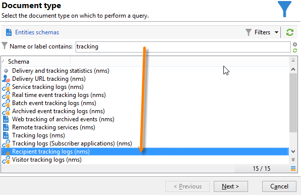
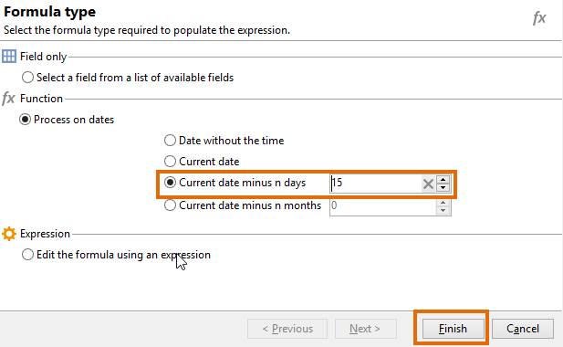
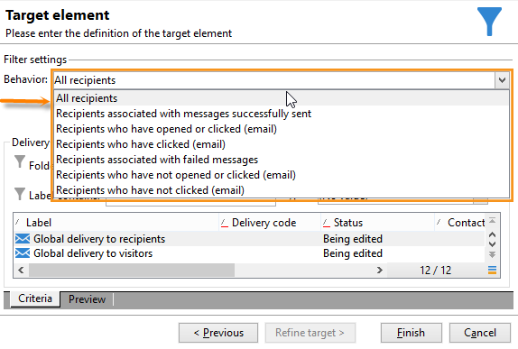

# 查詢傳遞資訊 {#querying-delivery-information}

## 特定遞送的點擊次數 {#number-of-clicks-for-a-specific-delivery}

在本示例中，我們希望恢復特定交付的點擊次數。 這些點擊記錄是由於在給定時間段內接收的收件人跟蹤日誌。 收件人通過其電子郵件地址被標識。 此查詢使用 **[!UICONTROL Recipient tracking logs]** 的子菜單。

* 需要選擇哪個表？

   收件人日誌跟蹤表(**[!UICONTROL nms:trackingLogRcp]**)

* 要為輸出列選擇的欄位？

   主鍵（帶計數）和電子郵件

* 將根據哪些標準篩選資訊？

   交貨標籤的特定期間和元素

要執行此示例，請應用以下步驟：

1. 開啟 **[!UICONTROL Generic query editor]** 的 **[!UICONTROL Recipient tracking logs]** 架構。

   

1. 在 **[!UICONTROL Data to extract]** 窗口，我們要建立一個聚合來收集資訊。 為此，請添加主鍵（位於主鍵上方） **[!UICONTROL Recipient tracking logs]** 元素):跟蹤日誌計數已在此上執行 **[!UICONTROL Primary key]** 的子菜單。 編輯的表達式將 **[!UICONTROL x=count(primary key)]**。 它將各種跟蹤日誌的總和連結到單個電子郵件地址。

   操作步驟：

   * 按一下 **[!UICONTROL Add]** 表徵圖 **[!UICONTROL Output columns]** 的子菜單。 在 **[!UICONTROL Formula type]** ，選擇 **[!UICONTROL Edit the formula using an expression]** 選項 **[!UICONTROL Next]**。 在 **[!UICONTROL Field to select]** 窗口，按一下 **[!UICONTROL Advanced selection]**。

      

   * 在 **[!UICONTROL Formula type]** 窗口，對聚合函式運行進程。 此進程將是主鍵計數。

      選擇 **[!UICONTROL Process on an aggregate function]** 的 **[!UICONTROL Aggregate]** 的 **[!UICONTROL Count]**。

      

      按一下&#x200B;**[!UICONTROL Next]**。

   * 選擇 **[!UICONTROL Primary key (@id)]** 的子菜單。 的 **[!UICONTROL count (primary key)]** 已配置輸出列。

      

1. 選擇要在輸出列中顯示的其他欄位。 在 **[!UICONTROL Available fields]** 列，開啟 **[!UICONTROL Recipient]** 選擇 **[!UICONTROL Email]**。 檢查 **[!UICONTROL Group]** 框 **[!UICONTROL Yes]** 按電子郵件地址對跟蹤日誌進行分組：此組將每個日誌連結到其收件人。

   

1. 配置列排序，以便首先顯示最活動的收件人（具有最多跟蹤日誌）。 檢查 **[!UICONTROL Yes]** 的 **[!UICONTROL Descending sort]** 的雙曲餘切值。

   

1. 然後，您必須篩選您感興趣的日誌，即那些2週以下且與銷售相關的交貨相關的日誌。

   操作步驟：

   * 配置資料篩選。 要執行此操作，請選擇 **[!UICONTROL Filter conditions]** 按一下 **[!UICONTROL Next]**。

      

   * 恢復特定傳送的給定時間段內的跟蹤日誌。 需要三種過濾條件：兩個日期條件，設定當前日期前2週和當前日期前2週之間的搜索期；以及限制搜索到特定交貨的另一個條件。

      在 **[!UICONTROL Target element]** 窗口，配置開始時將考慮跟蹤日誌的日期。 按一下 **[!UICONTROL Add]**。將顯示條件行。 編輯 **[!UICONTROL Expression]** 列 **[!UICONTROL Edit expression]** 的子菜單。 在 **[!UICONTROL Field to select]** 窗口，選擇 **[!UICONTROL Date (@logDate)]**。

      

      選擇 **[!UICONTROL greater than]** 運算子。 在 **[!UICONTROL Value]** 列，按一下 **[!UICONTROL Edit expression]**&#x200B;的 **[!UICONTROL Formula type]** 窗口，選擇 **[!UICONTROL Process on dates]**。 最後，在 **[!UICONTROL Current date minus n days]**，輸入「15」。

      按一下&#x200B;**[!UICONTROL Finish]**。

      

   * 要選擇跟蹤日誌搜索結束日期，請按一下 **[!UICONTROL Add]**。 在 **[!UICONTROL Expression]** 列，選擇 **[!UICONTROL Date (@logDate)]** 的雙曲餘切值。

      選擇 **[!UICONTROL less than]** 運算子。 在 **[!UICONTROL Value]** 列，按一下 **[!UICONTROL Edit expression]**。 對於日期處理，請轉至 **[!UICONTROL Formula type]** 中輸入「1」 **[!UICONTROL Current date minus n days]**。

      按一下&#x200B;**[!UICONTROL Finish]**。

      

      現在，我們要配置第三個篩選條件，即查詢所關注的傳遞標籤。

   * 按一下 **[!UICONTROL Add]** 函式以建立其他篩選條件。 在 **[!UICONTROL Expression]** 列，按一下 **[!UICONTROL Edit expression]**。 在 **[!UICONTROL Field to select]** 窗口，選擇 **[!UICONTROL Label]** 的 **[!UICONTROL Delivery]** 的下界。

      按一下&#x200B;**[!UICONTROL Finish]**。

      

      查找包含「sales」一詞的交貨。 由於您不記得它的確切標籤，因此可以選擇 **[!UICONTROL contains]** 運算子並在 **[!UICONTROL Value]** 的雙曲餘切值。

      

1. 按一下 **[!UICONTROL Next]** 直到你到達 **[!UICONTROL Data preview]** 窗口：此處不需要格式設定。
1. 在 **[!UICONTROL Data preview]** 窗口，按一下 **[!UICONTROL Start the preview of the data]** 查看每個傳遞收件人的跟蹤日誌數。

   結果按降序顯示。

   

   此傳遞的用戶最多日誌數為6。 5個不同的用戶開啟了遞送電子郵件或按一下了電子郵件中的一個連結。

## 未開啟任何交貨的收件人 {#recipients-who-did-not-open-any-delivery}

在此示例中，我們要篩選過去7天未開啟電子郵件的收件人。

要建立此示例，請應用以下步驟：

1. 拖放 **[!UICONTROL Query]** 的子菜單。
1. 按一下 **[!UICONTROL Edit query]** 將目標和篩選維設定為 **[!UICONTROL Recipients]**。

   

1. 選擇 **[!UICONTROL Filtering conditions]** 按一下 **[!UICONTROL Next]**。
1. 按一下 **[!UICONTROL Add]** 按鈕 **[!UICONTROL Tracking logs]**。
1. 設定 **[!UICONTROL Operator]** 的 **[!UICONTROL Tracking logs]** 表達式 **[!UICONTROL Do not exist such as]**。

   

1. 添加另一個表達式。 選擇 **[!UICONTROL Type]** 的 **[!UICONTROL URL]** 的子菜單。
1. 然後，設定 **[!UICONTROL Operator]** 至 **[!UICONTROL equal to]** 和 **[!UICONTROL Value]** 至 **[!UICONTROL Open]**。

   

1. 添加另一個表達式並選擇 **[!UICONTROL Date]**。 **[!UICONTROL Operator]** 應設定為 **[!UICONTROL on or after]**。

   

1. 要設定最後7天的值，請按一下 **[!UICONTROL Edit expression]** 按鈕 **[!UICONTROL Value]** 的子菜單。
1. 在 **[!UICONTROL Function]** 類別，選擇 **[!UICONTROL Current date minus n days]** 並添加目標天數。 這裡，我們要瞄準過去7天。

   

您的出站轉換將包含過去7天未開啟電子郵件的收件人。

相反，如果要篩選至少開啟了一封電子郵件的收件人，則您的查詢應如下所示。 請注意，在本案中， **[!UICONTROL Filtering dimension]** 應設定為 **[!UICONTROL Tracking logs (Recipients)]**。

## 已開啟交貨的收件人 {#recipients-who-have-opened-a-delivery}

以下示例說明如何針對在過去2週內開啟交貨的配置檔案：

1. 要瞄準已開啟傳遞的配置檔案，您需要使用跟蹤日誌。 它們儲存在連結表中：首先，在 **[!UICONTROL Filtering dimension]** 欄位，如下所示：

   

1. 有關篩選條件，請按一下 **[!UICONTROL Edit expression]** 跟蹤日誌的子樹結構中顯示的條件表徵圖。 選擇 **[!UICONTROL Date]** 的子菜單。

   

   按一下 **[!UICONTROL Finish]** 確認選擇。

   要僅恢復不到兩週的跟蹤日誌，請選擇 **[!UICONTROL Greater than]** 運算子。

   

   然後按一下 **[!UICONTROL Edit expression]** 的 **[!UICONTROL Value]** 列，以定義要應用的計算公式。 選擇 **[!UICONTROL Current date minus n days]** 公式，並在相關欄位中輸入15。

   

   按一下 **[!UICONTROL Finish]** 按鈕。 在篩選窗口中，按一下 **[!UICONTROL Preview]** 頁籤

   

## 篩選傳遞後收件人的行為 {#filtering-recipients--behavior-folllowing-a-delivery}

在工作流中， **[!UICONTROL Query]** 和 **[!UICONTROL Split]** 框中，您可以選擇先前交貨後的行為。 此選擇通過 **[!UICONTROL Delivery recipient]** 的子菜單。

* 示例的目標

   在傳遞工作流中，有多種方法跟蹤第一電子郵件通信。 此類操作涉及使用 **[!UICONTROL Split]** 框。

* 內容

   寄送「夏季體育活動」送貨。 交貨四天後，另外兩件交貨送來。 其中一個是「水上運動項目」，另一個是首次「夏季運動項目」交付的後續活動。

   &quot;Watersports優惠&quot;遞送發送給在第一次遞送中點擊&quot;Watersports&quot;連結的收件人。 這些點擊顯示收件人對主題感興趣。 將他們引向類似的報價是有道理的。 但是，未點擊&quot;夏季體育邀請書&quot;的收件人將再次收到相同的內容。

以下步驟將顯示如何配置 **[!UICONTROL Split]** 框，它整合了兩種不同的行為。

1. 插入 **[!UICONTROL Split]** 的子菜單。 此框將將第一個交貨的接收者分解為下兩個交貨。 基於在第一遞送期間連結到收件人行為的過濾條件發生故障。

   

1. 開啟 **[!UICONTROL Split]** 框。 在 **[!UICONTROL General]** 頁籤，輸入標籤： **基於行為拆分** 比如說，

   

1. 在 **[!UICONTROL Subsets]** 頁籤，定義第一個拆分分支。 例如，輸入 **已按一下** 此分支的標籤。
1. 選擇 **[!UICONTROL Add a filtering condition on the incoming population]** 的雙曲餘切值。 按一下&#x200B;**[!UICONTROL Edit]**。
1. 在 **[!UICONTROL Targeting and filtering dimension]** ，按兩下 **[!UICONTROL Recipients of a delivery]** 的子菜單。

   

1. 在 **[!UICONTROL Target element]** 窗口，選擇要應用於此分支的行為： **[!UICONTROL Recipients having clicked (email)]**。

   在下面，選擇 **[!UICONTROL Delivery specified by the transition]** 的雙曲餘切值。 此功能將自動恢復在第一次交貨期間目標的人員。

   這是&quot;水上運動優惠&quot;

   

1. 定義第二個分支。 此分支將包含與首次交付內容相同的後續電子郵件。 轉到 **[!UICONTROL Subsets]** 頁籤 **[!UICONTROL Add]** 建立它。

   

1. 將顯示另一個子頁籤。 命名它&quot;**未按一下**。
1. 按一下 **[!UICONTROL Add a filtering condition for the incoming population]**。然後按一下 **[!UICONTROL Edit...]**。

   

1. 按一下 **[!UICONTROL Delivery recipients]** 的 **[!UICONTROL Targeting and filtering dimension]** 的子菜單。
1. 在 **[!UICONTROL Target element]** ，選擇 **[!UICONTROL Recipients who did not click (email)]** 行為。 選擇 **[!UICONTROL Delivery specified by the transition]** 的子菜單。

   的 **[!UICONTROL Split]** 框現在已完全配置。

   

以下是預設配置的各種元件的清單：

* **[!UICONTROL All recipients]**
* **[!UICONTROL Recipients of successfully sent messages,]**
* **[!UICONTROL Recipients who opened or clicked (email),]**
* **[!UICONTROL Recipients who clicked (email),]**
* **[!UICONTROL Recipients of a failed message,]**
* **[!UICONTROL Recipients who didn't open or click (email),]**
* **[!UICONTROL Recipients who didn't click (email).]**

   
