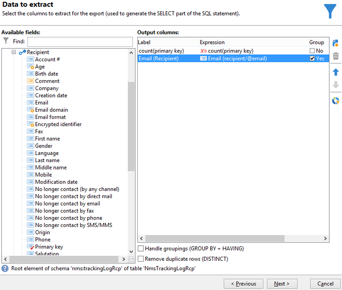
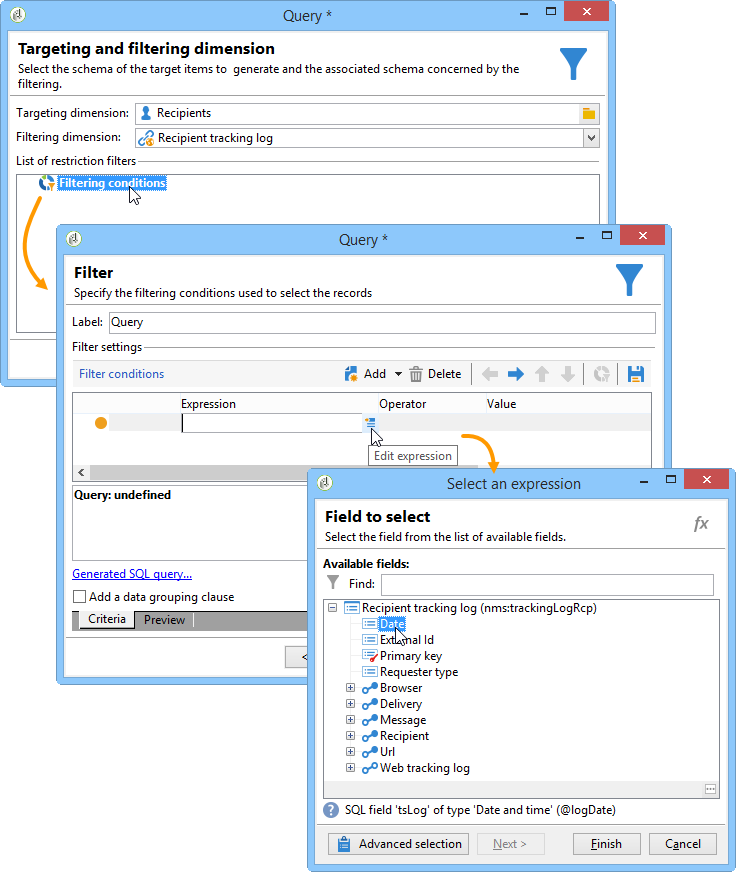
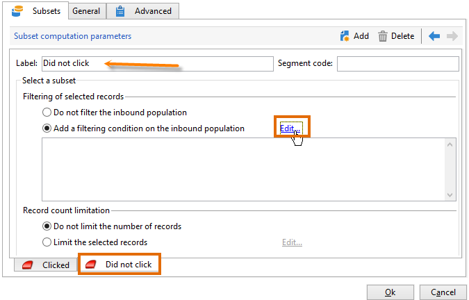

# 查詢傳遞資訊 {#querying-delivery-information}

## 特定傳送的點按次數 {#number-of-clicks-for-a-specific-delivery}

在此範例中，我們希望復原特定傳送的點按次數。 由於收件者追蹤記錄在指定時段內，因此會記錄這些點按。 收件者是透過其電子郵件地址識別。 此查詢使用 **[!UICONTROL Recipient tracking logs]** 表格。

* 需要選取哪個表格？

   收件者記錄追蹤表(**[!UICONTROL nms:trackingLogRcp]**)

* 要為輸出列選擇的欄位？

   主鍵（含計數）和電子郵件

* 會根據哪些條件篩選資訊？

   傳送標籤的特定期間和元素

若要執行此範例，請套用下列步驟：

1. 開啟 **[!UICONTROL Generic query editor]** ，然後選取 **[!UICONTROL Recipient tracking logs]** 綱要。

   

1. 在 **[!UICONTROL Data to extract]** 視窗中，我們要建立匯總以收集資訊。 要執行此操作，請新增主鍵（位於主鍵上方） **[!UICONTROL Recipient tracking logs]** 元素):會對此執行追蹤記錄計數 **[!UICONTROL Primary key]** 欄位。 編輯的運算式將為 **[!UICONTROL x=count(primary key)]**. 它會將各種追蹤記錄的總和連結至單一電子郵件地址。

   操作步驟：

   * 按一下 **[!UICONTROL Add]** 表徵圖 **[!UICONTROL Output columns]** 欄位。 在 **[!UICONTROL Formula type]** ，選擇 **[!UICONTROL Edit the formula using an expression]** 選項，然後按一下 **[!UICONTROL Next]**. 在 **[!UICONTROL Field to select]** 按一下 **[!UICONTROL Advanced selection]**.

      

   * 在 **[!UICONTROL Formula type]** 窗口，對聚合函式運行進程。 此程式將是主要金鑰計數。

      選擇 **[!UICONTROL Process on an aggregate function]** 在 **[!UICONTROL Aggregate]** 區段，按一下 **[!UICONTROL Count]**.

      

      按一下&#x200B;**[!UICONTROL Next]**。

   * 選取 **[!UICONTROL Primary key (@id)]** 欄位。 此 **[!UICONTROL count (primary key)]** 已配置輸出列。

      

1. 選取要在輸出欄中顯示的其他欄位。 在 **[!UICONTROL Available fields]** 欄，開啟 **[!UICONTROL Recipient]** 節點和選擇 **[!UICONTROL Email]**. 檢查 **[!UICONTROL Group]** 框 **[!UICONTROL Yes]** 若要依電子郵件地址將追蹤記錄分組：此群組會將每個記錄檔連結至其收件者。

   

1. 設定欄排序，讓最活躍的收件者（具有最多的追蹤記錄檔）先顯示。 檢查 **[!UICONTROL Yes]** 在 **[!UICONTROL Descending sort]** 欄。

   

1. 然後，您必須篩選您感興趣的日誌，即那些2週以內且與銷售相關的傳送相關的日誌。

   操作步驟：

   * 設定資料篩選。 要執行此操作，請選取 **[!UICONTROL Filter conditions]** 然後按一下 **[!UICONTROL Next]**.

      

   * 針對特定傳送在指定期間復原追蹤記錄。 需要三個篩選條件：兩個日期條件，用以設定目前日期之前2週與目前日期之前一天之間的搜尋期間；和另一個條件，限制搜尋至特定傳送。

      在 **[!UICONTROL Target element]** 視窗中，設定要考慮追蹤記錄的開始日期。 按一下 **[!UICONTROL Add]**。條件行隨即顯示。 編輯 **[!UICONTROL Expression]** 欄 **[!UICONTROL Edit expression]** 函式。 在 **[!UICONTROL Field to select]** 窗口，選擇 **[!UICONTROL Date (@logDate)]**.

      

      選取 **[!UICONTROL greater than]** 運算元。 在 **[!UICONTROL Value]** 欄，按一下 **[!UICONTROL Edit expression]**，和 **[!UICONTROL Formula type]** 窗口，選擇 **[!UICONTROL Process on dates]**. 最後，在 **[!UICONTROL Current date minus n days]**，輸入&quot;15&quot;。

      按一下&#x200B;**[!UICONTROL Finish]**。

      

   * 若要選取追蹤記錄搜尋結束日期，請按一下「 **[!UICONTROL Add]**. 在 **[!UICONTROL Expression]** 欄，選擇 **[!UICONTROL Date (@logDate)]** 。

      選取 **[!UICONTROL less than]** 運算元。 在 **[!UICONTROL Value]** 欄，按一下 **[!UICONTROL Edit expression]**. 若要進行日期處理，請前往 **[!UICONTROL Formula type]** 視窗中輸入「1」 **[!UICONTROL Current date minus n days]**.

      按一下&#x200B;**[!UICONTROL Finish]**。

      

      現在，我們想設定第三個篩選條件，即查詢所關注的傳送標籤。

   * 按一下 **[!UICONTROL Add]** 函式來建立其他篩選條件。 在 **[!UICONTROL Expression]** 欄，按一下 **[!UICONTROL Edit expression]**. 在 **[!UICONTROL Field to select]** 窗口，選擇 **[!UICONTROL Label]** 在 **[!UICONTROL Delivery]** 節點。

      按一下&#x200B;**[!UICONTROL Finish]**。

      

      尋找包含&quot;sales&quot;字的傳送。 由於您不記得其確切標籤，因此可以選取 **[!UICONTROL contains]** 運算元，並在 **[!UICONTROL Value]** 欄。

      

1. 按一下 **[!UICONTROL Next]** 直到你到達 **[!UICONTROL Data preview]** 窗口：此處不需要格式設定。
1. 在 **[!UICONTROL Data preview]** 按一下 **[!UICONTROL Start the preview of the data]** ，查看每個傳送收件者的追蹤記錄數。

   結果會以降序顯示。

   

   此傳送的使用者最多記錄數為6。 5個不同的使用者開啟傳送電子郵件，或按一下電子郵件中的其中一個連結。

## 未開啟任何傳遞的收件者 {#recipients-who-did-not-open-any-delivery}

在此範例中，我們要篩選過去7天內未開啟電子郵件的收件者。

若要建立此範例，請套用下列步驟：

1. 拖放 **[!UICONTROL Query]** 活動，然後開啟活動。
1. 按一下 **[!UICONTROL Edit query]** 並將目標和篩選維度設為 **[!UICONTROL Recipients]**.

   

1. 選擇 **[!UICONTROL Filtering conditions]** 然後按一下 **[!UICONTROL Next]**.
1. 按一下 **[!UICONTROL Add]** 按鈕並選取 **[!UICONTROL Tracking logs]**.
1. 設定 **[!UICONTROL Operator]** 的 **[!UICONTROL Tracking logs]** 運算式 **[!UICONTROL Do not exist such as]**.

   

1. 新增其他運算式。 選擇 **[!UICONTROL Type]** 在 **[!UICONTROL URL]** 類別。
1. 然後，設定 **[!UICONTROL Operator]** to **[!UICONTROL equal to]** 和 **[!UICONTROL Value]** to **[!UICONTROL Open]**.

   

1. 新增其他運算式並選取 **[!UICONTROL Date]**. **[!UICONTROL Operator]** 應設為 **[!UICONTROL on or after]**.

   

1. 若要設定最近7天的值，請按一下 **[!UICONTROL Edit expression]** 按鈕 **[!UICONTROL Value]** 欄位。
1. 在 **[!UICONTROL Function]** 類別，選擇 **[!UICONTROL Current date minus n days]** 並新增您要鎖定的天數。 在這裡，我們想鎖定過去7天。

   

您的出站轉變將包含過去7天內未開啟電子郵件的收件者。

相反地，如果您要篩選至少開啟一封電子郵件的收件者，您的查詢應如下所示。 請注意，在此情況下， **[!UICONTROL Filtering dimension]** 應設為 **[!UICONTROL Tracking logs (Recipients)]**.

## 已開啟傳遞的收件者 {#recipients-who-have-opened-a-delivery}

下列範例說明如何定位在過去2週內開啟傳送的設定檔：

1. 若要定位已開啟傳送的設定檔，您需要使用追蹤記錄。 它們儲存在連結的表中：首先，在 **[!UICONTROL Filtering dimension]** 欄位，如下所示：

   

1. 關於篩選條件，請按一下 **[!UICONTROL Edit expression]** 的子樹狀結構中顯示的條件圖示。 選取 **[!UICONTROL Date]** 欄位。

   

   按一下 **[!UICONTROL Finish]** 以確認選取。

   若要僅復原不到兩週前的追蹤記錄，請選取 **[!UICONTROL Greater than]** 運算元。

   

   然後按一下 **[!UICONTROL Edit expression]** 圖示 **[!UICONTROL Value]** 欄以定義要套用的計算公式。 選取 **[!UICONTROL Current date minus n days]** 公式，並在相關欄位中輸入15。

   

   按一下 **[!UICONTROL Finish]** 按鈕。 在篩選視窗中，按一下 **[!UICONTROL Preview]** 標籤來檢查定位條件。

   

## 篩選傳送後的收件者行為 {#filtering-recipients--behavior-folllowing-a-delivery}

在工作流程中， **[!UICONTROL Query]** 和 **[!UICONTROL Split]** 方塊可讓您選取先前傳送後的行為。 此選取會透過 **[!UICONTROL Delivery recipient]** 篩選。

* 範例目的

   在傳送工作流程中，有數種方式可追蹤第一封電子郵件通訊。 此類型的操作涉及使用 **[!UICONTROL Split]** 框。

* 內容

   系統會傳送「夏季運動優惠方案」。 傳送後4天，會傳送另外2個傳送。 其中一個是「水上運動優惠」，另一個是首次「夏季運動優惠」交付的後續活動。

   「水上運動選件」傳送會傳送給在第一次傳送時按下「水上運動」連結的收件者。 這些點按會顯示收件者對主題感興趣。 將他們引導至類似的報價是明智的。 不過，未點按「夏季運動優惠方案」的收件者將會再次收到相同內容。

下列步驟會示範如何設定 **[!UICONTROL Split]** 框中，

1. 插入 **[!UICONTROL Split]** 框插入工作流。 此方塊會將第一個傳送的收件者細分為下一個兩個傳送。 劃分會根據第一次傳送期間連結至收件者行為的篩選條件進行。

   

1. 開啟 **[!UICONTROL Split]** 框。 在 **[!UICONTROL General]** 頁簽，輸入標籤： **依行為分割** 例如。

   

1. 在 **[!UICONTROL Subsets]** 頁簽，定義第一個拆分分支。 例如，輸入 **已點按** 此分支的標籤。
1. 選取 **[!UICONTROL Add a filtering condition on the incoming population]** 選項。 按一下&#x200B;**[!UICONTROL Edit]**。
1. 在 **[!UICONTROL Targeting and filtering dimension]** 按兩下 **[!UICONTROL Recipients of a delivery]** 篩選。

   

1. 在 **[!UICONTROL Target element]** 窗口，選擇要應用到此分支的行： **[!UICONTROL Recipients having clicked (email)]**.

   在下方選取 **[!UICONTROL Delivery specified by the transition]** 選項。 此功能會自動復原第一次傳送期間鎖定的目標人員。

   這是「水上運動優惠方案」的傳遞。

   

1. 定義第二個分支。 此分支會包含後續電子郵件，其內容與第一次傳送的內容相同。 前往 **[!UICONTROL Subsets]** 按一下 **[!UICONTROL Add]** 來建立。

   

1. 畫面上會顯示另一個子標籤。 將其命名為「**未點按**」。
1. 按一下 **[!UICONTROL Add a filtering condition for the incoming population]**。然後按一下 **[!UICONTROL Edit...]**。

   

1. 按一下 **[!UICONTROL Delivery recipients]** 在 **[!UICONTROL Targeting and filtering dimension]** 窗口。
1. 在 **[!UICONTROL Target element]** ，選擇 **[!UICONTROL Recipients who did not click (email)]** 行為。 選取 **[!UICONTROL Delivery specified by the transition]** 選項，如最後一個分支所示。

   此 **[!UICONTROL Split]** 方塊現已完全設定。

   

以下是預設設定的各種元件清單：

* **[!UICONTROL All recipients]**
* **[!UICONTROL Recipients of successfully sent messages,]**
* **[!UICONTROL Recipients who opened or clicked (email),]**
* **[!UICONTROL Recipients who clicked (email),]**
* **[!UICONTROL Recipients of a failed message,]**
* **[!UICONTROL Recipients who didn't open or click (email),]**
* **[!UICONTROL Recipients who didn't click (email).]**

   
