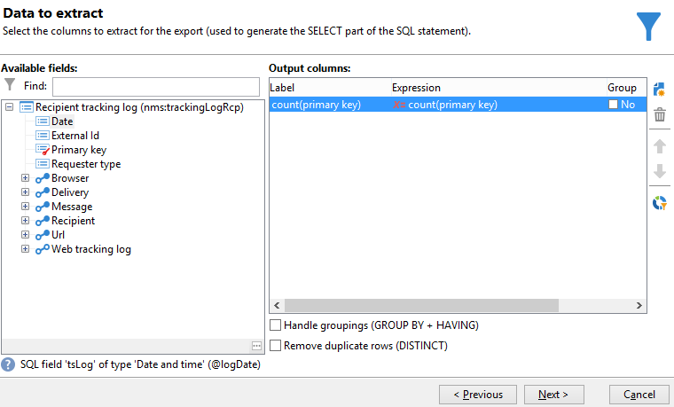

# 查詢傳遞資訊 {#querying-delivery-information}

## 特定傳送的點按次數 {#number-of-clicks-for-a-specific-delivery}

在此範例中，我們想要復原特定傳送的點按次數。 這些點按會被記錄下來，這要歸功於指定時段內的收件者追蹤記錄。 收件者可透過其電子郵件地址識別。 此查詢使用&#x200B;**[!UICONTROL Recipient tracking logs]**&#x200B;資料表。

* 需要選取哪個表格？

  收件者記錄追蹤資料表(**[!UICONTROL nms:trackingLogRcp]**)

* 要為輸出欄選取的欄位？

  主索引鍵（含計數）和電子郵件

* 會根據哪些條件篩選資訊？

  傳遞標籤的特定期間和元素

若要執行此範例，請套用下列步驟：

1. 開啟&#x200B;**[!UICONTROL Generic query editor]**&#x200B;並選取&#x200B;**[!UICONTROL Recipient tracking logs]**&#x200B;結構描述。

   

1. 在&#x200B;**[!UICONTROL Data to extract]**&#x200B;視窗中，我們要建立彙總以收集資訊。 若要這麼做，請新增主索引鍵（位於主要&#x200B;**[!UICONTROL Recipient tracking logs]**&#x200B;元素上方）：追蹤記錄計數會執行於此&#x200B;**[!UICONTROL Primary key]**&#x200B;欄位。 已編輯的運算式將為&#x200B;**[!UICONTROL x=count(primary key)]**。 它會將各種追蹤記錄的總和連結至單一電子郵件地址。

   操作步驟：

   * 按一下&#x200B;**[!UICONTROL Output columns]**&#x200B;欄位右側的&#x200B;**[!UICONTROL Add]**&#x200B;圖示。 在&#x200B;**[!UICONTROL Formula type]**&#x200B;視窗中，選取&#x200B;**[!UICONTROL Edit the formula using an expression]**&#x200B;選項並按一下&#x200B;**[!UICONTROL Next]**。 在&#x200B;**[!UICONTROL Field to select]**&#x200B;視窗中，按一下&#x200B;**[!UICONTROL Advanced selection]**。

     

   * 在&#x200B;**[!UICONTROL Formula type]**&#x200B;視窗中，對彙總函式執行程式。 此程式將會是主鍵計數。

     在&#x200B;**[!UICONTROL Aggregate]**&#x200B;區段中選取&#x200B;**[!UICONTROL Process on an aggregate function]**&#x200B;並按一下&#x200B;**[!UICONTROL Count]**。

     

     按一下&#x200B;**[!UICONTROL Next]**。

   * 選取&#x200B;**[!UICONTROL Primary key (@id)]**&#x200B;欄位。 已設定&#x200B;**[!UICONTROL count (primary key)]**&#x200B;輸出資料行。

     

1. 選取要顯示在輸出欄中的其他欄位。 在&#x200B;**[!UICONTROL Available fields]**&#x200B;欄中，開啟&#x200B;**[!UICONTROL Recipient]**&#x200B;節點並選擇&#x200B;**[!UICONTROL Email]**。 核取&#x200B;**[!UICONTROL Group]**&#x200B;方塊至&#x200B;**[!UICONTROL Yes]**，依電子郵件地址將追蹤記錄分組：此群組將每個記錄連結至其收件者。

   

1. 設定欄排序，以便最先顯示最活躍的收件者（具有最多的追蹤記錄）。 檢查&#x200B;**[!UICONTROL Descending sort]**&#x200B;欄中的&#x200B;**[!UICONTROL Yes]**。

   

1. 接著，您必須篩選出您感興趣的記錄，亦即兩週以內以及與銷售相關傳送的記錄。

   操作步驟：

   * 設定資料篩選。 若要這麼做，請選取&#x200B;**[!UICONTROL Filter conditions]**，然後按一下&#x200B;**[!UICONTROL Next]**。

     

   * 在特定期間內復原特定傳送的追蹤記錄。 需要三個篩選條件：兩個日期條件，可設定目前日期前2週與目前日期前一天之間的搜尋期間；另一個條件，可限制搜尋至特定傳遞。

     在&#x200B;**[!UICONTROL Target element]**&#x200B;視窗中，設定開始考慮追蹤記錄的日期。 按一下 **[!UICONTROL Add]**。會顯示條件行。 按一下&#x200B;**[!UICONTROL Edit expression]**&#x200B;函式以編輯&#x200B;**[!UICONTROL Expression]**&#x200B;欄。 在&#x200B;**[!UICONTROL Field to select]**&#x200B;視窗中選擇&#x200B;**[!UICONTROL Date (@logDate)]**。

     

     選取&#x200B;**[!UICONTROL greater than]**&#x200B;運運算元。 在&#x200B;**[!UICONTROL Value]**&#x200B;欄中按一下&#x200B;**[!UICONTROL Edit expression]**，然後在&#x200B;**[!UICONTROL Formula type]**&#x200B;視窗中選取&#x200B;**[!UICONTROL Process on dates]**。 最後，在&#x200B;**[!UICONTROL Current date minus n days]**&#x200B;中輸入「15」。

     按一下&#x200B;**[!UICONTROL Finish]**。

     

   * 若要選取追蹤記錄檔搜尋結束日期，請按一下&#x200B;**[!UICONTROL Add]**&#x200B;建立第二個條件。 在&#x200B;**[!UICONTROL Expression]**&#x200B;欄中，再次選擇&#x200B;**[!UICONTROL Date (@logDate)]**。

     選取&#x200B;**[!UICONTROL less than]**&#x200B;運運算元。 在&#x200B;**[!UICONTROL Value]**&#x200B;欄中按一下&#x200B;**[!UICONTROL Edit expression]**。 若要處理日期，請移至&#x200B;**[!UICONTROL Formula type]**&#x200B;視窗，在&#x200B;**[!UICONTROL Current date minus n days]**&#x200B;中輸入「1」。

     按一下&#x200B;**[!UICONTROL Finish]**。

     

     現在，我們要設定第三個篩選條件，即查詢關注的傳送標籤。

   * 按一下&#x200B;**[!UICONTROL Add]**&#x200B;函式以建立另一個篩選條件。 在&#x200B;**[!UICONTROL Expression]**&#x200B;欄中按一下&#x200B;**[!UICONTROL Edit expression]**。 在&#x200B;**[!UICONTROL Field to select]**&#x200B;視窗的&#x200B;**[!UICONTROL Delivery]**&#x200B;節點中選擇&#x200B;**[!UICONTROL Label]**。

     按一下&#x200B;**[!UICONTROL Finish]**。

     

     尋找包含「sales」字樣的傳遞。 由於您不記得其確切標籤，因此可以選擇&#x200B;**[!UICONTROL contains]**&#x200B;運運算元，並在&#x200B;**[!UICONTROL Value]**&#x200B;欄中輸入&quot;sales&quot;。

     

1. 按一下「**[!UICONTROL Next]**」，直到您進入「**[!UICONTROL Data preview]**」視窗：這裡不需要格式化。
1. 在&#x200B;**[!UICONTROL Data preview]**&#x200B;視窗中，按一下&#x200B;**[!UICONTROL Start the preview of the data]**&#x200B;以檢視每個傳遞收件者的追蹤記錄數目。

   結果會以遞減順序顯示。

   

   此傳遞的使用者最大記錄數為6。 5名不同使用者開啟了傳遞電子郵件，或按一下電子郵件中的連結。

## 未開啟任何傳遞的收件者 {#recipients-who-did-not-open-any-delivery}

在此範例中，我們要篩選過去7天內未開啟電子郵件的收件者。

若要建立此範例，請套用下列步驟：

1. 在工作流程中拖放&#x200B;**[!UICONTROL Query]**&#x200B;活動並開啟活動。
1. 按一下&#x200B;**[!UICONTROL Edit query]**&#x200B;並將目標和篩選維度設定為&#x200B;**[!UICONTROL Recipients]**。

   

1. 選取&#x200B;**[!UICONTROL Filtering conditions]**，然後按一下&#x200B;**[!UICONTROL Next]**。
1. 按一下&#x200B;**[!UICONTROL Add]**&#x200B;按鈕並選取&#x200B;**[!UICONTROL Tracking logs]**。
1. 將&#x200B;**[!UICONTROL Tracking logs]**&#x200B;運算式的&#x200B;**[!UICONTROL Operator]**&#x200B;設定為&#x200B;**[!UICONTROL Do not exist such as]**。

   

1. 新增另一個運算式。 在&#x200B;**[!UICONTROL URL]**&#x200B;類別中選取&#x200B;**[!UICONTROL Type]**。
1. 然後，將其&#x200B;**[!UICONTROL Operator]**&#x200B;設定為&#x200B;**[!UICONTROL equal to]**，將其&#x200B;**[!UICONTROL Value]**&#x200B;設定為&#x200B;**[!UICONTROL Open]**。

   

1. 新增其他運算式並選取&#x200B;**[!UICONTROL Date]**。 **[!UICONTROL Operator]**&#x200B;應設為&#x200B;**[!UICONTROL on or after]**。

   

1. 若要設定過去7天的值，請按一下&#x200B;**[!UICONTROL Value]**&#x200B;欄位中的&#x200B;**[!UICONTROL Edit expression]**&#x200B;按鈕。
1. 在&#x200B;**[!UICONTROL Function]**&#x200B;類別中，選取&#x200B;**[!UICONTROL Current date minus n days]**&#x200B;並新增您想要鎖定的天數。 在此處，我們想要鎖定過去7天。

   

您的出站轉變將包含過去7天內未開啟電子郵件的收件者。

如果相反地，您想要篩選至少開啟一封電子郵件的收件者，則您的查詢應如下所示。 請注意，在此情況下，**[!UICONTROL Filtering dimension]**&#x200B;應該設定為&#x200B;**[!UICONTROL Tracking logs (Recipients)]**。

## 已開啟傳遞的收件者 {#recipients-who-have-opened-a-delivery}

以下範例說明如何定位過去2週內開啟傳送的設定檔：

1. 若要將已開啟傳送的設定檔設為目標，您需要使用追蹤記錄。 它們儲存在連結的表格中：首先，在&#x200B;**[!UICONTROL Filtering dimension]**&#x200B;欄位的下拉式清單中選取此表格，如下所示：

   

1. 關於篩選條件，請按一下追蹤記錄之子樹狀結構中所顯示之條件的&#x200B;**[!UICONTROL Edit expression]**&#x200B;圖示。 選取&#x200B;**[!UICONTROL Date]**&#x200B;欄位。

   

   按一下&#x200B;**[!UICONTROL Finish]**&#x200B;以確認選取。

   若要只復原兩週前的追蹤記錄，請選取&#x200B;**[!UICONTROL Greater than]**&#x200B;運運算元。

   

   然後按一下&#x200B;**[!UICONTROL Value]**&#x200B;欄中的&#x200B;**[!UICONTROL Edit expression]**&#x200B;圖示以定義要套用的計算公式。 選取&#x200B;**[!UICONTROL Current date minus n days]**&#x200B;公式，並在相關欄位中輸入15。

   

   按一下公式視窗的&#x200B;**[!UICONTROL Finish]**&#x200B;按鈕。 在篩選視窗中，按一下&#x200B;**[!UICONTROL Preview]**&#x200B;索引標籤以檢查鎖定目標條件。

   

## 篩選傳遞後的收件者行為 {#filtering-recipients--behavior-folllowing-a-delivery}

在工作流程中，**[!UICONTROL Query]**&#x200B;和&#x200B;**[!UICONTROL Split]**&#x200B;方塊可讓您選取先前傳送後的行為。 此選取是透過&#x200B;**[!UICONTROL Delivery recipient]**&#x200B;篩選器執行。

* 範例的目標

  在傳遞工作流程中，有數種方式可追蹤第一個電子郵件通訊。 此型別的作業涉及使用&#x200B;**[!UICONTROL Split]**&#x200B;方塊。

* 內容

  已傳送「夏季運動選件」傳遞。 在傳送後四天，會傳送其他兩個傳送。 其中一個是「水上運動優惠方案」，另一個是第一個「夏季運動優惠方案」的後續專案。

  「水上運動選件」傳送會傳送給在第一次傳送中按一下「水上運動」連結的收件者。 這些點按可顯示收件者對主題感興趣。 引導他們接受類似優惠方案是有意義的。 不過，未點選「夏季體育選件」的收件者將再次收到相同的內容。

下列步驟說明如何整合兩種不同的行為，以設定&#x200B;**[!UICONTROL Split]**&#x200B;方塊：

1. 將&#x200B;**[!UICONTROL Split]**&#x200B;方塊插入工作流程。 此方塊會將第一個傳遞的收件者劃分為接下來的兩個傳遞。 在首次傳遞期間，根據連結至收件者行為的篩選條件會發生劃分。

   

1. 開啟&#x200B;**[!UICONTROL Split]**&#x200B;方塊。 在&#x200B;**[!UICONTROL General]**&#x200B;索引標籤中，輸入標籤： **根據執行個體的行為**&#x200B;分割。

   

1. 在&#x200B;**[!UICONTROL Subsets]**&#x200B;索引標籤中，定義第一個分割分支。 例如，輸入此分支的&#x200B;**已點按**&#x200B;標籤。
1. 選取&#x200B;**[!UICONTROL Add a filtering condition on the incoming population]**&#x200B;選項。 按一下&#x200B;**[!UICONTROL Edit]**。
1. 在&#x200B;**[!UICONTROL Targeting and filtering dimension]**&#x200B;視窗中，連按兩下&#x200B;**[!UICONTROL Recipients of a delivery]**&#x200B;篩選器。

   

1. 在&#x200B;**[!UICONTROL Target element]**&#x200B;視窗中，選取您要套用至此分支的行為： **[!UICONTROL Recipients having clicked (email)]**。

   在下方選取&#x200B;**[!UICONTROL Delivery specified by the transition]**&#x200B;選項。 此功能會自動在首次傳遞期間復原目標人員。

   這是「水上運動選件」傳遞。

   

1. 定義第二個分支。 此分支將包含後續電子郵件，其內容與第一次傳遞的內容相同。 移至&#x200B;**[!UICONTROL Subsets]**&#x200B;標籤，然後按一下&#x200B;**[!UICONTROL Add]**&#x200B;以建立它。

   

1. 另一個子標籤隨即顯示。 將其命名為「**未點按**」。
1. 按一下 **[!UICONTROL Add a filtering condition for the incoming population]**。然後按一下 **[!UICONTROL Edit...]**。

   

1. 在&#x200B;**[!UICONTROL Targeting and filtering dimension]**&#x200B;視窗中按一下&#x200B;**[!UICONTROL Delivery recipients]**。
1. 在&#x200B;**[!UICONTROL Target element]**&#x200B;視窗中，選取&#x200B;**[!UICONTROL Recipients who did not click (email)]**&#x200B;行為。 選取為最後一個分支顯示的&#x200B;**[!UICONTROL Delivery specified by the transition]**&#x200B;選項。

   **[!UICONTROL Split]**&#x200B;方塊現在已完整設定。

   

以下是預設設定的各種元件清單：

* **[!UICONTROL All recipients]**
* **[!UICONTROL Recipients of successfully sent messages,]**
* **[!UICONTROL Recipients who opened or clicked (email),]**
* **[!UICONTROL Recipients who clicked (email),]**
* **[!UICONTROL Recipients of a failed message,]**
* **[!UICONTROL Recipients who didn't open or click (email),]**
* **[!UICONTROL Recipients who didn't click (email).]**

  
