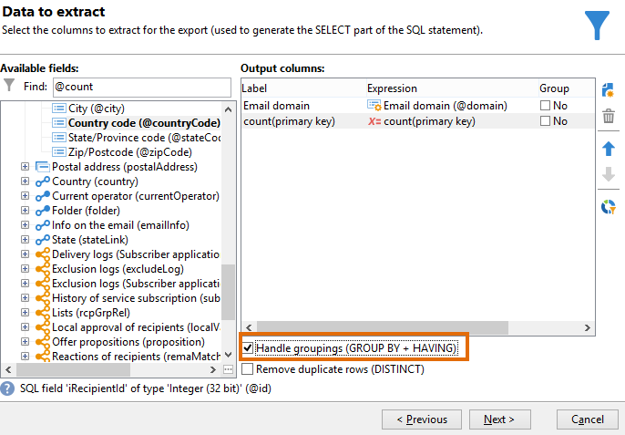

# 使用分組管理進行查詢 {#querying-using-grouping-management}

在此範例中，我們要執行查詢以尋找在先前傳送期間超過30次鎖定的所有電子郵件網域。

* 需要選取哪個表格？

  收件者資料表(nms:recipient)

* 要在輸出欄中選取的欄位？

  電子郵件網域和主索引鍵（含計數）

* 資料分組？

  根據主要金鑰計數超過30的電子郵件網域。 此作業是使用&#x200B;**[!UICONTROL Group by + Having]**&#x200B;選項執行。 **[!UICONTROL Group by + Having]**&#x200B;可讓您將資料分組（「分組依據」），並選取要分組的專案（「擁有」）。

若要建立此範例，請套用下列步驟：

1. 開啟&#x200B;**[!UICONTROL Generic query editor]**&#x200B;並選擇收件者資料表(**nms:recipient**)。

   

1. 在&#x200B;**[!UICONTROL Data to extract]**&#x200B;視窗中，選取&#x200B;**[!UICONTROL Email domain]**&#x200B;及&#x200B;**[!UICONTROL Primary key]**&#x200B;欄位。 對&#x200B;**[!UICONTROL Primary key]**&#x200B;欄位執行計數。

1. 勾選&#x200B;**[!UICONTROL Handle groupings (GROUP BY + HAVING)]**&#x200B;方塊。

   

1. 在&#x200B;**[!UICONTROL Sorting]**&#x200B;視窗中，以遞減順序排序電子郵件網域。 若要這麼做，請檢查&#x200B;**[!UICONTROL Yes]**&#x200B;欄中的&#x200B;**[!UICONTROL Descending sort]**。 按一下 **[!UICONTROL Next]**。

   

1. 在&#x200B;**[!UICONTROL Data filtering]**&#x200B;中，選取&#x200B;**[!UICONTROL Filtering conditions]**。 前往&#x200B;**[!UICONTROL Target elements]**&#x200B;視窗並按一下&#x200B;**[!UICONTROL Next]**。
1. 在&#x200B;**[!UICONTROL Data grouping]**&#x200B;視窗中，按一下&#x200B;**[!UICONTROL Email domain]**&#x200B;以選取&#x200B;**[!UICONTROL Add]**。

   此資料分組視窗只有在已核取&#x200B;**[!UICONTROL Handle groupings (GROUP BY + HAVING]**)方塊時才會顯示。

   

1. 在&#x200B;**[!UICONTROL Grouping condition]**&#x200B;視窗中，表示主索引鍵計數大於30，因為我們只希望目標定位超過30次的電子郵件網域作為結果傳回。

   勾選&#x200B;**[!UICONTROL Manage groupings (GROUP BY + HAVING)]**&#x200B;方塊時會顯示此視窗：這是篩選群組結果(HAVING)的位置。

   

1. 在&#x200B;**[!UICONTROL Data formatting]**&#x200B;視窗中，按一下&#x200B;**[!UICONTROL Next]**：這裡不需要格式設定。
1. 在資料預覽視窗中，按一下&#x200B;**[!UICONTROL Launch data preview]**：在此會傳回三個目標定位超過30次的不同電子郵件網域。

   
