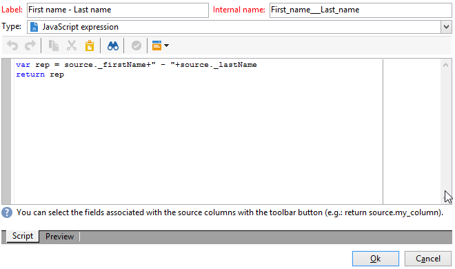

# 使用多對多關係進行查詢 {#querying-using-a-many-to-many-relationship}


在此範例中，我們要復原過去7天期間未聯絡的收件者。 此查詢與所有傳送有關。

此範例也說明如何設定與選取收集要素（或橘色節點）相關的篩選。 集合元素可在&#x200B;**[!UICONTROL Field to select]**&#x200B;視窗中使用。

* 需要選取哪個表格？

  收件者資料表(**nms：recipient**)

* 要為輸出欄選取的欄位

  主索引鍵、姓氏、名字和電子郵件

* 根據篩選的資訊標準

  根據今天之前7天回訪的收件者傳遞記錄

應用以下步驟：

1. 開啟一般查詢編輯器並選取收件者資料表&#x200B;**[!UICONTROL (nms:recipient)]**。
1. 在&#x200B;**[!UICONTROL Data to extract]**&#x200B;視窗中，選取&#x200B;**[!UICONTROL Primary key]**、**[!UICONTROL First name]**、**[!UICONTROL Last name]**&#x200B;和&#x200B;**[!UICONTROL Email]**。

   

1. 在排序視窗中，依字母順序排序名稱。

   

1. 在&#x200B;**[!UICONTROL Data filtering]**&#x200B;視窗中，選取&#x200B;**[!UICONTROL Filtering conditions]**。
1. 在&#x200B;**[!UICONTROL Target element]**&#x200B;視窗中，擷取過去7天沒有追蹤記錄之設定檔的篩選條件包含兩個步驟。 您需要選取的元素為多對多連結。

   * 首先，請為前&#x200B;**[!UICONTROL Value]**&#x200B;欄選取&#x200B;**[!UICONTROL Recipient delivery logs (broadlog)]**&#x200B;集合專案（橘色節點）。

     

     選擇&#x200B;**[!UICONTROL do not exist as]**&#x200B;運運算元。 不需要在此行中選取第二個值。

   * 第二個篩選條件的內容取決於第一個篩選條件。 在這裡，**[!UICONTROL Event date]**&#x200B;欄位直接在&#x200B;**[!UICONTROL Recipient delivery logs]**&#x200B;資料表中提供，因為有此資料表的連結。

     

     使用&#x200B;**[!UICONTROL greater than or equal to]**&#x200B;運運算元選取&#x200B;**[!UICONTROL Event date]**。 選取&#x200B;**[!UICONTROL DaysAgo (7)]**&#x200B;值。 若要這麼做，請按一下&#x200B;**[!UICONTROL Value]**&#x200B;欄位中的&#x200B;**[!UICONTROL Edit expression]**。 在&#x200B;**[!UICONTROL Formula type]**&#x200B;視窗中，選取&#x200B;**[!UICONTROL Process on dates]**&#x200B;和&#x200B;**[!UICONTROL Current date minus n days]**，並指定&quot;7&quot;作為值。

     

     已設定篩選條件。

     

1. 在&#x200B;**[!UICONTROL Data formatting]**&#x200B;視窗中，將姓氏切換為大寫。 按一下&#x200B;**[!UICONTROL Transformation]**&#x200B;欄中的&#x200B;**[!UICONTROL Last name]**&#x200B;行，然後在下拉式功能表中選取&#x200B;**[!UICONTROL Switch to upper case]**。

   

1. 使用&#x200B;**[!UICONTROL Add a calculated field]**&#x200B;函式將資料行插入資料預覽視窗中。

   在此範例中，新增計算欄位，並將收件者的名字和姓氏加入單一欄中。 按一下&#x200B;**[!UICONTROL Add a calculated field]**&#x200B;函式。 在&#x200B;**[!UICONTROL Export calculated field definition]**&#x200B;視窗中，輸入標籤和內部名稱，然後選擇&#x200B;**[!UICONTROL JavaScript Expression]**&#x200B;型別。 然後輸入下列運算式：

   ```
   var rep = source._firstName+" - "+source._lastName
   return rep
   ```

   

   按一下 **[!UICONTROL OK]**。已設定&#x200B;**[!UICONTROL Data formatting]**&#x200B;視窗。

   如需新增計算欄位的詳細資訊，請參閱本區段。

1. 結果會顯示在&#x200B;**[!UICONTROL Data preview]**&#x200B;視窗中。 過去7天未聯絡的收件者會依字母順序顯示。 名稱會以大寫顯示，而且已建立具有名字和姓氏的欄。

   
