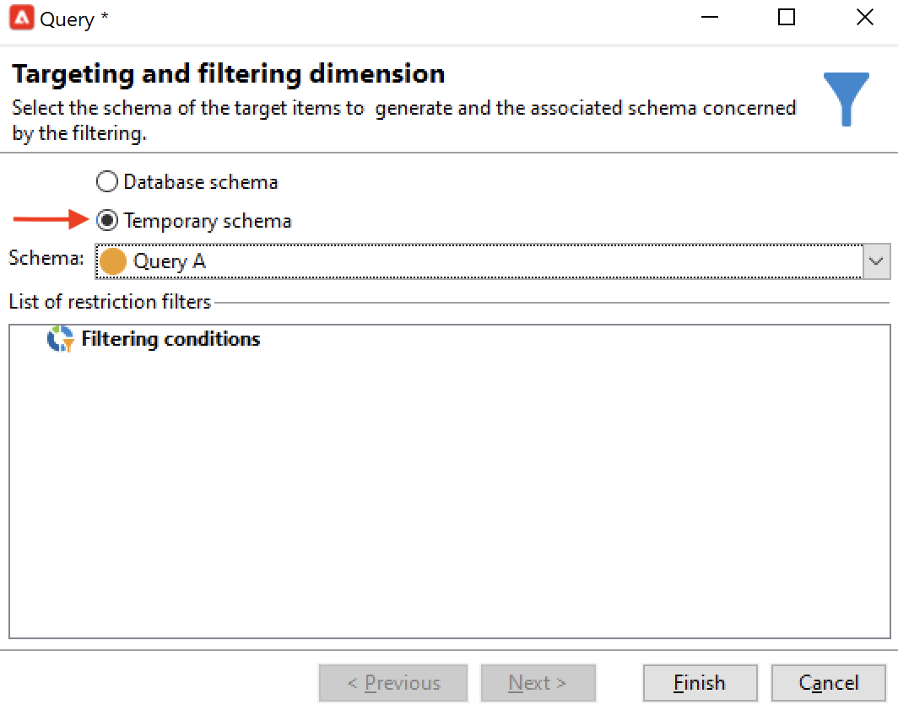

# 查詢{#query}

## 建立查詢 {#creating-a-query}

查詢可讓您根據條件選取目標。 您可以將區段代碼與查詢結果相關聯，並插入其他資料。
如需查詢範例的詳細資訊，請參閱此[此區段](querying-recipient-table.md)。

>[!NOTE]
>
>Adobe Campaign Web UI具有強大的查詢建模器，可簡化篩選資料庫的程式，以根據各種條件選取特定目標，讓您更輕鬆地建立和管理查詢。 若要進一步瞭解Web UI的查詢模型工具，請參閱[Adobe Campaign Web UI檔案](https://experienceleague.adobe.com/zh-hant/docs/campaign-web/v8/query-database/query-modeler-overview){target=_blank}。

{width="70%" align="center" zoomable="yes"}

有關使用和管理其他資料的詳細資訊，請參閱[新增資料](#adding-data)。

**[!UICONTROL Edit query...]**&#x200B;連結可讓您以下列方式定義母體的目標定位型別、限制和選取條件：

1. 選取目標定位和篩選維度。 預設情況下，會從收件者中選取目標。限制篩選器的清單與用於傳送目標定位的清單相同。

   目標維度與我們正在處理的元素型別一致，例如作業所定位的母體。

   篩選維度可讓您收集這些元素，例如與目標人員相關的資訊（合約、完整和最終結算等）。

   如需詳細資訊，請參閱[目標定位和篩選維度](targeting-workflows.md#targeting-and-filtering-dimensions)。

   {width="70%" align="center" zoomable="yes"}

   如有需要，可在選擇目標定位和篩選維度時選取&#x200B;**[!UICONTROL Temporary schema]**，以入站轉變的資料為基礎進行查詢。

   {width="70%" align="center" zoomable="yes"}

1. 使用精靈定義母體。 要輸入的欄位可能會因目標型別而異。 您可以使用&#x200B;**[!UICONTROL Preview]**&#x200B;索引標籤，以您目前的條件預覽目標母體。

   {width="70%" align="center" zoomable="yes"}

1. 如果您已在步驟1或使用&#x200B;**[!UICONTROL Filters]** > **[!UICONTROL Advanced filter...]**&#x200B;選項選取&#x200B;**[!UICONTROL Filtering conditions]**，則您稍後必須手動新增篩選條件。

   您也可以核取對應的方塊，以新增資料分組條件。 若要這麼做，篩選維度必須與查詢的目標維度不同。 如需分組的詳細資訊，請參閱此[區段](query-grouping-management.md)。

   您也可以使用運算式產生器，將其與邏輯選項AND、OR和EXCEPT結合，以新增更多條件。

   如果您稍後要重複使用篩選器，請儲存篩選器。

## 新增資料 {#adding-data}

其他欄可讓您收集目標母體的其他資訊，例如合約編號、電子報訂閱或來源。 此資料可儲存在Adobe Campaign資料庫或外部資料庫中。

**[!UICONTROL Add data...]**&#x200B;連結可讓您選取要收集的其他資料。

{width="70%" align="center" zoomable="yes"}

首先，選取要新增的資料型別：

{width="70%" align="center" zoomable="yes"}

* 選取&#x200B;**[!UICONTROL Data linked to the filtering dimension]**&#x200B;以選取Adobe Campaign資料庫中的資料。
* 選取&#x200B;**[!UICONTROL External data]**&#x200B;以從外部資料庫新增資料。 只有您已購買&#x200B;**同盟資料存取**&#x200B;選項時，才能使用此選項。 如需詳細資訊，請參閱[存取外部資料庫(FDA)](accessing-an-external-database-fda.md)。
* 選取&#x200B;**[!UICONTROL An offer proposition]**&#x200B;選項以新增一組欄，讓您儲存優惠方案引擎產生的最佳主張。 只有您已購買&#x200B;**互動**&#x200B;模組時，才能使用此選項。

如果平台上未安裝選用模組，則此階段不會顯示。 您將直接進入下一個階段。

若要從Adobe Campaign資料庫新增資料：

1. 選取您要新增的資料型別。 這可以是屬於篩選維度的資料，或是儲存在連結表格中的資料。

   {width="70%" align="center" zoomable="yes"}

1. 如果資料屬於查詢的篩選維度，只需在可用欄位清單中選取該資料，即可在輸出欄中顯示該資料。

   {width="70%" align="center" zoomable="yes"}

   您可以新增：

   * 根據從目標母體或彙總（上個月內未決購買的次數、收款的平均金額等）中取得的資料計算出的欄位。 例如，移至[選取資料](targeting-workflows.md#selecting-data)。
   * 新欄位，使用輸出欄清單右側的&#x200B;**[!UICONTROL Add]**&#x200B;按鈕建立。

     您也可以新增資訊集合，例如合約清單、最近5次傳遞等。 集合與相同設定檔可以有多個值的欄位一致（1-N關係）。 如需詳細資訊，請參閱[編輯其他資料](targeting-workflows.md#editing-additional-data)。

若要新增連結至目標母體的資訊集合：

1. 在精靈的第一步，選取&#x200B;**[!UICONTROL Data linked to the filtering dimension]**&#x200B;選項：
1. 選取包含您要收集之資訊的資料表，然後按一下&#x200B;**[!UICONTROL Next]**。

   {width="70%" align="center" zoomable="yes"}

1. 必要時，請在&#x200B;**[!UICONTROL Data collected]**&#x200B;欄位中選取其中一個值，以指定要保留的集合元素數目。 依預設，會復原集合的所有行，然後根據下列步驟指定的條件進行篩選。

   * 如果集合的單一專案符合此集合的篩選條件，請在&#x200B;**[!UICONTROL Data collected]**&#x200B;欄位中選取&#x200B;**[!UICONTROL Single row]**。

     >[!IMPORTANT]
     >
     >此模式會最佳化由於收集元素上的直接連線而產生的SQL查詢。
     >
     >如果未遵循初始條件，結果可能會有瑕疵（遺漏或重疊線）。

   * 如果您選擇復原數行(**[!UICONTROL Limit the line count]**)，則可以指定要收集的行數。
   * 如果收集的欄包含彙總，例如宣告的失敗次數、網站的平均費用性列管等。 您可以使用&#x200B;**[!UICONTROL Aggregates]**&#x200B;值。

   {width="70%" align="center" zoomable="yes"}

1. 指定集合的子選取專案。

   {width="70%" align="center" zoomable="yes"}

1. 如果您已選取&#x200B;**[!UICONTROL Limit the line count]**&#x200B;選項，請定義篩選所收集資料的順序。 一旦收集的行數超過您指定要保留的行數時，篩選順序可讓您指定要保留的行。

## 範例：在簡單收件者屬性上鎖定目標 {#example--targeting-on-simple-recipient-attributes}

在以下範例中，查詢會尋找年齡介於18至30歲之間且居住在法國的男性。 例如，此查詢將用於工作流程，旨在使其成為專屬選件。

>[!NOTE]
>
>其他查詢範例出現在[此區段](querying-recipient-table.md)中。

1. 為查詢命名，然後選取&#x200B;**[!UICONTROL Edit query...]**&#x200B;連結。
1. 在可用的篩選器型別清單中選取&#x200B;**[!UICONTROL Filtering conditions]**。
1. 為建議的目標輸入不同的條件。 這裡的條件使用AND選項結合。 收件者必須符合下列四個條件，才能納入選取範圍：

   * 標題為「先生」的收件者（也可使用&#x200B;**性別**&#x200B;欄位並選取&#x200B;**男性**&#x200B;作為值來找到）。
   * 30歲以下的收件者。
   * 18歲以上的收件者。
   * 住在法國的收件者。

   {width="70%" align="center" zoomable="yes"}

   您可以檢視符合條件組合的SQL：

   {width="70%" align="center" zoomable="yes"}

1. 您可以在相關索引標籤中預覽符合您查詢的收件者，以檢查條件是否正確：

   {width="70%" align="center" zoomable="yes"}

1. 儲存您的篩選器，以便日後按一下&#x200B;**[!UICONTROL Finish]** > **[!UICONTROL OK]**&#x200B;再次使用。
1. 新增其他活動以繼續編輯工作流程。 一旦啟動且完成先前的查詢步驟後，就會顯示找到的收件者數目。 您可以使用滑鼠快顯功能表顯示進一步的詳細資訊（以滑鼠右鍵按一下轉變> **[!UICONTROL Display the target...]**）。

   {width="70%" align="center" zoomable="yes"}

## 輸出引數 {#output-parameters}

* tableName
* 結構描述
* recCount

這組三個值會識別查詢所定位的母體。 **[!UICONTROL tableName]**&#x200B;是記錄目標識別碼的資料表的名稱，**[!UICONTROL schema]**&#x200B;是母體的結構描述（通常是nms：recipient），而&#x200B;**[!UICONTROL recCount]**&#x200B;是資料表中的元素數目。

此值是工作表的結構描述。 此引數適用於所有具有&#x200B;**[!UICONTROL tableName]**&#x200B;和&#x200B;**[!UICONTROL schema]**&#x200B;的轉變。

## 最佳化查詢 {#optimizing-queries}

下節提供最佳實務，以最佳化Adobe Campaign上執行的查詢，限制資料庫上的工作負載並改善使用者體驗。

### 聯結和索引 {#joins-and-indexes}

* 有效的查詢需要索引。
* 使用索引來連線所有聯結。
* 在架構上定義連結將決定加入條件。 連結資料表的主索引鍵上應該有唯一索引，而且聯結應該在此欄位上。
* 在數值欄位上定義鍵而非字串欄位，以執行聯結。
* 避免執行外部聯結。 只要有可能，請使用Zero ID記錄來實現外部聯結功能。
* 使用正確的資料型別進行聯結。

  請確定`where`子句與欄位屬於相同型別。

  常見的錯誤為： `iBlacklist='3'`，其中`iBlacklist`是數值欄位，而`3`表示文字值。

  確定您知道查詢的執行計畫。 避免進行完整的表格掃描，尤其是針對每分鐘執行的即時查詢或近乎即時查詢。

### 函數 {#functions}

* 請注意類似`Lower(...)`的功能。 使用Lower函式時，不會使用Index。
* 仔細檢查使用「like」指示或「upper」或「lower」指示的查詢。 在使用者輸入上套用「Upper」，而不是在資料庫欄位上套用。

### 篩選維度 {#filtering-dimensions}

使用查詢的篩選維度，而非使用「存在方式」運運算元。

{width="70%" align="center" zoomable="yes"}

在查詢中，篩選器中的「存在（例如）」條件無效。 它們等同於SQL中的子查詢：

`select iRecipientId from nmsRecipient where iRecipientId IN (select iRecipientId from nmsBroadLog where (...))`

最佳實務建議改用查詢的篩選維度：

{width="70%" align="center" zoomable="yes"}

SQL中篩選維度的對等項是內部聯結：

`select iRecipientId from nmsRecipient INNER JOIN nmsBroadLog ON (...)`

如需篩選維度的詳細資訊，請參閱[本節](build-a-workflow.md#targeting-and-filtering-dimensions)。

### 架構 {#architecture}

* 使用與生產平台類似的磁碟區、引數和架構來建置開發平台。
* 在開發和生產環境中使用相同的值。 請儘可能使用相同專案：

   * 作業系統，
   * 版本，
   * 資料，
   * 應用程式，
   * 磁碟區。

  >[!NOTE]
  >
  >在開發環境中運作的功能，在資料可能不同的生產環境中可能無法運作。 嘗試識別主要差異以預測風險並準備解決方案。

* 設定符合目標磁碟區的組態。 大型磁碟區需要特定的設定。 100,000位收件者適用的設定可能無法處理10,000,000位收件者。

  考慮系統上線時的擴充方式。 只是因為某個小規模的東西可以運作，並不表示它適合較大的體積。 應該使用與生產中的磁碟區類似的磁碟區來進行測試。 您也應該評估在高峰時間、尖峰天數和整個專案期間磁碟區變更（呼叫數、資料庫大小）的影響。
