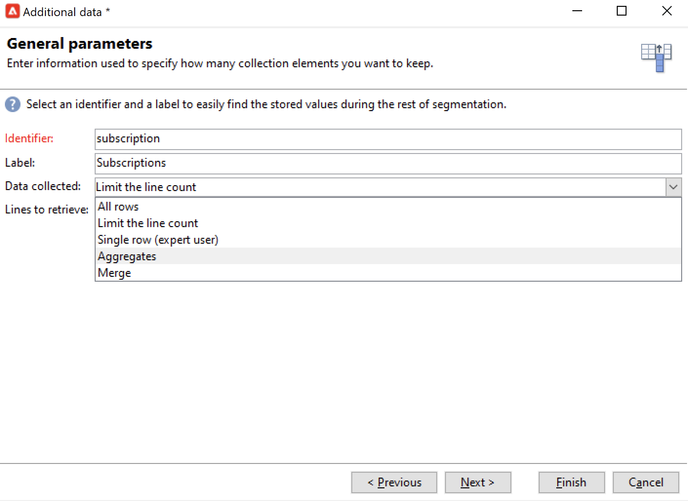

# 查詢{#query}

## 建立查詢 {#creating-a-query}

查詢允許您根據條件選擇目標。 您可以將段代碼與查詢結果關聯，並將其他資料插入。
有關查詢示例的詳細資訊，請參閱 [此部分](querying-recipient-table.md)。

有關使用和管理其他資料的詳細資訊，請參閱 [添加資料](#adding-data)。

的 **[!UICONTROL Edit query...]** 連結允許您按以下方式定義人口的目標類型、限制和選擇標準：

1. 選擇目標和篩選維。 預設情況下，目標是從收件人中選擇的。 限制篩選器清單與用於傳遞目標的篩選器清單相同。

   目標維與我們將要處理的元素類型一致，例如操作所針對的群體。

   過濾維可收集這些要素，例如與目標人員（合同、完全和最終結算等）相關的資訊。

   有關此內容的詳細資訊，請參閱 [定位和篩選維](targeting-workflows.md#targeting-and-filtering-dimensions)。

   

   如果需要，通過選擇 **[!UICONTROL Temporary schema]** 選擇目標和篩選維時。

   

1. 使用嚮導定義總體。 要輸入的欄位可能因目標類型而異。 可以使用當前條件預覽目標人口 **[!UICONTROL Preview]** 頁籤。

   有關建立和使用篩選器或查詢的詳細資訊，請參閱此。

   

1. 如果已選擇 **[!UICONTROL Filtering conditions]** 或使用 **[!UICONTROL Filters]** > **[!UICONTROL Advanced filter...]** 選項，則以後必須手動添加篩選條件。

   還可以通過選中相應框來添加資料分組條件。 為此，篩選維必須與查詢的目標維不同。 有關分組的詳細資訊，請參閱 [節](query-grouping-management.md)。

   也可以使用表達式生成器添加更多條件，並將其與邏輯選項AND、OR和EXCEPT組合。 然後可以預覽**。

   如果希望以後重新使用，請保存篩選器。

## 新增資料 {#adding-data}

附加列使您能夠收集有關目標人口的附加資訊，如合同編號、新聞稿或來源的訂閱。 此資料可以儲存在Adobe Campaign資料庫或外部資料庫中。

的 **[!UICONTROL Add data...]** 連結允許您選擇要收集的附加資料。

從選擇要添加的資料類型開始：

* 選擇 **[!UICONTROL Data linked to the filtering dimension]** 的子菜單。
* 選擇 **[!UICONTROL External data]** 從外部資料庫添加資料。 此選項僅在您購買了 **聯合資料存取** 的雙曲餘切值。 有關此內容的詳細資訊，請參閱 [訪問外部資料庫(FDA)](accessing-an-external-database--fda-.md)。
* 選擇 **[!UICONTROL An offer proposition]** 選項，以添加一組列，以便您儲存由提供引擎生成的最佳命題。 此選項僅在您購買了 **交互** 中。

如果平台上未安裝可選模組，則不顯示此階段。 你會被帶到下一個階段。

要添加來自Adobe Campaign資料庫的資料：

1. 選擇要添加的資料類型。 這可以是屬於篩選維的資料或儲存在連結表中的資料。

   

1. 如果資料屬於查詢的篩選維，只需在可用欄位清單中選擇該資料即可在輸出列中顯示。

   

   您可以添加：

   * 根據從目標人口或集合（上個月內的待定採購數、收據的平均金額等）獲取的資料計算的欄位。 例如，轉到 [選擇資料](targeting-workflows.md#selecting-data)。
   * 使用 **[!UICONTROL Add]** 按鈕。

      您還可以添加資訊集合，例如合同清單、最後5個交貨等。 集合與可具有相同配置檔案（1-N關係）的多個值的欄位一致。 有關此內容的詳細資訊，請參閱 [編輯其他資料](targeting-workflows.md#editing-additional-data)。

要添加連結到目標人口的資訊集合，請執行以下操作：

1. 在嚮導的第一步，選擇 **[!UICONTROL Data linked to the filtering dimension]** 選項：
1. 選擇包含要收集的資訊的表，然後按一下 **[!UICONTROL Next]**。

   

1. 如有必要，通過選擇集合中的某個值來指定要保留的集合元素數 **[!UICONTROL Data collected]** 的子菜單。 預設情況下，收集的所有行都將恢復，然後根據在下一步中指定的條件進行篩選。

   * 如果集合的單個元素與此集合的篩選條件一致，請選擇 **[!UICONTROL Single row]** 的 **[!UICONTROL Data collected]** 的子菜單。

      >[!IMPORTANT]
      >
      >此模式優化了由於集合元素上的直接連接而生成的SQL查詢。
      >
      >如果不尊重初始條件，則結果可能有缺陷（缺少線或重疊線）。

   * 如果選擇恢復幾行(**[!UICONTROL Limit the line count]**)可以指定要收集的行數。
   * 如果收集的列包含聚合，例如聲明的失敗數、站點的平均支出等。 你可以 **[!UICONTROL Aggregates]** 值。

   

1. 指定集合的子選擇。

   

1. 如果已選擇 **[!UICONTROL Limit the line count]** 的子菜單。 一旦收集的行數超過您指定要保留的行數，篩選順序允許您指定要保留的行。

## 示例：針對簡單收件人屬性 {#example--targeting-on-simple-recipient-attributes}

在下例中，查詢試圖確定在法國生活的18至30歲男子。 此查詢將用在工作流中，例如，該工作流旨在使這些查詢成為獨家優惠。

>[!NOTE]
>
>其他查詢示例在 [此部分](querying-recipient-table.md)。

1. 命名查詢，然後選擇 **[!UICONTROL Edit query...]** 的子菜單。
1. 選擇 **[!UICONTROL Filtering conditions]** 的子菜單。
1. 輸入建議目標的不同標準。 這裡使用AND選項組合條件。 要納入選擇，接收者必須滿足以下四個條件：

   * 標題為「Mr」的收件人(也可以使用 **性別** 欄位和選擇 **男性** 值)。
   * 年齡在30歲以下的收件人。
   * 年齡超過18歲的收件人。
   * 住在法國的收件人。

   

   您可以查看與條件組合匹配的SQL:

   

1. 您可以通過在相關標籤中預覽與查詢匹配的收件人來檢查標準是否正確：

   

1. 保存篩選器，以便您稍後通過按一下 **[!UICONTROL Finish]** > **[!UICONTROL OK]**。
1. 通過向工作流中添加其他活動繼續編輯工作流。 啟動後，上一個查詢步驟完成後，將顯示找到的收件人數。 可以使用滑鼠彈出菜單(按一下右鍵過渡> **[!UICONTROL Display the target...]**)。

   

## 輸出參數 {#output-parameters}

* 表名
* 架構
* 記錄計數

這三組值標識查詢所針對的填充。 **[!UICONTROL tableName]** 是記錄目標標識符的表的名稱， **[!UICONTROL schema]** 是人口的模式（通常為nms:recipient）, **[!UICONTROL recCount]** 是表中的元素數。

此值是工作表的架構。 此參數對於所有具有 **[!UICONTROL tableName]** 和 **[!UICONTROL schema]**。

## 優化查詢 {#optimizing-queries}

以下部分提供了優化在Adobe Campaign運行的查詢以限制資料庫的工作負載和改善用戶體驗的最佳實踐。

### 連接和索引 {#joins-and-indexes}

* 高效查詢依賴索引。
* 對所有聯接使用索引。
* 在架構上定義連結將確定聯接條件。 連結的表在主鍵上應具有唯一的索引，並且連接應位於此欄位上。
* 通過在數字欄位上而不是字串欄位上定義鍵來執行聯接。
* 避免執行外連接。 盡可能使用「零ID」記錄來實現外連接功能。
* 為聯接使用正確的資料類型。

   確保 `where` 子句與欄位的類型相同。

   一個常見的錯誤是： `iBlacklist='3'` 何處 `iBlacklist` 是數字欄位， `3` 表示文本值。

   確保知道查詢的執行計畫。 避免完全表掃描，尤其是對每分鐘運行的即時查詢或接近即時查詢。

   有關此內容的詳細資訊，請參閱以下各節：

   !

   [  Campaign v8 文件](https://experienceleague.adobe.com/docs/campaign/campaign-v8/architecture/shemas-forms/database-mapping.html)

### 函式 {#functions}

* 當心那些功能 `Lower(...)`。 使用Lower函式時，不使用Index。
* 使用「like」指令或「upper」或「lower」指令仔細檢查查詢。 在用戶輸入上應用&quot;Upper&quot;，而不是在資料庫欄位上應用。

   有關功能的詳細資訊，請參閱。

### 篩選維 {#filtering-dimensions}

使用查詢的篩選維，而不是使用「exists as」運算子。

在查詢中，篩選器中的&quot;exists aske&quot;條件無效。 它們相當於SQL中的子查詢：

`select iRecipientId from nmsRecipient where iRecipientId IN (select iRecipientId from nmsBroadLog where (...))`

最佳做法是改用查詢的篩選維：

SQL中的篩選維等效於內部連接：

`select iRecipientId from nmsRecipient INNER JOIN nmsBroadLog ON (...)`

有關篩選維的詳細資訊，請參閱 [此部分](build-a-workflow.md#targeting-and-filtering-dimensions)。

### 架構 {#architecture}

* 構建一個具有與生產平台相似的卷、參數和體系結構的開發平台。
* 對開發和生產環境使用相同的值。 盡可能使用相同：

   * 作業系統,
   * 版本,
   * 資料,
   * 應用程式，
   * 卷。

   >[!NOTE]
   >
   >在開發環境中工作的功能在資料可能不同的生產環境中可能無法工作。 嘗試識別主要差異以預測風險並準備解決方案。

* 建立與目標卷匹配的配置。 大卷需要特定的配置。 為100,000個收件者工作的配置可能不為10,000,000個收件者工作。

   考慮系統在投入使用時將如何擴展。 只是因為某種東西在小範圍內工作，並不意味著它適合在更大範圍內工作。 測試應使用與生產卷類似的捲進行。 您還應評估在高峰時段、高峰時段以及整個項目生命週期中卷（呼叫數、資料庫大小）更改的影響。
