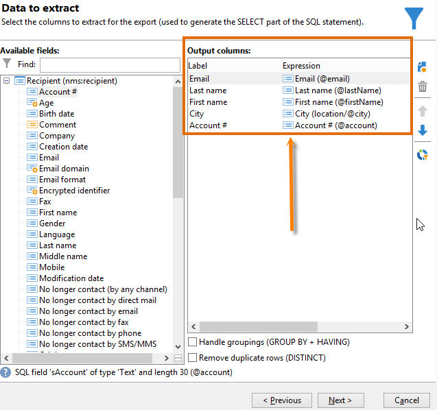
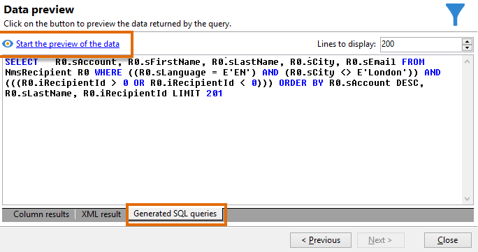

# 查詢收件者表格 {#querying-recipient-table}

在此範例中，我們要復原其電子郵件網域為「orange.co.uk」且不在倫敦居住的收件者的名稱和電子郵件。

* 我們應該選取哪個表格？

  收件者表格(nms：recipient)

* 要選取作為輸出欄的欄位

  電子郵件、姓名、城市和帳號

* 收件者的篩選條件為何？

  城市和電子郵件網域

* 是否已設定排序？

  是，根據&#x200B;**[!UICONTROL Account number]**&#x200B;和&#x200B;**[!UICONTROL Last name]**

若要建立此範例，請套用下列步驟：

1. 按一下&#x200B;**[!UICONTROL Tools > Generic query editor...]**&#x200B;並選擇&#x200B;**收件者** (**nms：recipient**)資料表。 然後按一下 **[!UICONTROL Next]**。
1. 選擇： **[!UICONTROL Last name]**、**[!UICONTROL First name]**、**[!UICONTROL Email]**、**[!UICONTROL City]**&#x200B;和&#x200B;**[!UICONTROL Account number]**。 這些欄位已新增至&#x200B;**[!UICONTROL Output columns]**。 然後按一下 **[!UICONTROL Next]**。

   

1. 排序欄，以使用正確的順序顯示。 在此處，我們要以遞減順序排序帳號，並以字母順序排序名稱。 然後按一下 **[!UICONTROL Next]**。

   

1. 在&#x200B;**[!UICONTROL Data filtering]**&#x200B;視窗中，調整您的搜尋：選擇&#x200B;**[!UICONTROL Filtering conditions]**&#x200B;並按一下&#x200B;**[!UICONTROL Next]**。
1. **[!UICONTROL Target element]**&#x200B;視窗可讓您輸入篩選設定。

   定義下列篩選條件：電子郵件網域等於「orange.co.uk」的收件者。 若要這麼做，請在&#x200B;**[!UICONTROL Expression]**&#x200B;欄中選擇&#x200B;**電子郵件網域(@email)**，在&#x200B;**[!UICONTROL Operator]**&#x200B;欄中選擇&#x200B;**等於**，並在&#x200B;**[!UICONTROL Value]**&#x200B;欄中輸入&quot;orange.co.uk&quot;。

   

1. 如有需要，請按一下&#x200B;**[!UICONTROL Distribution of values]**&#x200B;按鈕，以根據潛在客戶的電子郵件網域檢視分送。 資料庫中每個電子郵件網域都有百分比可用。 「orange.co.uk」以外的網域會一直顯示，直到套用篩選器為止。

   查詢摘要會顯示在視窗底部： **電子郵件網域等於&#39;orange.co.uk&#39;**。

1. 按一下&#x200B;**[!UICONTROL Preview]**&#x200B;以瞭解查詢結果：只顯示「orange.co.uk」電子郵件網域。

   

1. 我們現在將變更查詢，以尋找不在倫敦的聯絡人。

   在&#x200B;**[!UICONTROL Expression]**&#x200B;欄中選取&#x200B;**[!UICONTROL City (location/@city)]**，**[!UICONTROL different from]**&#x200B;作為運運算元，並在&#x200B;**[!UICONTROL Value]**&#x200B;欄中輸入&#x200B;**[!UICONTROL London]**。

   

1. 這會將您帶往&#x200B;**[!UICONTROL Data formatting]**&#x200B;視窗。 檢查欄順序。 將「城市」欄向上移動到「帳號」欄下方。

   取消勾選「名字」欄，將其從清單中移除。

   

1. 在&#x200B;**[!UICONTROL Data preview]**&#x200B;視窗中，按一下&#x200B;**[!UICONTROL Start the preview of the data]**。 此函式計算查詢的結果。

   **[!UICONTROL Column results]**&#x200B;索引標籤以欄顯示查詢結果。

   該結果會顯示所有含有「orange.co.uk」電子郵件網域的收件者，他們並非住在倫敦。 「名字」欄未顯示，因為在上一個階段中它未被核取。 帳號會依遞減順序排序。

   

   **[!UICONTROL XML result]**&#x200B;索引標籤以XML格式顯示結果。

   

   **[!UICONTROL Generated SQL queries]**&#x200B;索引標籤以SQL格式顯示查詢結果。

   
