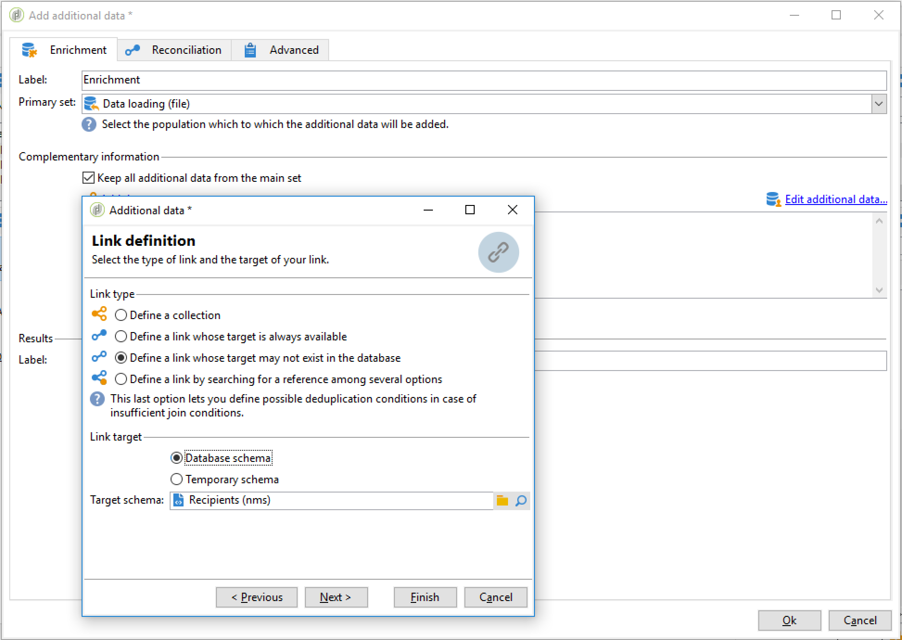

# 設定週期性匯入工作流程 {#setting-up-a-recurring-import}


如果您需要定期匯入具有相同結構的檔案，則使用工作流程範本是最佳作法。

此範例說明如何預先設定可重複用於匯入來自Adobe Campaign資料庫中CRM之設定檔的工作流程。 如需每個活動所有可能設定的詳細資訊，請參閱 [節](activities.md).

1. 從建立新的工作流模板 **[!UICONTROL Resources > Templates > Workflow templates]**.
1. 新增下列活動：

   * **[!UICONTROL Data loading (file)]**:定義包含要匯入之資料的檔案的預期結構。
   * **[!UICONTROL Enrichment]**:將匯入的資料與資料庫資料進行調解。
   * **[!UICONTROL Split]**:建立篩選器以根據記錄是否可協調而以不同方式處理記錄。
   * **[!UICONTROL Deduplication]**:在將傳入檔案插入資料庫之前，先從該檔案中刪除重複資料。
   * **[!UICONTROL Update data]**:使用匯入的設定檔更新資料庫。

   

1. 設定 **[!UICONTROL Data Loading (file)]** 活動：

   * 上傳範例檔案以定義預期的結構。 範例檔案應僅包含幾行，但匯入所需的所有欄。 檢查並編輯檔案格式，確保正確設定每欄的類型：文字、日期、整數等。 例如：

      ```
      lastname;firstname;birthdate;email;crmID
      Smith;Hayden;23/05/1989;hayden.smith@mailtest.com;123456
      ```

   * 在 **[!UICONTROL Name of the file to load]** 部分，選擇 **[!UICONTROL Upload a file from the local machine]** 並將欄位留空。 每次從此模板建立新工作流時，只要與定義的結構對應，您都可以在此處指定所需的檔案。

      您可以使用任何選項，但必須據以修改範本。 例如，若您選取 **[!UICONTROL Specified in the transition]**，您可以新增 **[!UICONTROL File Transfer]** 活動，以擷取要從FTP/SFTP伺服器匯入的檔案。 透過S3或SFTP連線，您也可以透過Adobe即時客戶資料平台，將區段資料匯入Adobe Campaign。 有關詳細資訊，請參閱 [檔案](https://experienceleague.adobe.com/docs/experience-platform/destinations/catalog/email-marketing/adobe-campaign.html).

      

1. 設定 **[!UICONTROL Enrichment]** 活動。 此活動在此背景下的目的是識別傳入的資料。

   * 在 **[!UICONTROL Enrichment]** 索引標籤，選取 **[!UICONTROL Add data]** 並定義匯入資料與收件者目標維度之間的連結。 在此範例中， **CRM ID** 「自訂」欄位可用來建立連接條件。 使用您需要的欄位或欄位組合，只要它允許識別唯一記錄即可。
   * 在 **[!UICONTROL Reconciliation]** 標籤，保留 **[!UICONTROL Identify the document from the working data]** 選項。

   

1. 設定 **[!UICONTROL Split]** 在一個轉變中擷取已調解的收件者，以及在第二個轉變中具有足夠資料無法調解的收件者。

   之後，可以使用與已調解收件者的轉變來更新資料庫。 然後，如果檔案中有最少一組資訊可用，則具有未知收件者的轉變可用於在資料庫中建立新的收件者項目。

   無法調解且沒有足夠資料的收件者會在補充的出站轉變中選取，並可匯出至個別檔案或僅遭忽略。

   * 在 **[!UICONTROL General]** 索引標籤，選取 **[!UICONTROL Use the additional data only]** 設為篩選設定，並確定 **[!UICONTROL Targeting dimension]** 會自動設為 **[!UICONTROL Enrichment]**.

      檢查 **[!UICONTROL Generate complement]** 選項，查看資料庫中是否無法插入任何記錄。 如有需要，您可以對補充資料套用進一步處理：檔案匯出、清單更新等。

   * 在 **[!UICONTROL Subsets]** 索引標籤，在入站母體上新增篩選條件，以僅選取收件者主索引鍵不等於0的記錄。 這樣，在該子集中將選擇與資料庫的收件人協調的檔案中的資料。

      

   * 添加第二個子集，以選擇具有足夠資料可插入資料庫的未協調記錄。 例如：電子郵件地址、名字和姓氏。

      子集按其建立順序進行處理，這意味著當處理此第二子集時，已存在於資料庫中的所有記錄都已在第一子集中被選擇。

      

   * 未在前兩個子集中選擇的所有記錄都將在 **[!UICONTROL Complement]**.

1. 設定 **[!UICONTROL Update data]** 位於 **[!UICONTROL Split]** 先前設定的活動。

   * 選擇 **[!UICONTROL Update]** as **[!UICONTROL Operation type]** 因為入站轉變只包含資料庫中已存在的收件者。
   * 在 **[!UICONTROL Record identification]** 部分，選擇 **[!UICONTROL Using reconciliation keys]** 和定義目標維度與 **[!UICONTROL Enrichment]**. 在此範例中， **CRM ID** 已使用自訂欄位。
   * 在 **[!UICONTROL Fields to update]** 區段中，指定「收件者」維度中的欄位，以使用檔案中對應欄的值更新。 如果檔案列的名稱與收件人維欄位的名稱相同或幾乎相同，則可以使用魔術棒按鈕自動匹配不同欄位。

      

1. 設定 **[!UICONTROL Deduplication]** 位於包含未調解收件者之轉變之後的活動：

   * 選擇 **[!UICONTROL Edit configuration]** 並將目標維度設為從 **[!UICONTROL Enrichment]** 工作流程的活動。

      

   * 在此範例中，電子郵件欄位可用來尋找唯一的設定檔。 您可以使用任何您確定已填入的欄位，以及唯一組合的一部分。
   * 在 **[!UICONTROL Deduplication method]** 螢幕，選擇 **[!UICONTROL Advanced parameters]** 並檢查 **[!UICONTROL Disable automatic filtering of 0 ID records]** 可確保主鍵等於0的記錄（應該是此轉變的所有記錄）未被排除。

   

1. 設定 **[!UICONTROL Update data]** 位於 **[!UICONTROL Deduplication]** 先前設定的活動。

   * 選擇 **[!UICONTROL Insert]** as **[!UICONTROL Operation type]** 因為入站轉變只包含資料庫中不存在的收件者。
   * 在 **[!UICONTROL Record identification]** 部分，選擇 **[!UICONTROL Directly using the targeting dimension]** 並選擇 **[!UICONTROL Recipients]** 維度。
   * 在 **[!UICONTROL Fields to update]** 區段中，指定「收件者」維度中的欄位，以使用檔案中對應欄的值更新。 如果檔案列的名稱與收件人維欄位的名稱相同或幾乎相同，則可以使用魔術棒按鈕自動匹配不同欄位。

      

1. 在 **[!UICONTROL Split]** 活動，新增 **[!UICONTROL Data extraction (file)]** 活動與 **[!UICONTROL File transfer]** 活動。 設定這些活動以匯出您需要的欄，並在FTP或SFTP伺服器上傳輸檔案，您可在其中擷取檔案。
1. 新增 **[!UICONTROL End]** 活動並儲存工作流程範本。

範本現在可供使用，並可供所有新工作流程使用。 然後，就需要全部，以指定包含要匯入的資料的檔案 **[!UICONTROL Data loading (file)]** 活動。


