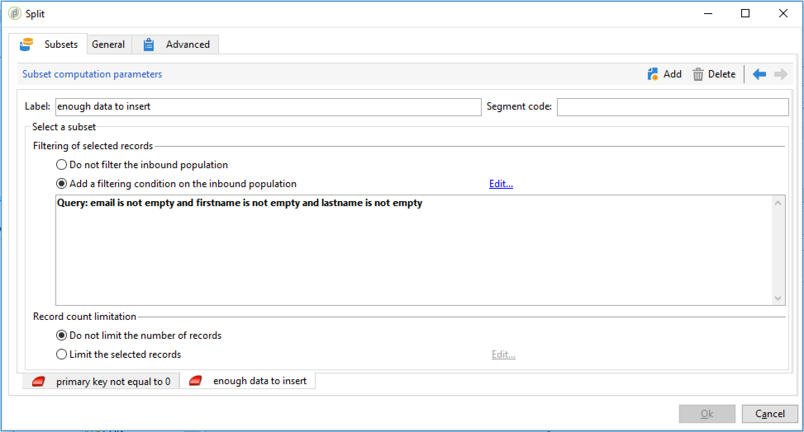

# 設定週期性匯入工作流程 {#setting-up-a-recurring-import}


如果您需要定期匯入具有相同結構的檔案，最佳做法是使用工作流程範本。

此範例說明如何預先設定一個工作流程，此工作流程可重複用於匯入來自Adobe Campaign資料庫中CRM之設定檔的工作流程。 如需每個活動所有可能設定的詳細資訊，請參閱此[區段](activities.md)。

1. 從&#x200B;**[!UICONTROL Resources > Templates > Workflow templates]**&#x200B;建立新的工作流程範本。
1. 新增下列活動：

   * **[!UICONTROL Data loading (file)]**：定義包含要匯入之資料的檔案預期結構。
   * **[!UICONTROL Enrichment]**：使用資料庫資料調解匯入的資料。
   * **[!UICONTROL Split]**：建立篩選條件以依據是否可以調解記錄而以不同方式處理記錄。
   * **[!UICONTROL Deduplication]**：將資料插入資料庫之前，先從內送檔案刪除重複資料。
   * **[!UICONTROL Update data]**：使用匯入的設定檔更新資料庫。

   

1. 設定&#x200B;**[!UICONTROL Data Loading (file)]**&#x200B;活動：

   * 透過上傳範例檔案來定義預期的結構。 範例檔案應該只包含幾行，但應包含匯入所需的所有欄。 檢查並編輯檔案格式，確定每欄的型別已正確設定：文字、日期、整數等。 例如：

     ```
     lastname;firstname;birthdate;email;crmID
     Smith;Hayden;23/05/1989;hayden.smith@mailtest.com;123456
     ```

   * 在&#x200B;**[!UICONTROL Name of the file to load]**&#x200B;區段中，選取&#x200B;**[!UICONTROL Upload a file from the local machine]**&#x200B;並保留欄位空白。 每次從這個範本建立新工作流程時，只要檔案符合定義的結構，您就可以在此處指定所要的檔案。

     您可以使用任何選項，但必須據以修改範本。 例如，如果您選取&#x200B;**[!UICONTROL Specified in the transition]**，您可以先新增&#x200B;**[!UICONTROL File Transfer]**&#x200B;活動，再擷取要從FTP/SFTP伺服器匯入的檔案。 透過S3或SFTP連線，您也可以透過Adobe即時客戶資料平台將區段資料匯入Adobe Campaign。 如需詳細資訊，請參閱[Adobe Experience Platform檔案](https://experienceleague.adobe.com/docs/experience-platform/destinations/catalog/email-marketing/adobe-campaign.html){target="_blank"}。

     

1. 設定&#x200B;**[!UICONTROL Enrichment]**&#x200B;活動。 此活動在此內容的目的是識別傳入資料。

   * 在&#x200B;**[!UICONTROL Enrichment]**&#x200B;索引標籤中，選取&#x200B;**[!UICONTROL Add data]**&#x200B;並定義匯入資料和收件者目標維度之間的連結。 在此範例中，**CRM ID**&#x200B;自訂欄位是用來建立加入條件。 只要允許您識別唯一記錄，就使用所需的欄位或欄位組合。
   * 在&#x200B;**[!UICONTROL Reconciliation]**&#x200B;索引標籤中，保留&#x200B;**[!UICONTROL Identify the document from the working data]**&#x200B;選項為未核取。

   

1. 設定&#x200B;**[!UICONTROL Split]**&#x200B;活動以在一個轉變中擷取已調解的收件者，以及在第二個轉變中無法調解但擁有足夠資料的收件者。

   然後可以使用包含已調解收件者的轉變來更新資料庫。 如果檔案中有最少的一組資訊，則可使用具有未知收件者的轉變在資料庫中建立新的收件者專案。

   無法調解且資料不足的收件者，會選取在補充外站轉變中，並可匯出至個別檔案或直接忽略。

   * 在活動的&#x200B;**[!UICONTROL General]**&#x200B;索引標籤中，選取&#x200B;**[!UICONTROL Use the additional data only]**&#x200B;作為篩選設定，並確定&#x200B;**[!UICONTROL Targeting dimension]**&#x200B;會自動設定為&#x200B;**[!UICONTROL Enrichment]**。

     核取&#x200B;**[!UICONTROL Generate complement]**&#x200B;選項，以檢視是否有任何記錄無法插入資料庫中。 如有需要，您可以對補充資料套用進一步處理：檔案匯出、清單更新等。

   * 在&#x200B;**[!UICONTROL Subsets]**&#x200B;索引標籤的第一個子集中，對入站母體新增篩選條件，以僅選取收件者主索引鍵不等於0的記錄。 如此一來，會在該子集中選取檔案中與資料庫收件者調解的資料。

     

   * 新增第二個子集，選取有足夠資料可插入資料庫中的未調解記錄。 例如：電子郵件地址、名字和姓氏。

     子集會依其建立順序進行處理，這表示在處理此第二個子集時，已在第一個子集中選取資料庫中已存在的所有記錄。

     

   * 在前兩個子集中未選取的所有記錄都會在&#x200B;**[!UICONTROL Complement]**&#x200B;中選取。

1. 設定位於先前設定之&#x200B;**[!UICONTROL Update data]**&#x200B;活動的第一個出站轉變之後的&#x200B;**[!UICONTROL Split]**&#x200B;活動。

   * 選取&#x200B;**[!UICONTROL Update]**&#x200B;作為&#x200B;**[!UICONTROL Operation type]**，因為入站轉變僅包含資料庫中已存在的收件者。
   * 在&#x200B;**[!UICONTROL Record identification]**&#x200B;區段中，選取&#x200B;**[!UICONTROL Using reconciliation keys]**&#x200B;並定義目標維度與在&#x200B;**[!UICONTROL Enrichment]**&#x200B;中建立的連結之間的索引鍵。 在此範例中，使用&#x200B;**CRM ID**&#x200B;自訂欄位。
   * 在&#x200B;**[!UICONTROL Fields to update]**&#x200B;區段中，指示收件者維度中的欄位，以使用檔案中對應欄的值進行更新。 如果檔案欄的名稱相同或幾乎與收件者維度欄位的名稱相同，您可以使用魔術棒按鈕來自動比對不同的欄位。

     

1. 設定位於包含未調解收件者的轉換之後的&#x200B;**[!UICONTROL Deduplication]**&#x200B;活動：

   * 選取&#x200B;**[!UICONTROL Edit configuration]**&#x200B;並將目標維度設定為從工作流程的&#x200B;**[!UICONTROL Enrichment]**&#x200B;活動產生的暫存結構描述。

     

   * 在此範例中，電子郵件欄位用於尋找唯一設定檔。 您可以使用任何您確定已填的欄位，以及唯一組合的一部分。
   * 在&#x200B;**[!UICONTROL Deduplication method]**&#x200B;畫面中，選取&#x200B;**[!UICONTROL Advanced parameters]**&#x200B;並核取&#x200B;**[!UICONTROL Disable automatic filtering of 0 ID records]**&#x200B;選項，以確保不會排除主索引鍵等於0 （這應該是此轉換的所有記錄）的記錄。

   

1. 設定位於先前設定的&#x200B;**[!UICONTROL Update data]**&#x200B;活動之後的&#x200B;**[!UICONTROL Deduplication]**&#x200B;活動。

   * 選取&#x200B;**[!UICONTROL Insert]**&#x200B;作為&#x200B;**[!UICONTROL Operation type]**，因為入站轉變只包含不在資料庫中的收件者。
   * 在&#x200B;**[!UICONTROL Record identification]**&#x200B;區段中，選取&#x200B;**[!UICONTROL Directly using the targeting dimension]**&#x200B;並選擇&#x200B;**[!UICONTROL Recipients]**&#x200B;維度。
   * 在&#x200B;**[!UICONTROL Fields to update]**&#x200B;區段中，指示收件者維度中的欄位，以使用檔案中對應欄的值進行更新。 如果檔案欄的名稱相同或幾乎與收件者維度欄位的名稱相同，您可以使用魔術棒按鈕來自動比對不同的欄位。

     

1. 在&#x200B;**[!UICONTROL Split]**&#x200B;活動的第三個轉變之後，如果您要追蹤未插入資料庫中的資料，請新增&#x200B;**[!UICONTROL Data extraction (file)]**&#x200B;活動和&#x200B;**[!UICONTROL File transfer]**&#x200B;活動。 設定這些活動以匯出您需要的欄，並在FTP或SFTP伺服器上傳輸檔案，以便您擷取檔案。
1. 新增&#x200B;**[!UICONTROL End]**&#x200B;活動並儲存工作流程範本。

範本現在可用於每個新工作流程。 然後只需指定包含要在&#x200B;**[!UICONTROL Data loading (file)]**&#x200B;活動中匯入之資料的檔案。


