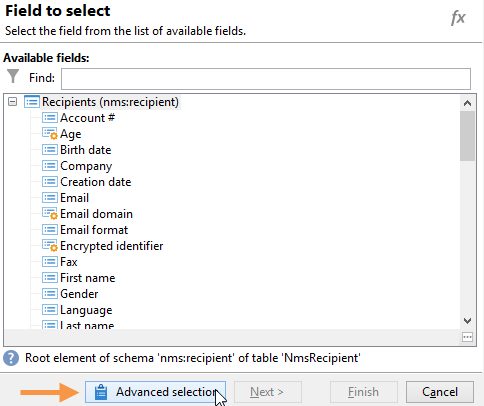

# 傳送生日電子郵件{#sending-a-birthday-email}

此使用案例說明如何規劃在收件者生日當天傳送循環電子郵件至其清單。

為了設定此使用案例，我們建立了下列目標工作流程：


此（每日執行）工作流程會選取在目前日期具有其生日的所有收件者。

若要這麼做，請建立促銷活動並新增 [行銷活動工作流程](campaign-workflows.md).

然後，請依照下列詳細步驟操作。

## 識別生日為誰的收件者 {#identifying-recipients-whose-birthday-it-is}

設定 **[!UICONTROL Scheduler]** 活動，以便工作流程每天開始，識別其出生日期等於目前日期的所有收件者。

若要這麼做，請套用下列步驟：

1. 拖放 **[!UICONTROL Query]** 活動並連按兩下它。
1. 按一下 **編輯查詢** 連結和選取 **[!UICONTROL Filtering conditions]**.

   

1. 按一下 **[!UICONTROL Expression]** 欄，按一下 **[!UICONTROL Edit expression]** 開啟運算式編輯器。

   

1. 按一下 **[!UICONTROL Advanced selection]** ，以選取篩選模式。

   

1. 選擇 **[!UICONTROL Edit the formula using an expression]** 按一下 **[!UICONTROL Next]** 以顯示運算式編輯器。
1. 在函式清單中，按兩下 **[!UICONTROL Day]**，可透過 **[!UICONTROL Date]** 節點。 此函式會傳回數字，代表與以參數傳遞之日期相對應的日期。

   

1. 在可用欄位清單中，按兩下 **[!UICONTROL Birth date]**. 然後編輯器的上方區段顯示下列公式：

   ```
   Day(@birthDate)
   ```

   按一下 **[!UICONTROL Finish]** 確認。

1. 在查詢編輯器中，於 **[!UICONTROL Operator]** 欄，選擇 **[!UICONTROL equal to]**.

   

1. 接下來，按一下第二欄的第一個儲存格(**[!UICONTROL Value]**)，然後按一下 **[!UICONTROL Edit expression]** 開啟運算式編輯器。
1. 在函式清單中，按兩下 **[!UICONTROL Day]**，可透過 **[!UICONTROL Date]** 節點。
1. 按兩下 **[!UICONTROL GetDate]** 函式來擷取目前日期。

   

   編輯器的上方區段顯示下列公式：

   ```
   Day(GetDate())
   ```

   按一下 **[!UICONTROL Finish]** 確認。

1. 重複此過程以檢索與當前月份對應的出生月份。 若要這麼做，請按一下 **[!UICONTROL Add]** 按鈕並重複步驟3到10，替換 **[!UICONTROL Day]** with **[!UICONTROL Month]**.

   完整查詢如下：

   

連結 **[!UICONTROL Query]** 活動 **[!UICONTROL Email delivery]** 活動，在所有收件者生日當天傳送電子郵件至其清單。

## 包括2月29日出生的收件者（可選） {#including-recipients-born-on-february-29th--optional-}

如果您想納入2月29日出生的所有收件者，此使用案例會說明如何計畫傳送循環電子郵件給生日的收件者清單，無論是否為閏年。

此使用案例的主要實作步驟為：

* 選取收件者
* 選擇是否是閏年
* 選擇2月29日出生的任何收件人

為了設定此使用案例，我們建立了下列目標工作流程：


如果當年 **不是閏年** 工作流程將於3月1日執行，我們需要選取所有原本在昨天（2月29日）生日的收件者，並將他們新增至收件者清單。 在任何其他情況下，均無需採取其他動作。

### 步驟1:選取收件者 {#step-1--selecting-the-recipients}

設定 **[!UICONTROL Scheduler]** 活動，以便工作流程每天開始，識別其週年為當天的所有收件者。

>[!NOTE]
>
>如果今年是閏年，則所有出生於2月29日的收件者都會自動包含在內。


選取生日對應至目前日期的收件者，會顯示在 [識別生日為誰的收件者](#identifying-recipients-whose-birthday-it-is) 區段。

### 步驟2:選擇是否是閏年 {#step-2--select-whether-or-not-it-is-a-leap-year}

此 **[!UICONTROL Test]** 活動可讓您檢查是否為閏年，以及目前日期是否為3月1日。

如果測試經過驗證（年份不是閏年 — 沒有2月29日 — 而目前的日期的確是3月1日），則 **[!UICONTROL True]** 轉換已啟用，2月29日出生的收件者將新增至3月1日的傳送。 否則， **[!UICONTROL False]** 轉換已啟用，且只有在目前日期出生的收件者才會收到傳送。

將程式碼複製並貼到下方的 **[!UICONTROL Initialization script]** 區段 **[!UICONTROL Advanced]** 標籤。

```
function isLeapYear(iYear)
{
    if(iYear/4 == Math.floor(iYear/4))
    {
        if(iYear/100 != Math.floor(iYear/100))
        {
            // Divisible by 4 only -> Leap Year
            return 1;
        }
        else
        {
            if(iYear/400 == Math.floor(iYear/400))
            {
                // Divisible by 4, 100 and 400 -> Leap year
                return 1;
            }
        }
    }
    // all others: no leap year
    return 0;
}

// Return today's date and time
var currentTime = new Date()
// returns the month (from 0 to 11)
var month = currentTime.getMonth() + 1
// returns the day of the month (from 1 to 31)
var day = currentTime.getDate()
// returns the year (four digits)
var year = currentTime.getFullYear()

// is current year a leap year?
vars.currentIsALeapYear = isLeapYear(year);

// is current date the first of march?
if(month == 3 && day == 1) {
  // today is 1st of march
vars.firstOfMarch = 1;
}
```


在 **[!UICONTROL Conditional forks]** 小節：

```
vars.currentIsALeapYear == 0 && vars.firstOfMarch == 1
```


### 步驟3:選擇2月29日出生的任何收件人 {#step-3--select-any-recipients-born-on-february-29th}

建立 **[!UICONTROL Fork]** 活動並將其中一個出站轉變連結至 **[!UICONTROL Query]** 活動。

在此查詢中，選擇出生日期為2月29日的所有收件人。


將結果與 **[!UICONTROL Union]** 活動。

連結兩者的結果 **[!UICONTROL Test]** 活動分支到 **[!UICONTROL Email delivery]** 活動，在您所有收件者的生日當天（甚至2月29日出生的非閏年），將電子郵件傳送至其清單。

## 建立循環傳送 {#creating-a-recurring-delivery-in-a-targeting-workflow}

新增 **循環傳送** 活動，根據您要傳送的生日電子郵件範本。

>[!CAUTION]
>
>若要執行工作流程，必須啟動與Campaign套件相關的技術工作流程。 有關詳細資訊，請參閱 [技術工作流程清單](technical-workflows.md) 區段。
>
>如果為促銷活動啟用核准步驟，則只有確認這些步驟後，才會傳送傳遞。 如需詳細資訊，請參閱區段。


