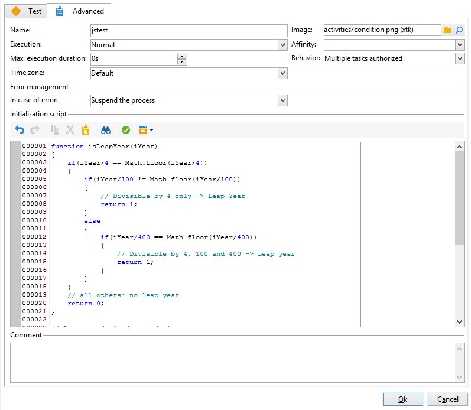

# 傳送生日電子郵件{#sending-a-birthday-email}

此使用案例說明如何計畫於收件者生日當天傳送定期電子郵件給收件者清單。

為了設定此使用案例，我們已建立下列目標定位工作流程：


此（每日執行）工作流程會選取目前日期生日的所有收件者。

若要這麼做，請建立行銷活動並新增[行銷活動工作流程](campaign-workflows.md)。

然後遵循以下詳述的步驟操作。

## 識別其生日為的收件者 {#identifying-recipients-whose-birthday-it-is}

設定&#x200B;**[!UICONTROL Scheduler]**&#x200B;活動以便工作流程每天開始之後，識別出生日期等於目前日期的所有收件者。

若要這麼做，請套用下列步驟：

1. 將&#x200B;**[!UICONTROL Query]**&#x200B;活動拖放到工作流程中，然後按兩下。
1. 按一下&#x200B;**編輯查詢**&#x200B;連結並選取&#x200B;**[!UICONTROL Filtering conditions]**。

   

1. 按一下&#x200B;**[!UICONTROL Expression]**&#x200B;欄的第一個儲存格，然後按一下&#x200B;**[!UICONTROL Edit expression]**&#x200B;以開啟運算式編輯器。

   

1. 按一下&#x200B;**[!UICONTROL Advanced selection]**&#x200B;以選取篩選模式。

   

1. 選取&#x200B;**[!UICONTROL Edit the formula using an expression]**&#x200B;並按一下&#x200B;**[!UICONTROL Next]**&#x200B;以顯示運算式編輯器。
1. 在函式清單中，按兩下&#x200B;**[!UICONTROL Day]**，可透過&#x200B;**[!UICONTROL Date]**&#x200B;節點存取。 此函式傳回的數字，代表以引數形式傳遞之日期對應的日期。

   

1. 在可用欄位清單中，按兩下&#x200B;**[!UICONTROL Birth date]**。 然後，編輯器的上半區段會顯示下列公式：

   ```
   Day(@birthDate)
   ```

   按一下 **[!UICONTROL Finish]** 確認。

1. 在查詢編輯器中，在&#x200B;**[!UICONTROL Operator]**&#x200B;欄的第一個儲存格中，選取&#x200B;**[!UICONTROL equal to]**。

   

1. 接著，按一下第二欄(**[!UICONTROL Value]**)的第一個儲存格，然後按一下&#x200B;**[!UICONTROL Edit expression]**&#x200B;以開啟運算式編輯器。
1. 在函式清單中，按兩下&#x200B;**[!UICONTROL Day]**，可透過&#x200B;**[!UICONTROL Date]**&#x200B;節點存取。
1. 連按兩下&#x200B;**[!UICONTROL GetDate]**&#x200B;函式以擷取目前的日期。

   

   編輯器的上方區段會顯示下列公式：

   ```
   Day(GetDate())
   ```

   按一下 **[!UICONTROL Finish]** 確認。

1. 重複此程式以擷取與目前月份對應的出生月份。 若要這麼做，請按一下&#x200B;**[!UICONTROL Add]**&#x200B;按鈕，然後重複步驟3到10，將&#x200B;**[!UICONTROL Day]**&#x200B;取代為&#x200B;**[!UICONTROL Month]**。

   完整的查詢如下：

   

將&#x200B;**[!UICONTROL Query]**&#x200B;活動的結果連結至&#x200B;**[!UICONTROL Email delivery]**&#x200B;活動，以傳送電子郵件至您所有收件者生日清單。

## 包含2月29日出生的收件者（選擇性） {#including-recipients-born-on-february-29th--optional-}

如果您想要包含所有在2月29日出生的收件者，此使用案例會說明如何計畫傳送循環電子郵件給生日收件者清單（無論是否為閏年）。

此使用案例的主要實施步驟為：

* 選取收件者
* 選取是否為閏年
* 選取2月29日出生的任何收件者

為了設定此使用案例，我們已建立下列目標定位工作流程：


如果目前年度&#x200B;**不是閏年**，而工作流程在3月1日執行，我們需要選取昨天（2月29日）生日的所有收件者，並將他們新增至收件者清單。 在任何其他情況下，都不需要執行其他動作。

### 步驟1：選取收件者 {#step-1--selecting-the-recipients}

設定&#x200B;**[!UICONTROL Scheduler]**&#x200B;活動以便工作流程每天開始之後，識別其週年是當天的所有收件者。

>[!NOTE]
>
>如果目前年份是閏年，則所有在2月29日出生的收件者都會自動納入。


選取生日符合目前日期的收件者，會顯示在[識別生日為](#identifying-recipients-whose-birthday-it-is)的收件者區段。

### 步驟2：選擇是否為閏年 {#step-2--select-whether-or-not-it-is-a-leap-year}

**[!UICONTROL Test]**&#x200B;活動可讓您檢查是否為閏年，以及目前的日期是否為3月1日。

如果測試通過驗證（該年不是閏年 — 沒有2月29日 — 而目前日期確實是3月1日），則會啟用&#x200B;**[!UICONTROL True]**&#x200B;轉換，並將在2月29日出生的收件者新增至3月1日傳遞。 否則，會啟用&#x200B;**[!UICONTROL False]**&#x200B;轉變，而且只有生於目前日期的收件者才會收到傳遞。

將下列程式碼複製並貼到&#x200B;**[!UICONTROL Advanced]**&#x200B;索引標籤的&#x200B;**[!UICONTROL Initialization script]**&#x200B;區段中。

```
function isLeapYear(iYear)
{
    if(iYear/4 == Math.floor(iYear/4))
    {
        if(iYear/100 != Math.floor(iYear/100))
        {
            // Divisible by 4 only -> Leap Year
            return 1;
        }
        else
        {
            if(iYear/400 == Math.floor(iYear/400))
            {
                // Divisible by 4, 100 and 400 -> Leap year
                return 1;
            }
        }
    }
    // all others: no leap year
    return 0;
}

// Return today's date and time
var currentTime = new Date()
// returns the month (from 0 to 11)
var month = currentTime.getMonth() + 1
// returns the day of the month (from 1 to 31)
var day = currentTime.getDate()
// returns the year (four digits)
var year = currentTime.getFullYear()

// is current year a leap year?
vars.currentIsALeapYear = isLeapYear(year);

// is current date the first of march?
if(month == 3 && day == 1) {
  // today is 1st of march
vars.firstOfMarch = 1;
}
```



在&#x200B;**[!UICONTROL Conditional forks]**&#x200B;區段中新增下列條件：

```
vars.currentIsALeapYear == 0 && vars.firstOfMarch == 1
```


### 步驟3：選取2月29日出生的任何收件者 {#step-3--select-any-recipients-born-on-february-29th}

建立&#x200B;**[!UICONTROL Fork]**&#x200B;活動，並將其中一個出站轉變連結至&#x200B;**[!UICONTROL Query]**&#x200B;活動。

在此查詢中，選取出生日期為2月29日的所有收件者。


將結果與&#x200B;**[!UICONTROL Union]**&#x200B;活動結合。

將兩個&#x200B;**[!UICONTROL Test]**&#x200B;活動分支的結果連結至&#x200B;**[!UICONTROL Email delivery]**&#x200B;活動，以傳送電子郵件至您所有生日收件者的清單，甚至傳送至在非閏年2月29日出生的收件者。

## 建立循環傳遞 {#creating-a-recurring-delivery-in-a-targeting-workflow}

根據您要傳送的生日電子郵件範本，新增&#x200B;**週期性傳遞**&#x200B;活動。

>[!CAUTION]
>
>若要執行工作流程，必須啟動與行銷活動套件相關的技術工作流程。 如需詳細資訊，請參閱[技術工作流程清單](technical-workflows.md)區段。
>
>如果已為行銷活動啟用核准步驟，則只有在確認這些步驟後，才會傳送傳送。 有關詳細資訊，請參閱   區段。


